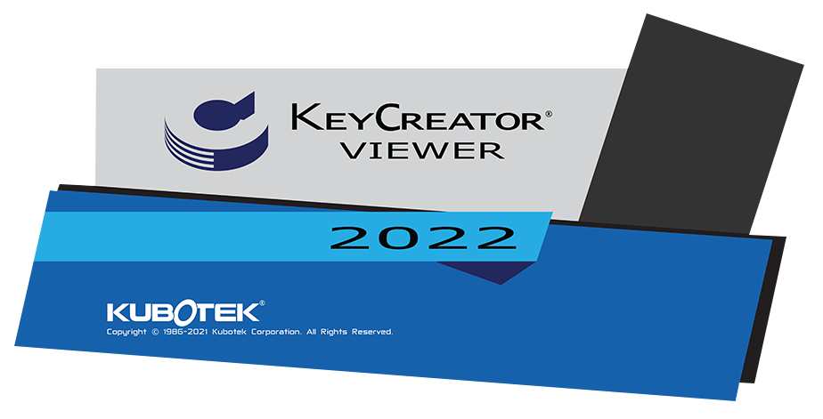

# KeyCreator Pro 202x SPx

<!-- Splashscreen -->

## Généralités

### Système

#### Emplacement
<!-- Modifier l'emplacement en fonction de la version -->
- Keycreator Pro 20xx SPx est installé dans un nouveau répertoire
    - C:\Programmes\Kubotek\KeyCreatorPro2022.SP0
    - Cela permet d'utiliser plusieurs versions différentes de KeyCreator sur la même machine
- Versions 64 bits uniquement

#### Configuration requise
<!-- Mettre à jour la version et vérifier les informations -->
- Système d’exploitation et matériel recommandés pour KeyCreator 2022 SP1

| Matériel | Recommandé | Minimum |
| --- | --- | --- |
| OS | Windows 10 ou 11 Pro 64-bit | Windows 10 64-bit |
| Processeur | Intel Core i7 (quadcore) ou dual quadcore Xeons ou equivalent AMD | Requis par l’OS (Windows) |
| Mémoire | 16 GB RAM ou plus | 8 GB RAM |
| Carte Graphique | NVIDIA, AMD 4 GB de mémoire ou plus | Pas de minimum |
| Matériel Additionnel | Souris 3 boutons avec roulette ou 3Dconnexion 3D mouse |  |

### Version KeyCreator supportées par Kubotek
<!-- Mettre à jour -->
- V2022
- V2021
- V2020
- V2019

**Versions qui ne bénéficient plus d’un support :**

- Toutes les versions antérieures de KeyCreator
- Toutes les versions de Cadkey

### Pas de prise en charge descendante pour les fichiers CKD
<!-- Voir si on peut utiliser avec une version précédente les fichiers -->
Les fichiers .CKD créés avec KeyCreator 2022 ne pourront être lu avec une version plus ancienne de KeyCreator.

En revanche, les fichiers créées avec des anciennes versions de KeyCreator seront ouvrable et éditable dans KeyCreator 2022 SP1.

### Type de fichier supportées par KeyCreator 202x SPx
<!-- Mettre à jour les interfaces -->
| Format | Sens | Version supportées | Assemblage | Nouveautés |
| --- | --- | --- | --- | --- |
| ACIS | Import - Export | 1.5 R26 - R2019 - R2021- R2022 | NON | 2022 |
| AutoCAD DWG/DXF | Import - Export | Toutes versions jusqu’a 2021 | NON |  |
| Autodesk Inventor | Import | 6-11,2008-2023 | OUI | 2023 |
| CATIA V4 | Import - Export | 4.1.9 - 4.2.4 | NON |  |
| CATIA V5 | Import (Géom+Draw) | V5-6 R2018 - V5 R29 - V5 R30, V5-6 R2020 / R2020x - V5 R31 / R2022 | OUI | R2022 |
| Catia V6 | Import | V6 R2019x - V6 R2021x - 3dxml |  | 3dxml |
| IFC | Import | 4 | OUI |  |
| IGES | Import - Export | Jusqu’à la version 5.3 | OUI |  |
| JT | Import | Versions 8,9 & 10 | OUI |  |
| Parasolid | Import - Export | Jusqu’à la version 34 | OUI | 34 |
| Pro/E / CREO | Import | Solide – PMI – Drawing - V9 | OUI | V9 |
| Solid Edge | Import | V18 – ST11 - 2021 - 2022 | OUI | 2022 |
| Solidworks | Import | 98 - 2019 - 2021 - 2022 | OUI | 2022 |
| STEP | Import - Export | AP203, AP214, AP 242 | OUI |  |
| Unigraphics | Import | 11 - 18, NX 1 - 12 -1847 - NX 1919 - NX 1926 - NX 1980 - NX2000, NX2007, NX2008, NX2011, NX2015, NX 2019, NX2027 | OUI | NX2000, NX2007, NX2008, NX2011, NX2015, NX 2019, NX2027 |
|  | Export Géom + PMI | V5-6 R2018 - V5 R29 - V5 R30, V5-6 R2020 / R2020x - V5 R31 / R2021 - R33 | OUI |  |
|  | Drawing | V5-6 R2018 - V5 R29 - V5 R30 - V5 R31 |  |  |
|  | Export | R12, R13, R14,2000-2018 | NON |  |
|  | PMI | PMI 1847 Drawing 1884 - 1919 - 1926 |  |  |
| Rhino | Import | 3dm |  | Rhino 3dm |

### Rappel : les licences pour le télétravail

- Pour les clients disposant d'un AUC (Contrat de maintenance annuel) actif
    - Il est possible de créer une licence Home (basé sur l'adresse MAC de la seconde machine)
    - Pour les licences par code d'activation, il est possible de remplacer l'activation de la machine (code d'activation) par une activation par login (utilisable sur n'importe quelle machine disposant de KeyCreator et d'internet)
- Pour utiliser les technologies WTS (Windows Terminal Services), il est nécessaire de disposer d'un serveur de licences et de licences flottantes.
*WTS est utilisé par les outils d'accès à distance et de virtualisation de Windows (Serveur)*

## Améliorations (en bref)
<!-- Faire un résumé des améliorations -->

<!-- Écrire chaque amélioration par thème -->

## Liste des corrections (PDF en anglais)
<!-- Créer le fichier et mettre à jour le lien -->
[Bug\_Fixes\_KC\_2022\_SP0\_en.pdf](../../assets/files/bug_kixes_kc_2022_SP0_en.pdf)

---

## KeyCreator Viewer

### Visualisation des fichiers KeyCreator

Programme indépendant de KeyCreator afin de visualiser, mesurer, imprimer les fichiers CKD.

Vous pouvez installer ce programme sur différents ordinateurs pour consulter des fichiers KeyCreator.

<!-- Mettre à jour le splash screen -->

## Récapitulatif AUC ou contrat de maintenance de mise à jour

- Recevoir les mises à jour KeyCreator
- Être prioritaire pour toutes demandes de support ou d'information
- Pouvoir demander une licence KeyCreator Home : une seconde licence KeyCreator à utiliser chez vous liée à une adresse Mac (pas de frais supplémentaires)
- Pouvoir commander et remplacer une clé USB défectueuse (nouvelle clé et transport payant)
- Permets d'utiliser le mode d'authentification par login : remplace l'utilisation du code d'activation (la licence est liée à une machine) et permets d'utiliser sa licence sur différents postes (nécessite une connexion internet pour toute utilisation)