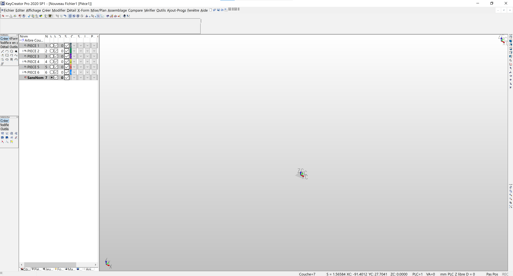
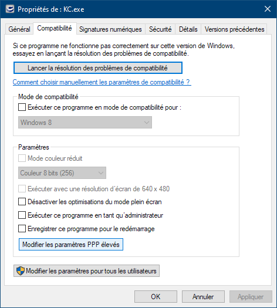

# Interface et icones trop petits - Ecran HiDPI (4K)

*Version KeyCreator: v2019*

## Problème

L'interface et les icones dans KeyCreator s'affiche en très petit. Cela se produit pour les écrans 4K ou UHD qui nécessite une mise à échelle de l'interface.

## Corriger le problème

1. Dans l'explorateur de fichier, aller dans le répertoire d'installation de KeyCreator
*Par défaut : C:\Program Files\Kubotek\KeyCreatorPro.xxxx.xxx (xxx : version de KeyCreator)*  
    
    
2. Recherché l'application KC (KC.exe)
    
    
3. Faite un clic-droit sur KC puis cliquer sur **Propriétés**  
    
    
4. Aller dans l'onglet **Compatibilité**, puis cliquer sur **Modifier les paramètres PPP élevés**  
    
    
5. Dans la fenêtre, **cocher la case** "Remplacez le comportement de mise à l'échelle PPP élevée."
Puis sélectionner dans la liste **Système**  
    
    
6. Valider en cliquant sur OK puis OK

7. Vous pouvez redémarrer KeyCreator, l'interface devrait être de taille normale  
    