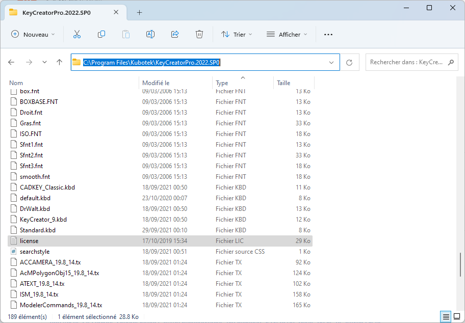
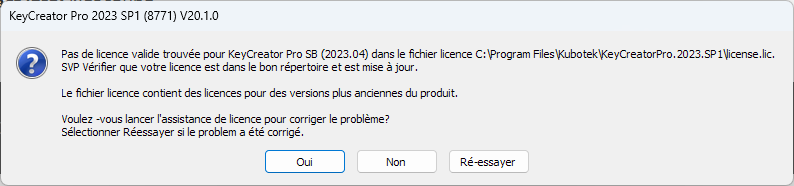
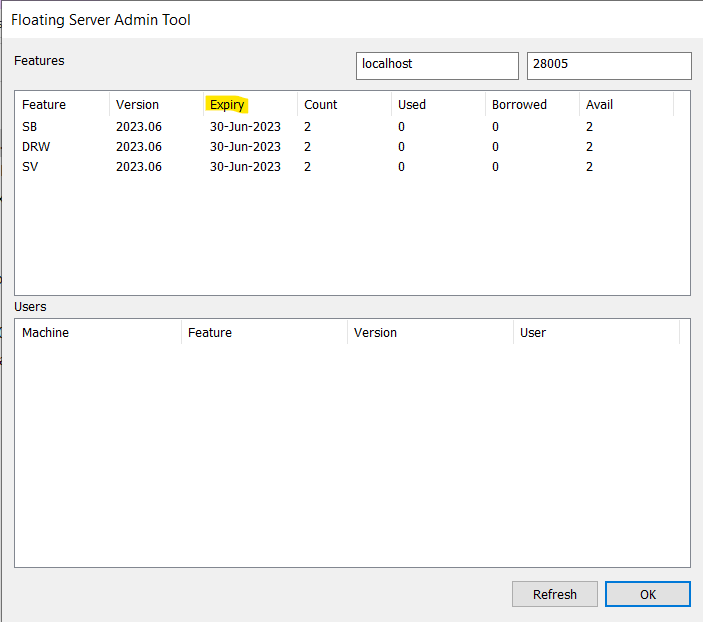
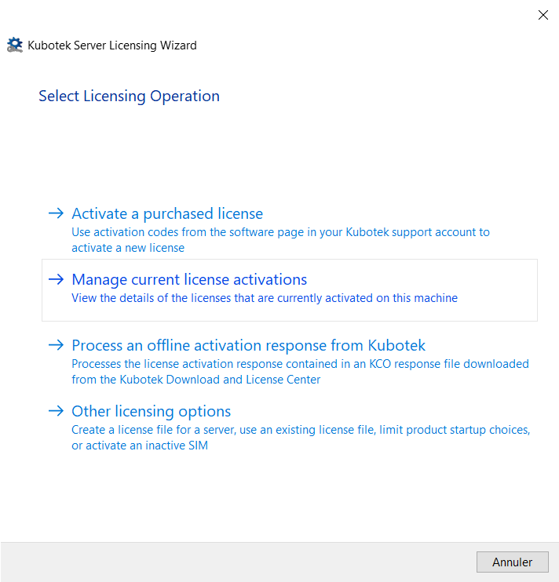
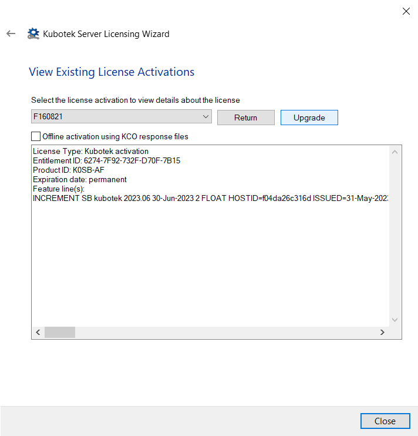
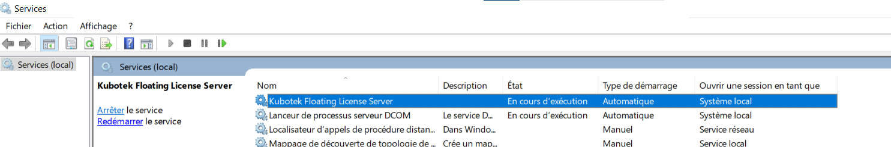
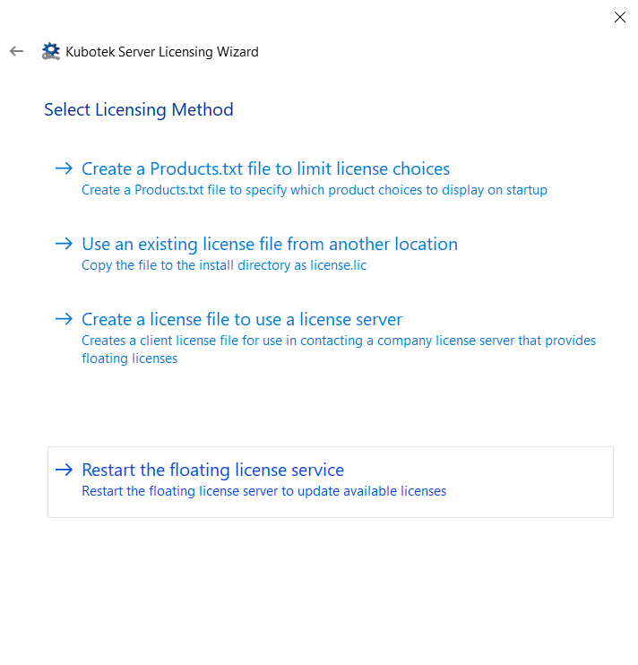
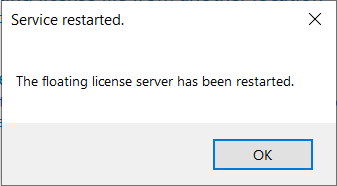

# Mise à jour KeyCreator - licences flottantes

## Mise à jour poste client

Ajouter le fichier “license.lic” pour la liaison au serveur. Soit par copier-coller, soit par LicenseWizard.

### Via LicenseWizard

Pour créer le fichier "license.lic" sur le poste client suivre le paragraphe "Partie poste de travail client" de cette fiche technique :

[CADM Services : Fiches techniques KeyCreator](http://fiches-techniques.kubotekfrance.fr/#/installation/guide-dinstallation-serveur?id=partie-poste-de-travail-client)

### Par copier-coller

Il aussi possible de copier-coller le fichier "license.lic" de la version précédente de KeyCreator vers la nouvelle version

*Répertoire d'installation par défaut de KeyCreator : C:\Program Files\Kubotek\KeyCreatorPro.20xx.SPx*

## Message d’erreur : “licences trop anciennes”

Si le message d'erreur ci-dessous apparait, cela veut dire que la licence sur le serveur n'est pas à jour.

### Vérifier la date d’expiration des licences

Normalement les licences par code d'activation se mettent à jour automatiquement, mais il peut arriver que ce ne soit pas le cas.

Pour vérifier que les licences sur le serveur sont à jour ou pas, sur le serveur, allez dans le répertoire d’installation de KCNetAdmin (par défaut : *C:\KCNetAdmin)*

Démarrer l’utilitaire “KCFloatingAdmin.exe” et vérifier la date d’expiration (la date affichée doit être suppérieur à la date du jour).

## Mise à jour des licences sur le serveur

La démarche n'est pas la même en foncion de votre type de licence : licences par code d'activation ou licence par fichier license.lic(serveur).

### Mettre à jour les licences flottantes par code d'activation

Pour mettre à jour les licences manuellement (vérifier que le serveur à bien accès à internet) :

- Dans le répertoire de KCNetAdmin lancer “ServerLicenseWizard.exe”
- Aller dans “Manage current license activations”  
    
- Puis **pour chaque licence** cliquer sur le bouton “Upgrade”  
    
- Ensuite appuyer sur “Close”

### Mettre à jour les licences flottantes par license.lic (clé USB - adresse MAC)

Pour mettre à jour les licences, il suffit de copier-coller le fichier license.lic,fournit par Cadm Services, à la racine du répertoire KCNetAdmin (par défaut : *C:\KCNetAdmin)*.

## Redémarrer le serveur de licence

Après avoir mis à jour vos licences, il est préférable de redémarrer le serveur de licence.

### Via les services Windows

Sur le serveur, redémarrer le service “Kubotek Floating License Server”

### Via “ServerLicenseWizard.exe”

- Démarrer “ServerLicenseWizard.exe”
- Puis cliquez sur “Other licensing options” puis “Restart the floating license service”
    
    
    

- Valider le message qui dit que le serveur de licence à bien été redémarré
    
    
    