# KeyCreator 2020 SP1

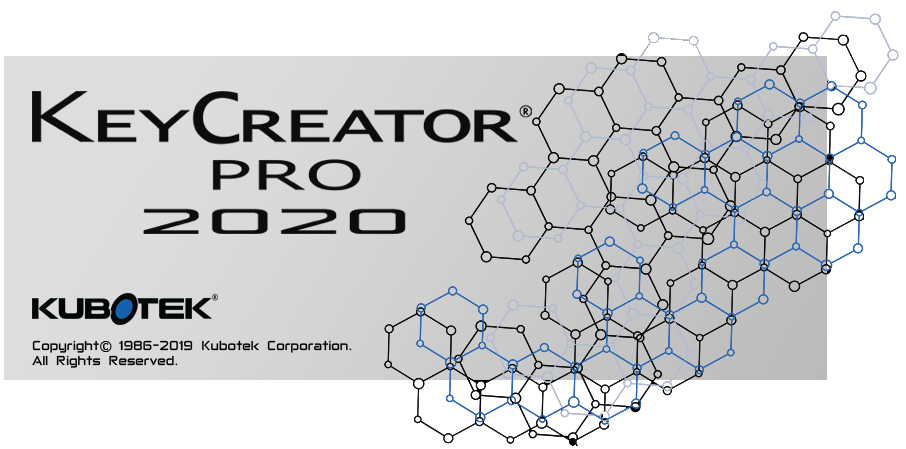

## Généralités

### Système

#### Emplacement

- KeyCreator64.2020.SP1 est installé dans un nouveau répertoire
    - C:\Programmes\Kubotek\KeyCreatorPro2020.SP1

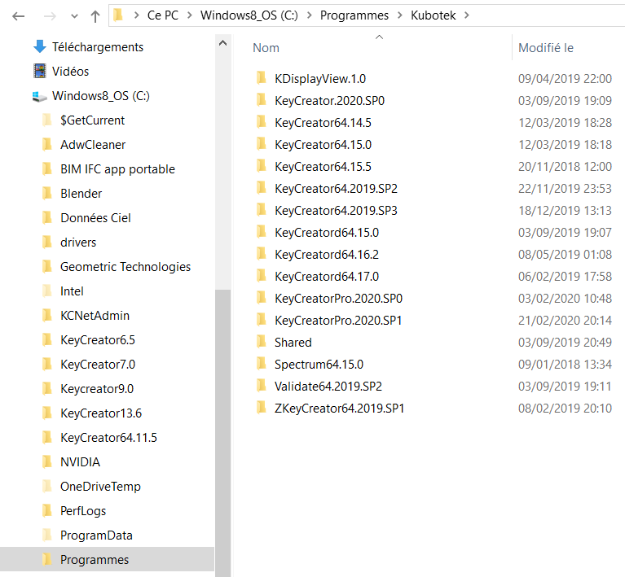

- Versions 64 bits uniquement

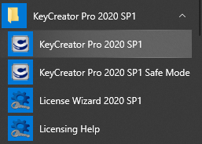

#### Configuration requise

- Système d’exploitation et matériel recommandés pour KeyCreator 2020 SP1

| Matériel             | Recommandé                                             | Minimum                   |
| -------------------- | ------------------------------------------------------ | ------------------------- |
| Processeur           | Intel Core i7 (quadcore) ou dual quadcore Xeons        | Requis par l’OS(Windows)  |
| Mémoire              | 16 GB RAM ou plus                                      | 8 GB RAM                  |
| Carte Graphique      | NVIDIA, 1 GB GDDR3 mémoire ou plus                     | Pas de minimum            |
| OS                   | Windows 10 Pro 64-bit                                  | Windows 7ou 8 Pro 64-bit, |
| Matériel Additionnel | Souris 3 boutons avec roulette ou 3Dconnexion 3D mouse |                           |

### Version KeyCreator supportées par KUBOTEK

- V2020
- V2019
- V15.5
- V15

**Versions qui ne bénéficie plus d’un support :**  
- V14
- V13
- V12
- Toutes les versions antérieur de KeyCreator
- Toutes les versions de Cadkey

### Type de fichier supportées par KeyCreator 2020 SP1

| Format            | Sens               | Version supportées           | Assemblage | Nouveautés |
| ----------------- | ------------------ | ---------------------------- | ---------- | ---------- |
| ACIS              | Import Export      | 1.5 R26-R2019                | NON        |            |
| CATIA V4          | Import Export      | 4.1.9 - 4.2.4                | NON        | -          |
| CATIA V5          | Import (Géom+Draw) | V5-6 R2018 - V5 R29          | OUI        | R29        |
|                   | Export Géom + PMI  | V5-6 R2018 - V5 R29          | OUI        | R29        |
|                   | Drawing            | V5-6 R2018 - V5 R29          |            | R29        |
| Catia V6          | Import             | V6 R2019x                    |            | V6 2019    |
| DWG/DXF           | Import             | Toutes versions jusqu’a 2018 | NON        |            |
|                   | Export             | R12, R13, R14,2000-2018      | NON        |            |
| IGES              | Import Export      | Jusqu’à la version 5.3       | OUI        |            |
| Autodesk Inventor | Import             | 6-11,2008-2020               | OUI        | 2020       |
| JT                | Import             | Versions 8,9 & 10            | OUI        |            |
| Parasolid         | Import / Export    | Jusqu’à la version 31        | OUI        | 31         |
| IFC               | Import             |                              | OUI        | Nouveau31  |
| Pro/E / CREO      | Import             | Solide – PMI – Drawing V6    | OUI        | V6         |
| Solid Edge        | Import             | V18 – ST11                   | OUI        |            |
| Solidworks        | Import             | 98 - 2019                    | OUI        |            |
| STEP              | Import/Export      | AP203, AP214                 | OUI        |            |
| Unigraphics       | Import             | 11 - 18, NX 1 - 12 -1847     | OUI        | 1847       |
|                   | PMI                | PMI 1847 Drawing 1884        |            | 1884       |

### Améliorations

#### Amélioration de l'interface utilisateur

L'interface utilisateur a été mis à jour vers une CAO plus moderne et plus conviviale pour permettre aux nouveaux utilisateurs d'apprendre et de travailler plus facilement et plus rapidement avec KeyCreator 2020.

Dans ce but, une réorganisation des commandes les plus fréquemment utilisées a été opéré.

De plus, une nouvelle fonction permettant de prendre les attributs d’une entité pour les appliquées à une autre a été ajouté. Cela permet de dupliquer et modifier les couleurs, les textes et les cotes avec un simple clic de souris.

#### Des fonction plus dynamique

Lors de l’import d’une pièce, un trièdre dynamique a été ajouté afin de pouvoir orienter et positionner facilement la pièce.

La fonction *Déformer Fenêtre* est complété par une option dynamique permettant de redimensionner, simplement, suivant le plan de construction.

Les fonctions de création de primitives (cube, sphère, etc…) comportent toute la possibilité de les créer de manière dynamique, c’est-à-dire que toutes les formes peuvent être modélisé uniquement avec le trièdre de création.

#### Interopérabilité avec d’autre système CAO

Pour une meilleure interopérabilité, la prise en charge d'un nouveau format a été ajouté pour les données de construction (IFC) et la plupart des autres interfaces ont été mises à jour vers les dernières versions.

#### En résumé

Kubotek continue d’améliorer l’expérience utilisateur tout en gardant l’ADN de KeyCreator pour permettre de réaliser plus facilement et plus rapidement tous types de projets.

*La version KeyCreator 2020 c’est de la DYNAMIQUE !!!!*

### Ajouts - Modifications - Disparition

#### Simplification du Trièdre d’affichage

Simplification du trièdre d’affichage pour améliorer sa visibilité. Il est utilisé pour les indications d’origine, de plan de construction (PlanC) et de Vues.

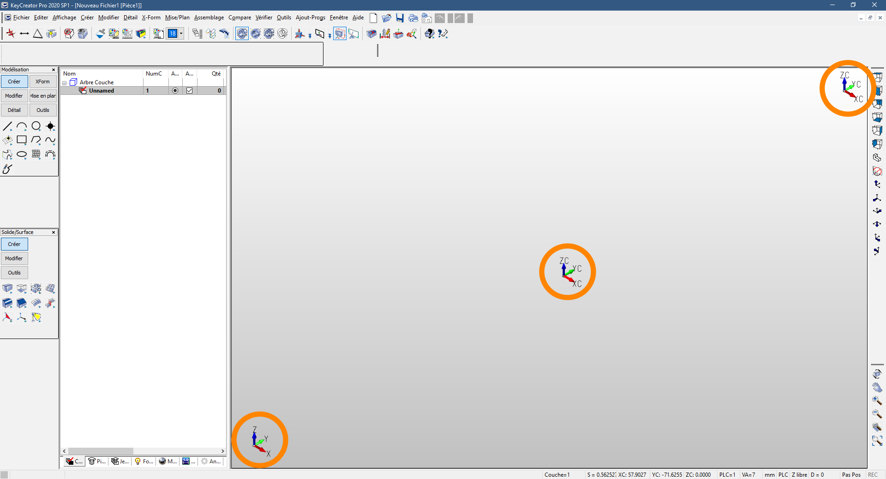

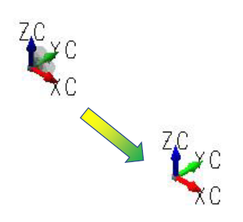

#### Disparition

- Fenêtre d’information « Au sujet de... »
- Fichier IMPORT > FASTSURF
- Fichier EXPORT > CADL
- Retrait des infobulles et options de réglages des axes pour le Trièdre Dynamique      
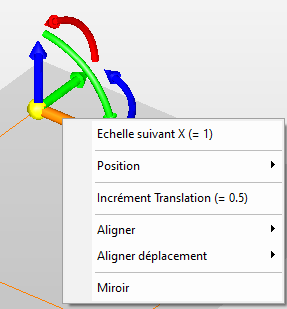
    
- Modifier > Opérations Booléennes > Combiner solides disjoints
La commande combiner solides disjoints a été supprimé, il est possible d’utiliser une union booléenne à la place. En effet, dans les versions précédentes, une fenêtre d’information vous indiquez que cette commande était équivalente à faire une [ Union booléenne ]      
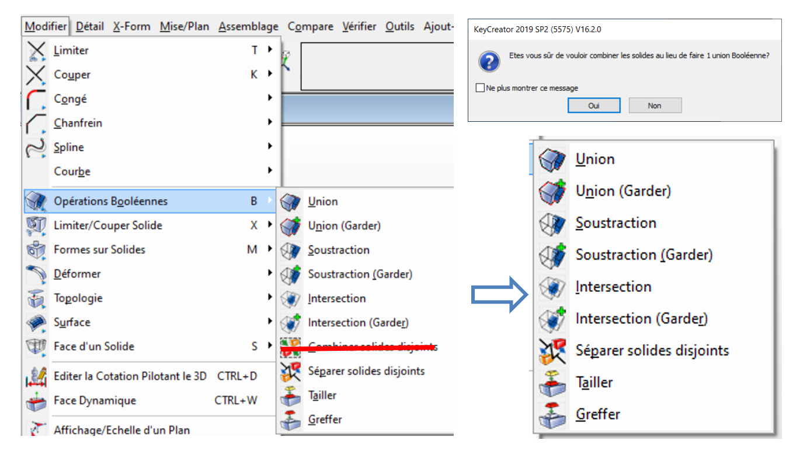
    

#### Modification

- Edition Ligne → **Format** Ligne (ou arc ellipse nurbs solide..)
- Modifier Mise en plan → **Format** Mise en Plan
- Masque des entités → **Filtre** Entités      
    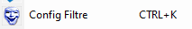
    
- Editer > Attribut Système > 2D/3D → **Z Bloqué ou Z libre**      
    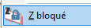
    
- Editer > Entité > Blanchir ou Déblanchir → **Cacher ou Montrer**      
    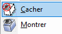
    
- Barre de conversation : Accept ou Entrée → **OK** Echap → **Annuler**      
    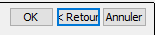
    
- Réorganisation du **menu couche**Après un clic droit sur une couche les options *Créer Copier Déplacer* ont été regroupées      
    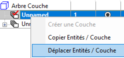
    
- Le menu contextuel comporte une option pour modifier la couleur d’une face. **[ Format Face ]**  
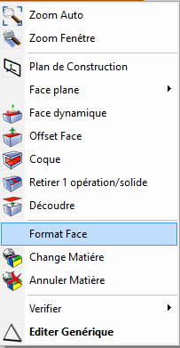 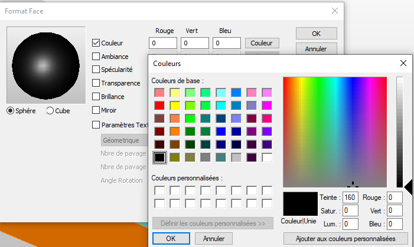

- Le menu contextuel (clic droit) permet de modifier la valeur du rayon d’un congé**. [Editer Congé]**  
    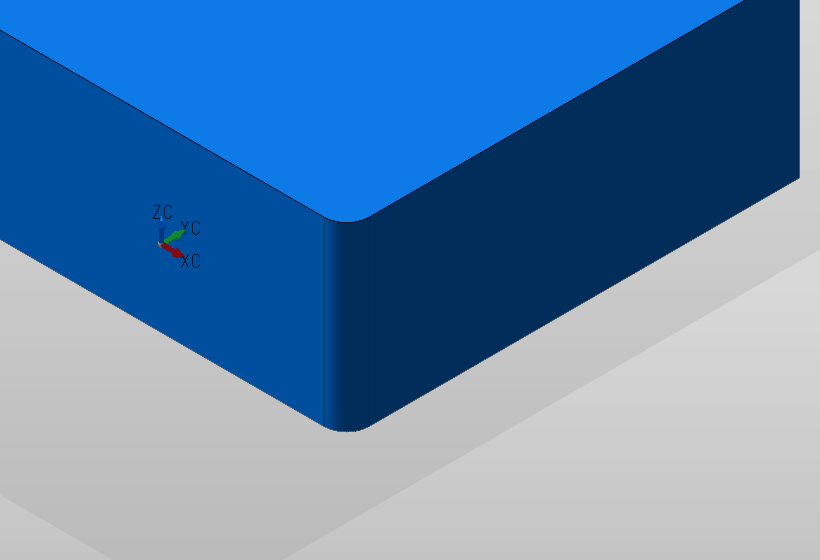
    
- Présélection des formes en survolant les congés ou les perçages.  
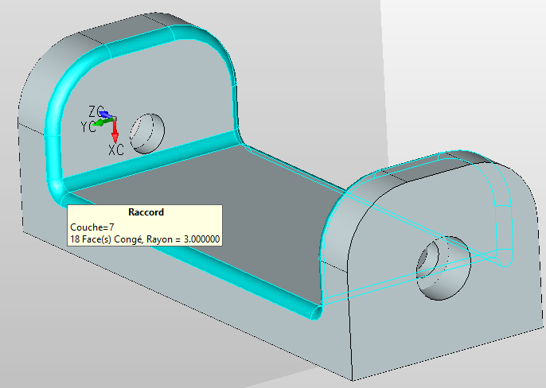 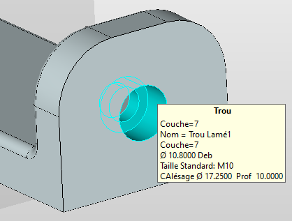

#### Sélection fenêtre suivant le sens de sélection

Suivant le sens de sélection, avec le clic gauche de la souris, vous obtenez ce qui se trouve strictement à l’intérieur ou ce qui se trouve à l’intérieur et à l’intersection de la fenêtre.

**Sélection de gauche à droite**   
Sélectionne uniquement des éléments à l’intérieur de la fenêtre

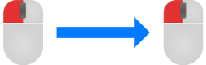

**Sélection de droite à gauche**   
Sélectionne tous les éléments à l’intérieur ainsi que ceux présents sur la fenêtre de sélection

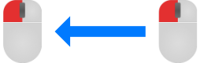

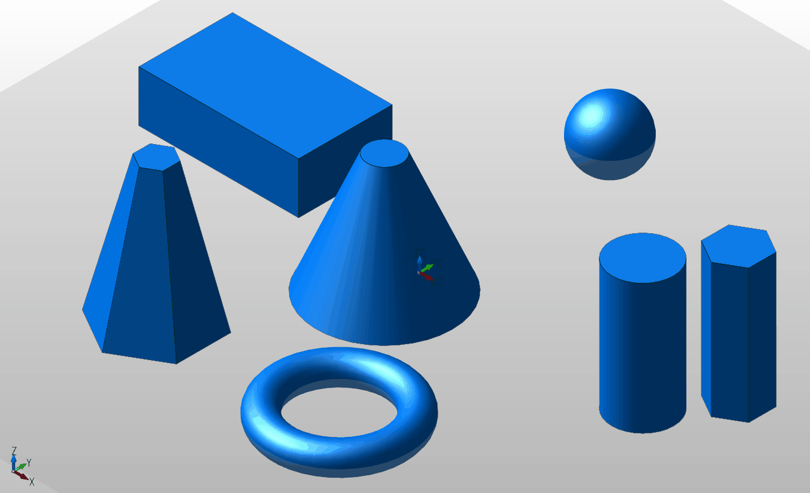

## FICHIER

### OUVRIR

Changement et regroupement des types de fichiers par applications (*ex : DXF et DWG sont groupés sous Fichier AutoCad (.DWG, .DWG)*)

Lors du choix du type de fichier.

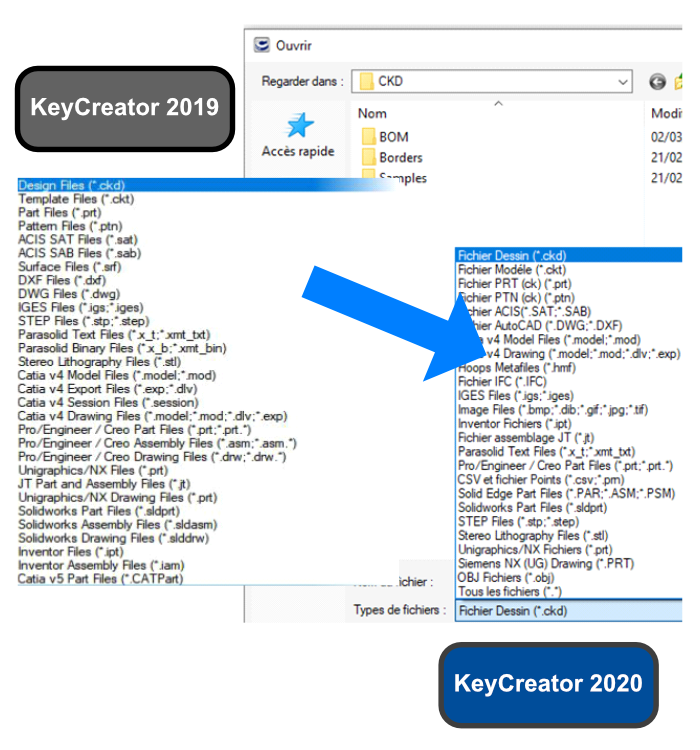

### IMPORT

#### Nouvelle organisation des fichiers

- Retrait du format FastSurf (Ancien Format propre à Cadkey)

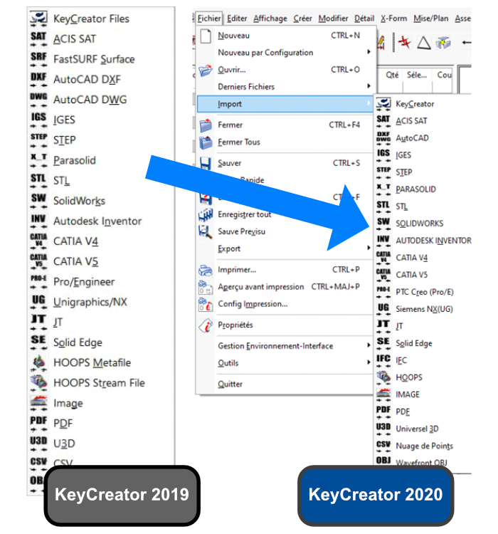
    

#### Trièdre dynamique

Tous les fichiers importés s’affichent avec le trièdre dynamique pour les positionner plus facilement.  
De plus, il est maintenant possible d’utiliser la fonction [ Copier ] pour insérer directement plusieurs fois la même pièce. *(Voir utilisation du trièdre dynamique dans les versions précédentes)*

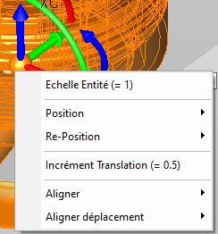 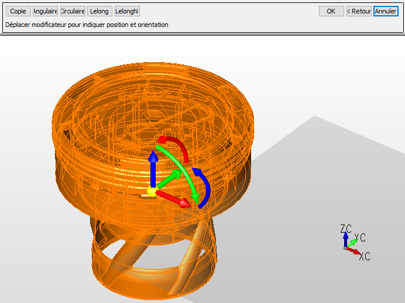

#### Format de Fichier IFC

Importation des fichiers IFC (neutral Industry Foundation Classes) créer pour l’industrie de la construction.

Les fichier IFC sont souvent exportés depuis Autodesk REVIT et d’autres logiciels orientés architecture ou construction.

Actuellement, aucune option d’importation n’est disponible.

### EXPORT

#### Nouvelle organisation des fichiers

- RETRAIT DU FORMAT CADL (ancien format propre à Cadkey)

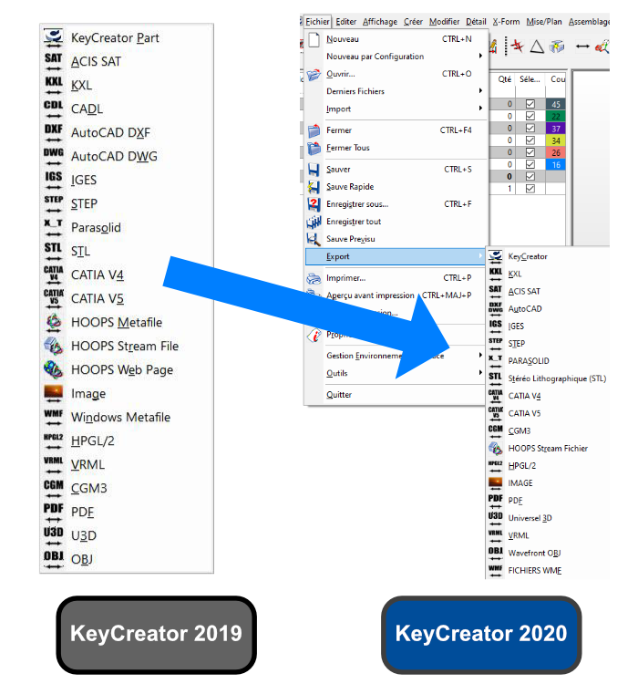

## EDITER

### ATTRIBUTS / SYSTEMES

#### Chainage rapide

- Maintenant par défaut, un contour 2D est sélectionné en survolant la pièce, appuyez sur la [Barre Espace] pour basculer sur un autre contour.
- Il est possible de remettre la sélection comme sur les versions antérieures dans Editer > Attributs Système > [Chaînage Rapide]

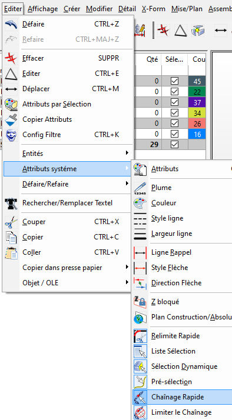 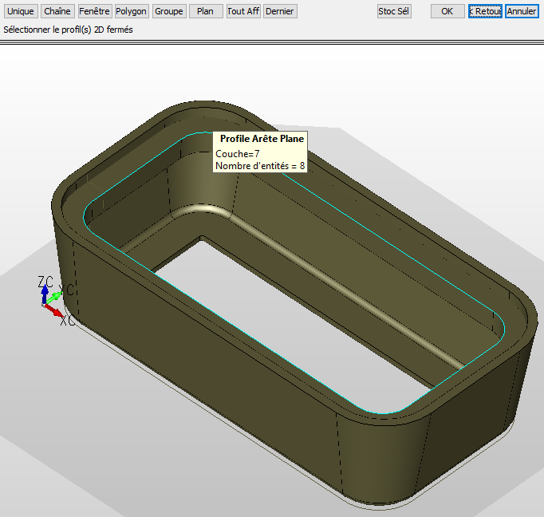

### Copier / Coller

- Après un copier, vous pouvez coller la pièce, la positionnée suivant un point et le curseur Dynamique. Ensuite, vous pouvez déplacer la pièce suivant le trièdre et les axes de rotation.

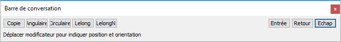

- En cliquant sur copie, vous pouvez coller plusieurs fois pièce
- Le clic droit sur l’un des axes permet d’afficher le menu contextuelle (échelle, miroir ...)

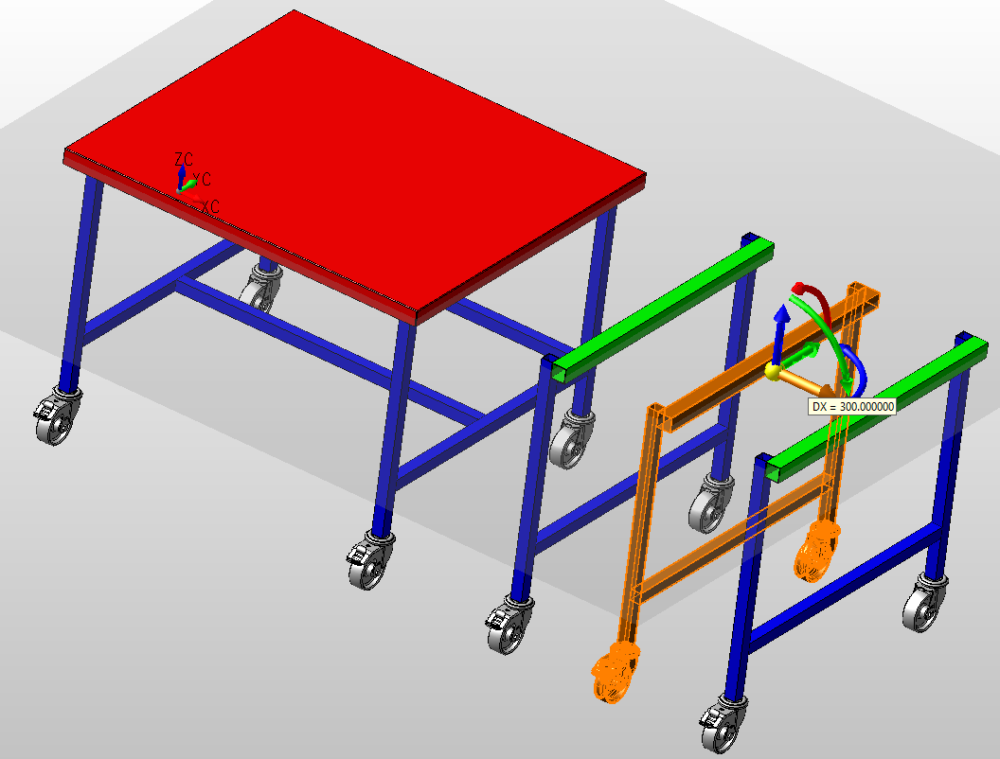

### Copier attributs

 
**Editer > Copier Attributs**

Cette nouvelle fonction permet de prendre les attributs d’une entité pour l’appliquer sur une autre.

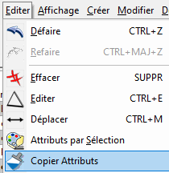

#### Utilisation

1. Sélectionner une entité dont vous désirez les paramètres
2. Cliquer sur Copier Attributs
3. Cliquer sur les entités sur lesquelles vous voulez appliquer les attributs copiés.

Fonctionne pour tout type d’entité et modifie l’orientation du texte suivant le plan de construction.

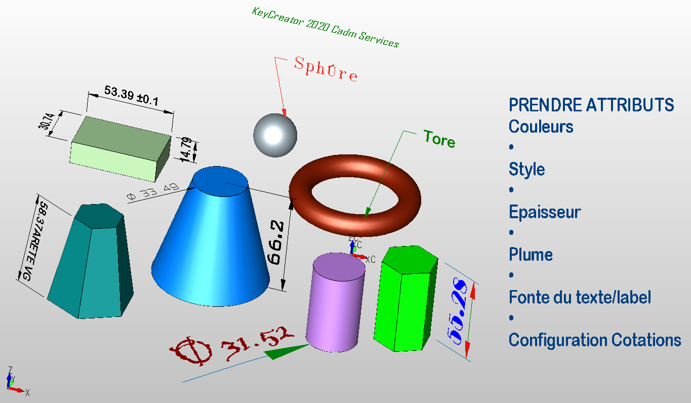 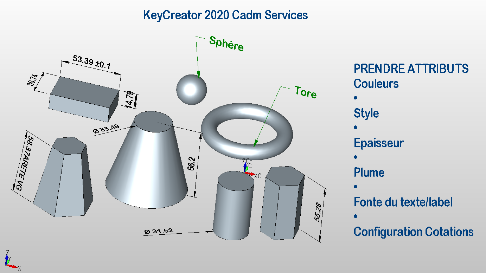

## AFFICHAGE

### RENDU

#### Direction lumière

L'orientation de l’éclairage par défaut a changé pour que les couleurs sur les faces ne soient plus dégradées.

Affichage > Rendu Graphique > Lumière direction : Vous pouvez déplacer le curseur ou saisir des valeurs X,Y,Z

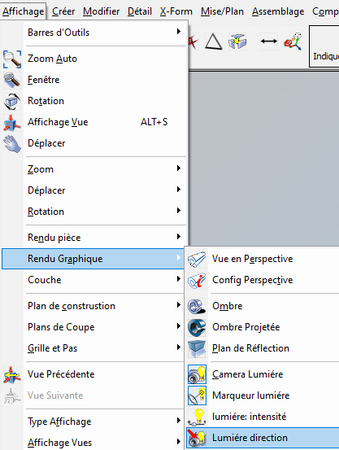 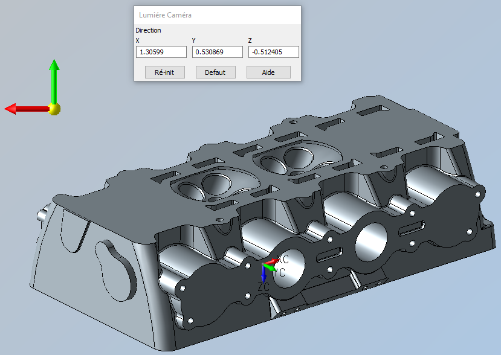

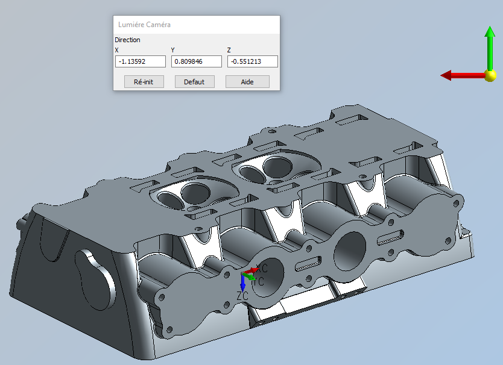

## CREER

### PRIMITIVE SOLIDE

Toutes les primitives de solides comportent maintenant l’option dynamique qui permet l’affichage d’axes pour définir les paramètres (hauteur, rayon …)

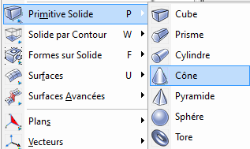

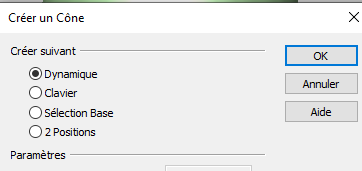

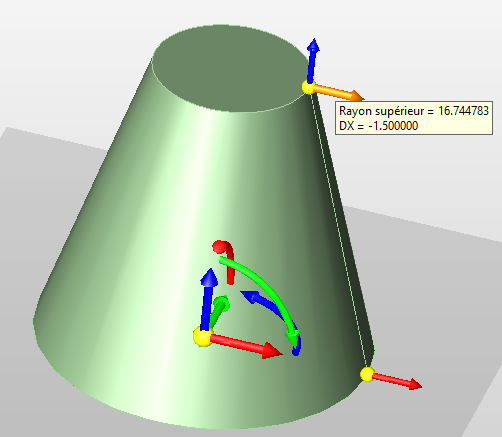

>[!Note]
> Pensez à valider avec **[OK]** pour conserver votre création

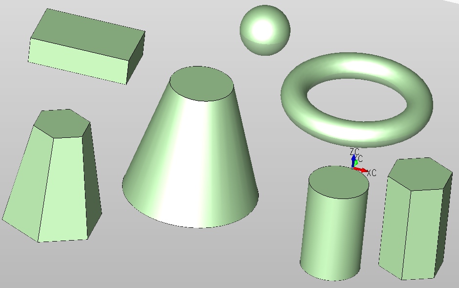

## MODIFIER

### LIMITER

#### Deux

- Permets d’éviter un clic souris pour relimiter une entité.
- S’approcher de l’intersection de la relimite et automatiquement l’opération est effectuée.
- L’option relimite rapide est active par défaut.  

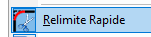
    

  
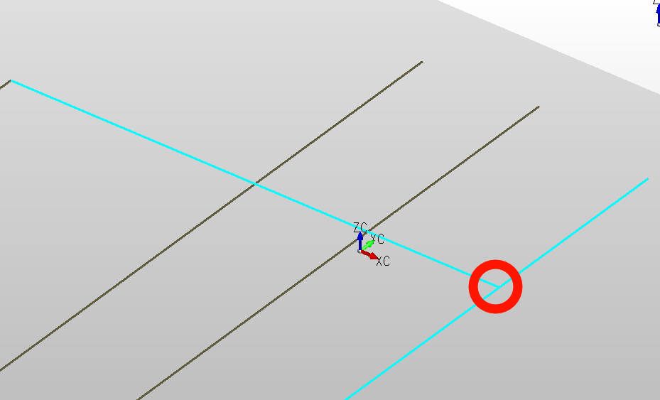

- Idem pour la fonction Congé après avoir indiqué le rayon se positionner près de l’intersection et vous pouvez valider la commande.

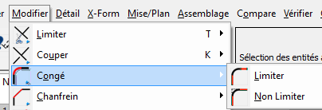

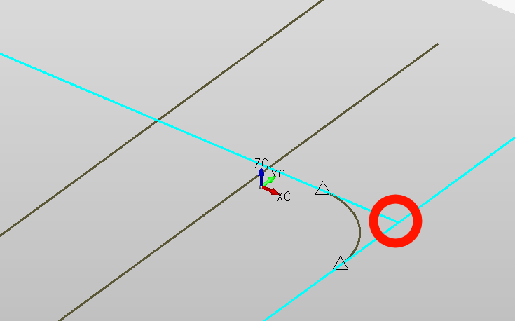

### FACE D’UN SOLIDE

#### Épaissir une face

La fonction épaissir une face comporte maintenant une nouvelle option permettant de pouvoir donner une épaisseur différente pour chaque côté de la face.

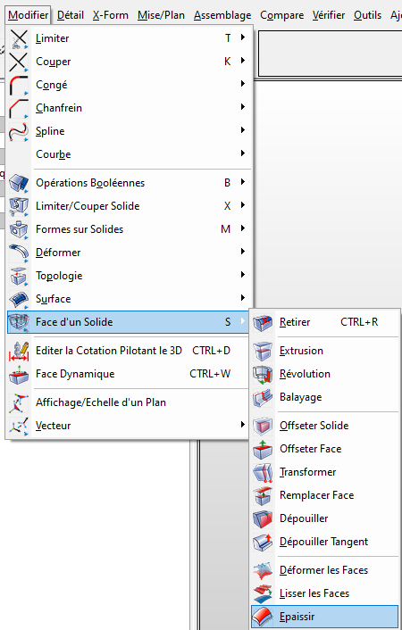

>[!Note]
>La sélection de la flèche indique la première direction

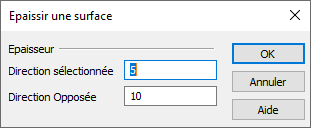

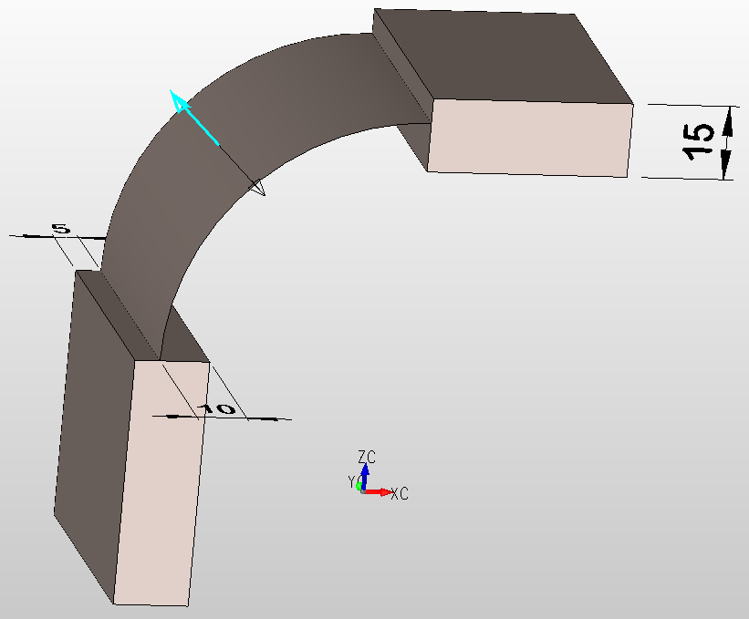

## X-FORM

### DEFORMER

#### Etirer

- La pièce peut être étirée ou déformée en dynamique, suivant le plan de construction, après définition d’une zone 3D suivant une fenêtre ou un polygone quelconque.*Dans les versions précédentes de KeyCreator, la déformation s’effectuait uniquement suivant une vue de projection (face, dessus...)*

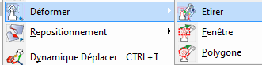

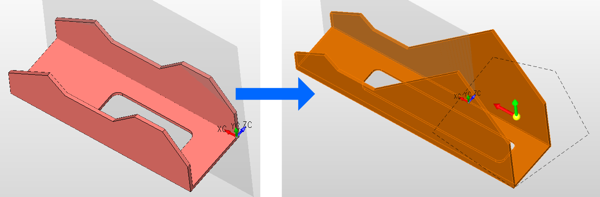

- Le déplacement des axes X et Y du trièdre permet d’orienter la déformation.

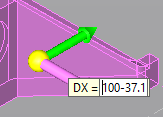

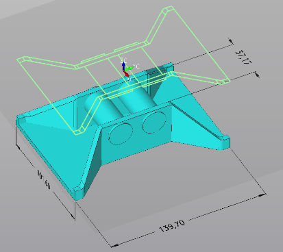 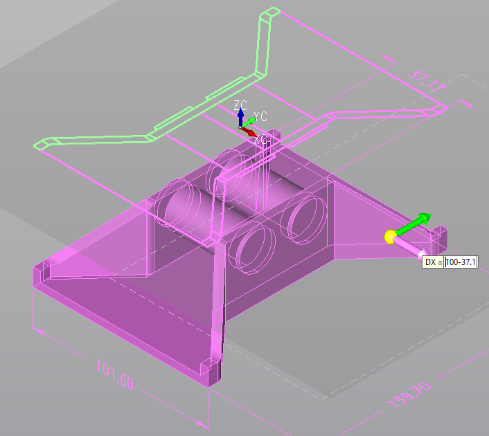 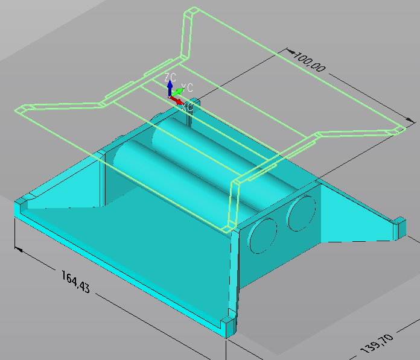

### DEPLACER DYNAMIQUE

- La fonction [Dynamique Déplacer] accessible depuis les menus (ou clic droit) comporte une option [CopieN]

Elle permet de dupliquer les solides N fois (linéaire ou angulaire) en dynamique suivant la position du curseur.

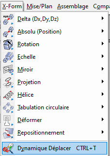

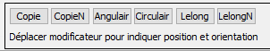

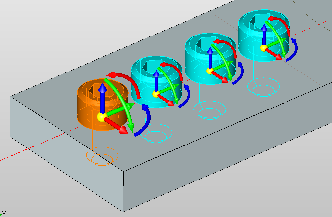

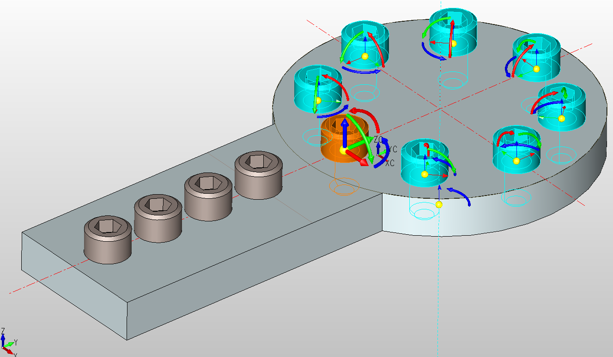

## ASSEMBLAGE

### Editer pièce dans le Contexte

- Une icône indique, maintenant, lorsqu’une pièce d’assemblage est en cours d’édition dans le contexte.
- Assemblage > Editer pièce dans le Contexte.

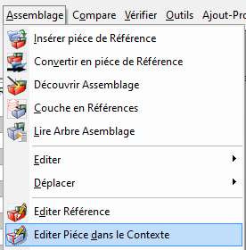 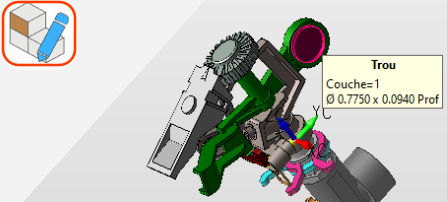

- Fin d’édition Référence dans Contexte permet de terminer l’édition.      
    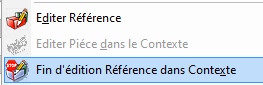
    

## OUTILS

### ELEMENT ASSEMBLAGE

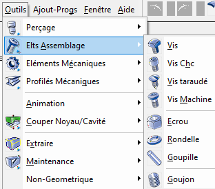 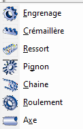 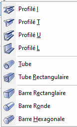

Dans la boite de dialogue pour générer un objet, **l’option [Config] est maintenant désactivée par défaut,** cela permet de pouvoir créer ces pièces comme des solides classiques.

Lorsque cette option est activée (le cas pour les versions précédentes de KeyCreator), les éléments sont créés sous forme d’objets. De ce fait ils ne sont pas éditables et sont bloqués pour la *relimite* ou l’option *déformer fenêtre* *(ex : si actif alors un tube rectangulaire de 500 ne sera pas rallongé)*

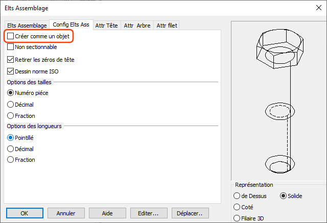 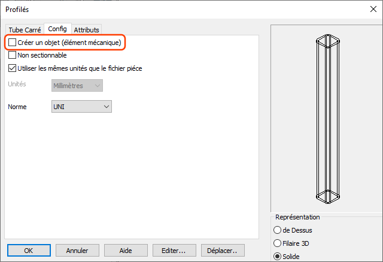 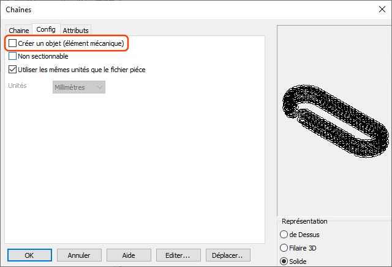

### Options des applications

#### ENTITES (2020)

Une nouvelle option permet de conserver les attributs (couleur...) avec l’option Couper. Auparavant, les attributs courants étaient uniquement utilisés.

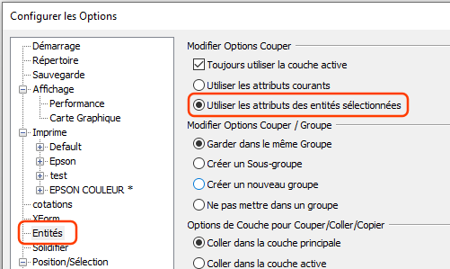 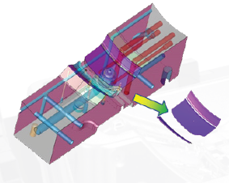

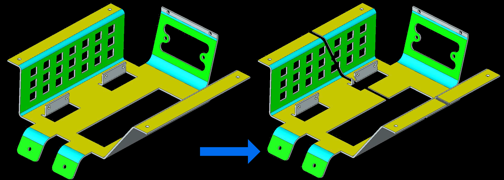

#### SOLIDES

Une nouvelle option permet de visualiser les arêtes d’un solide en trait fin même si celles-ci ont été dessinées différemment. Lors de la sélection, elles réapparaissent suivant les paramètres de création.

#### Option désactivée (par défaut)
 

#### Option activée

## KeyCreator Viewer

### Visualisation des fichiers KeyCreator et Cadkey

Programme indépendant de KeyCreator afin de visualiser, mesurer, imprimer les fichiers CKD.

Valable pour les fichiers KeyCreator (fichier CKD) et Cadkey (fichier PRT)

Vous pouvez installer ce programme sur différents ordinateurs pour consultation des fichiers KeyCreator.

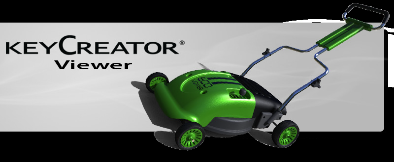

## Récapitulatif AUC ou contrat de maintenance de mise à jour

- Recevoir les mises à jour KeyCreator (au moins une par an)
- Être prioritaire pour toutes demandes de support ou d'information
- Pouvoir demander une licence KeyCreator Home : une seconde licence KeyCreator à utiliser chez vous lié à une adresse Mac (pas de frais supplémentaires)
- Pouvoir commander et remplacer une clé USB défectueuse (nouvelle clé et transport payant)
- Permets d'utiliser le mode d'authentification par login : remplace l'utilisation du code d'activation (la licence est liée à une machine) et permets d'utiliser sa licence sur différents postes (nécessite une connexion internet pour toute utilisation)