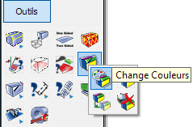
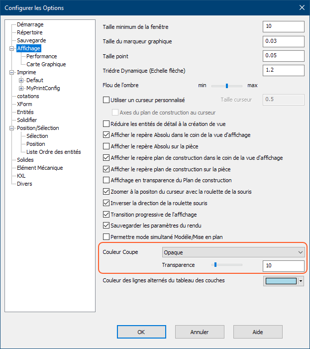

# KeyCreator 2021 SP1

## Généralités

### Système

#### Emplacement

- KeyCreator64.2021.SP1 est installé dans un nouveau répertoire
    - C:\Programmes\Kubotek\KeyCreatorPro2021.SP1
    - Cela permet d'utiliser plusieurs versions différentes de KeyCreator sur la même machine
- Versions 64 bits uniquement

#### Configuration requise

- Système d’exploitation et matériel recommandés pour KeyCreator 2021 SP1

| Matériel | Recommandé | Minimum |
| --- | --- | --- |
| OS | Windows 10 Pro 64-bit | Windows 10 64-bit |
| Processeur | Intel Core i7 (quadcore) ou dual quadcore Xeons ou equivalent AMD | Requis par l’OS(Windows) |
| Mémoire | 16 GB RAM ou plus | 8 GB RAM |
| Carte Graphique | NVIDIA, 1 GB de mémoire ou plus | Pas de minimum |
| Matériel Additionnel | Souris 3 boutons avec roulette ou 3Dconnexion 3D mouse |  |

#### Fin du support de Windows 7 & 8

Microsoft Windows 7 et Windows 8 ne sont plus supporté par Kubotek. 
Ainsi que les versions Windows Server 2008 et Windows Server 2012R2

### Version KeyCreator supportées par Kubotek

- V2021
- V2020
- V2019

**Versions qui ne bénéficient plus d’un support :**

- V15
- V14
- V13
- Toutes les versions antérieures de KeyCreator
- Toutes les versions de Cadkey

### Pas de prise en charge descendante pour les fichiers CKD

Les fichiers .CKD créés avec KeyCreator 2021 ne pourront être lu avec une version plus ancienne de KeyCreator.

En revanche, les fichiers créées avec des anciennes versions de KeyCerator seront ouvrable et editable dans KeyCreator 2021 SP1.

### Type de fichier supportées par KeyCreator 2020 SP1

| Format | Sens | Version supportées | Assemblage | Nouveautés |
| --- | --- | --- | --- | --- |
| ACIS | Import Export | 1.5 R26 - R2019 - R2021 | NON | R 2021 |
| CATIA V4 | Import Export | 4.1.9 - 4.2.4 | NON |  |
| CATIA V5 | Import (Géom+Draw) | V5-6 R2018 - V5 R29 - V5 R30, V5-6 R2020 / R2020x - V5 R31 / R2021 | OUI | V5 R30, V5-6 R2020 / R2020x - V5 R31 / R2021 |
|  | Export Géom + PMI | V5-6 R2018 - V5 R29 - V5 R30, V5-6 R2020 / R2020x - V5 R31 / R2021 | OUI | V5 R30, V5-6 R2020 / R2020x - V5 R31 / R2021 |
|  | Drawing | V5-6 R2018 - V5 R29 - V5 R30 - V5 R31 |  | R30 - R31 |
| Catia V6 | Import | V6 R2019x - V6 R2020 |  | V6 2020 |
| DWG/DXF | Import | Toutes versions jusqu’a 2021 | NON | 2021 |
|  | Export | R12, R13, R14,2000-2018 | NON |  |
| IGES | Import Export | Jusqu’à la version 5.3 | OUI |  |
| Autodesk Inventor | Import | 6-11,2008-2021 | OUI | 2021 |
| JT | Import | Versions 8,9 & 10 | OUI |  |
| Parasolid | Import / Export | Jusqu’à la version 31 | OUI |  |
| IFC | Import | 4 | OUI | 4 |
| Pro/E / CREO | Import | Solide – PMI – Drawing V7 | OUI |  |
| Solid Edge | Import | V18 – ST11 - 2021 | OUI | 2021 |
| Solidworks | Import | 98 - 2019 - 2021 | OUI | 2021 |
| STEP | Import/Export | AP203, AP214, AP 242 | OUI | AP 242 |
| Unigraphics | Import | 11 - 18, NX 1 - 12 -1847 - NX 1919 - NX 1926 | OUI | NX 1919 - NX 1926 |
|  | PMI | PMI 1847 Drawing 1884 - 1919 - 1926 |  | 1919 -1926 |

### Les licences pour le télétravail

- Pour les clients disposant d'un AUC (Contrat de maintenance annuel) actif
    - Il est possible de créer une licence Home (basé sur l'adresse MAC de la seconde machine)
    - Pour les licences par code d'activation, il est possible de remplacer l'activation de la machine (code d'activation) par une activation par login (utilisable sur n'importe quelle machine disposant de KeyCreator et d'internet)
- Pour utiliser les technologies WTS (Windows Terminal Services), il est nécessaire de disposer d'un serveur de licences et de licences flottantes.  
    *WTS est utilisé par les outils d'accès à distance et de virtualisation de Windows (Serveur)*

## Améliorations (Points clés)

- Amélioration de la gestion des matières et des couleurs
    - Amélioration de l'onglet "Matières"
    - Les matières sont stockées dans le fichier et plus sur le système (mieux pour le partage)
    - Ajout de la possibilité de filtrer les entités par leur matière
- Prise en charge du format STEP AP 242
    - La norme AP 242 est la convergence des normes AP203 et AP2014
- Améliorations des options de mise en plan
    - Possibilité de créer des vues auxiliaires perpendiculaire à une ligne du plan
    - Nouvelle fonction pour créer des vues non-alignées

- Améliorations pour les assemblages
    - L'outil plan de coupe dynamique fonctionne maintenant avec les pièces d'assemblage
    - Les cotes sont maintenant affichées par défaut pour les pièces de références (permet de facilement les modifier lors de l'édition dans le contexte)
    - Amélioration de l'affichage de la transparence pour les pièces d'assemblage : maintenant, tous les solides, les pièces de références, les surfaces affichent la transparence de la même façon
- Amélioration des performances et de la productivité
    - Le repère absolu et celui du plan de construction peuvent être utilisés pour définir une direction ou un vecteur
    - Option pour ne sélectionner que les entités au premier plan
    - Dans l'onglet des couches, possibilité de changer la couleur des lignes alternées du tableau
    

## Amélioration de la gestion des matières et couleurs

Ces attributs de matière sont largement utilisés dans l’industrie de moule et d’outillage, ils permettent d'identifier visuellement les informations de fabrication grâce à des couleurs spécifiques.

- Types de trous : dégagement, tape, conduites d’eau...
- Tailles de trous standard de l’entreprise, ...
- Types de surface : Sceller, ligne de pièce, sécurité, ...
- Fraisage CNC vs WEDM/EDM
- Paramètres d’usinage : profondeurs, décalages, finition, ...
- Etc...

 

### Les matières sont sauvegardées avec le fichier KeyCreator (.CKD)

Maintenant, les matières créées sont enregistrées avec le fichier .CKD et plus dans la base de registre du système. Cela permet de plus facilement partager des fichiers sans perdre les réglages de matière ou de transparence, que ce soit en interne ou avec d'autres utilisateurs.

De plus, il est possible d'exporter une ou plusieurs matières dans un fichier (.TXT), cela vous permet de vous constituer facilement une bibliothèque de matière réutilisable en fonction du projet.

> [!NOTE]
> Lorsque plusieurs matières sont sélectionnées, elles sont toutes exportées dans un seul fichier.  
> Si aucune matière n'est sélectionnée, toutes les matières sont exportées dans un seul fichier.

</aside>

### L'onglet "Matières"

Avec KeyCreator 2021, il est plus facile de gérer les matières. L'affichage dans l'onglet est maintenant horizontal et permet de réorganiser l'ordre des matières. Il est aussi possible de sélectionner plusieurs matières avec la souris et les touches <shift> et <ctrl>, pour les effacer, les sauver...

#### KeyCreator 2021

Nouveau fichier  

#### &nbsp;

Un fichier avec différentes matières  

#### Avant

&nbsp;  

#### Modification du menu contextuel des matières

Maintenant, lorsque que l'on effectue un clic-droit dans l'onglet matière (pas sur une matière spécifique), le menu permet d'accéder plus facilement aux fonctionnalités.

- Nouveau : crée une nouvelle matière
- Charger : Permet de charger une matière sauvegarder précédemment (fichier .txt)
  *Répertoire d'exemple : C:\Program Files\Kubotek\KeyCreatorPro.2021.SP1\Textures*
- Sauver : Enregistrer la matière (format .txt)
- Enlever : permet de supprimer la matière d'une face ou d'un solide      
    
    

**Menu onglet matière**  

De même, le menu d'une matière spécifique s'agrémente de deux nouveaux raccourcis :

- Sauver : sauvegarder la matière (fichier .TXT)
- Appliquer : permet d'appliquer la matière a une face, un solide ou une coque (en fonction de la configuration)      
    
    

**Menu matière**  

### Les matières sont importées

Pour les fichiers enregistrés dans des versions plus anciennes ou à partir d’autres systèmes CAO, **les matières sont importées automatiquement** et ajoutées aux propriétés.

Si aucun nom de matière n’est disponible, la valeur de la propriété RGB et/ou les autres valeurs sont utilisées dans le nouveau nom.

Les propriétés matière incluent plus de choses que juste les couleurs RVB : couleur, ambiance, spécularité, transparence, brillance, miroir et texture.

Le nom de la matière est assigné à une face ; utilisable pour le filtrage suivant matière.

Les trois comportements suivants ont été mis en place lorsque des matières en double sont importés :

1. Aucune matière en double ne sera créée lors d’une importation
2. Lorsqu’une matière importée est identique à un nom d'une matière existante, mais qu’il a des propriétés différentes (RGB, etc.), le nom de la matière nouvellement importée sera incrémenté (Mnom, Mnom (1), Mnom(2), etc.)
3. Si les propriétés matières d’une face importé correspondent à une matière existante 
    - Pas de double créé
    - Applique la matière appropriée aux faces importées      
    
    

### Filtre par matière

Lors d'une sélection, il est maintenant possible de filtrer par matière.

Les options "Ajout/entité" et "Svt Entité" fonctionnent maintenant avec les matières.

### Changer la couleur avec l'outil "Change Couleurs"

La fonction reste la même, mais elle a été mise à jour pour gérer les matières. 

Lors de l'utilisation de la fonction, une matière est créée dans l'onglet matière. Cela permet différents usages notamment pour filter lors d'une sélection.

### Mise à jour du menu pour la fonction "Change couleur"

Pour une homogénéisation de l'interface, la fonction "Change couleur" est maintenant accessible dans le menu :  
*Editer > Entités > Texture > Couleur.*

**Menu Editer > Entités > Texture > Couleur**  

**Panneau Solie/Surface > outils**  

**Barre d'outils > Outils Face**  

### La boite de dialogue "Rendu Matière"

La boite de dialogue "Rendu Matière" a maintenant une case à cocher pour éviter de modifier accidentellement une matière.

Les matières nouvellement chargés et édités sont ajoutées ou mises à jour au besoin dans l'onglet matière.

### La boite de dialogue "Format Face"

La commande "Format Face", accessible depuis le menu contextuel (clic droit), a une nouvelle option pour enregistrer la matière. De plus, elle a été mise à jour pour prendre en charge les matières (toute modification impliquera la mise à jour de la matière).

- Bouton "Sauver" : les propriétés matières seront enregistrées en tant que fichier .txt pour être ré-utilisé plus tard

 

### L'outil "Copier attributs"

L'outil **Copier attributs** applique le nom de la matière et les propriétés de la face (d'une face à l'autre).

## Fichier STEP norme AP242

Nouvelle prise en charge des fichiers STEP avec la norme AP242. 

La convergence des normes AP203 et AP214 est maintenant connue sous le nom d’AP242. Il inclut également de nouvelles fonctionnalités qui ont un impact sur : 

- Définition basée sur le modèle (MBD)
- Intégration PDM et services PDM
- Archivage à long terme (LTA)
- Intégration de la "Supply chain"
- Données de conception d’ingénierie
- Information sur la fabrication de produits (PMI)

Ce que KeyCreator peut lire sur ces fichiers :

- Les assemblages
- B-Rep
- PMI
- Mesh

KeyCreator 2021 SP1 permet aussi l'export en norme AP 242 des fichiers STEP. Il est possible d'exporter :

- Un assemblage
- Des solides et corps solides
- Des profiles et des points
- Des surfaces
- Les couleurs
- Les couches

### Fichiers STEP compressés

KeyCreator prend en charge les fichiers STEP compressé en import et en export. Ils sont automatiquement compressés lors de la génération d’un fichier STEP.
Les fichiers STEP compressés peuvent aussi avoir l'extension .STPZ.

## Nouvelles fonctions pour la mise en plan

### Projection d'une Vue

*Mise en plan > Projection d'une Vue*

Dans la fonction *Projection d'une Vue*, l’option "Multi" permet de créer une vue auxiliaire « Perpendiculaire à une ligne du plan » lorsqu’aucun bord ou plan parallèle ne donne la vue désirée 

- Utilisez le bouton Multi et sélectionnez simplement la ligne d’instance pour projeter une vue perpendiculaire
    - Les cotes restent associées lors du rendu wireframe
    - Élimine la création et l’enregistrement manuelle d’une vue de modèle à utiliser dans la mise en plan

### Fonction vue Non-Aligné

*Mise en Plan > Alignement des Vues > Non-aligné*

Permet d'enlever l'alignement par rapport à d'autre vue.

### Indicateur d'alignement de vue

Le déplacement générique d’une instance de vue affiche maintenant une ligne fantôme surlignée montrant les associations d’alignement actuelles.

## Améliorations pour les assemblages

### Plan de coupe sur les pièces d'assemblage

*Affichage > Plans de Coupe > Plans de Coupe*

Il est maintenant possible de récupérer un plan de coupe d'un assemblage, via la fonction "Limiter" de la coupe.

 

### Changement des options d'importation d'un assemblage

À la suite de la demande des utilisateurs, l'option d'importation d'assemblage **par défaut** a été modifier pour importer tous les solides de référence dans la pièce. 

Il est toujours possible de changer l'option pour importés les solides de référence dans différents fichiers ou dans différentes pièces (dans le même fichier).

>[!NOTE]
>L'import de fichiers .IFC n'a pas cette option

### Cotes affichées pour les pièces de références

Lors de l'insertion d'une nouvelle pièce de référence (assemblage), l'option "Affiche Détails" est coché par défaut.

Cela permet de facilement utiliser la cotation pilotante lorsque l'on utilise "Editer Pièce dans le contexte".

- Les fichiers déjà créés gardent leur réglage actuel.
- Il est toujours possible de changer l'option (décocher), et ce, aussi, sur plusieurs pièces à la fois (Clic-droit > Tout sélectionner > Clic-droit > Inclure entités Détail)

  

## Améliorations des performances et de la productivité

### Repère Absolu et Repère du plan de construction sélectionnables

Le repère Absolu et le repère du plan de construction sont maintenant sélectionnables et utilisables pour définir un emplacement ou une direction (un vecteur).

Les trois repères sont utilisables : le repère absolu, le repère du plan de construction et le repère du plan de construction sur la pièce.

Vérifier dans les options que les repères soient bien affichés

Lorsque vous survoler la sphère ou le vecteur, une info-bulle apparait pour vous permettre de sélectionner soit l'origine ou un axe (vecteur). Cela peut être utiliser pour définir une location (position) ou un vecteur de direction (utile dans certaines commandes).

  

#### Clic droit sur le repère Absolu

Un clic droit sur le repère Absolu, vous permet de modifier la vue.

#### Clic droit sur le repère du Plan de construction

Un clic droit sur le repère du plan de construction (ou celui sur la pièce), vous permet de changer de plan de construction facilement.

### Améliorations des fonctions appelées via le menu contextuel (Clic-droit)

Les fonctions appelées via le menu contextuel fonctionnent maintenant comme les fonctions appelées via le menu ou les icônes. 

Précédemment, la plupart des fonctions ne permettaient pas la répétions de la commande, lorsqu'elles étaient appelées via le clic-droit. Maintenant, les fonctions s'exécutent sur la sélection puis permettent de sélectionner d'autres entités pour être appliqué de nouveau.

### Option "Sélection au premier plan"

Le nouvelle option "Sélection au premier plan" permet de bloquer les entités sélectionnables sous le curseur sur les éléments du premier plan.  
Cela permet de ne pas sélectionner une ligne ou une face par erreur, notamment pour des modélisations complexes.  
Ce mode de sélection fonctionne sur tous les modes d'affichages incluant le mode d'affichage filaire.

**Pour l'activer**  
*Editer > Attributs système > Sélection au premier plan*  
*Outils > Options des applications... >  Position/Sélection*

 

### Chaînage rapide n'est plus actif par défaut

La fonction "Chainage Rapide" introduite dans KeyCreator 2020 n'est plus active par défaut (à la demande des utilisateurs).

L'option peut être modifié dans :

- Editer > Attributs système > Chaînage Rapide
- Outils > Option des applications... > Position/Sélection > Permettre la sélection rapide en chaînage

 

### Transparence du plan de coupe

Tous les plans de coupe utilisent une nouvelle option de transparence.

- Outils > Options des Applications... > Affichage > Couleur Coupe
- *Par défaut 10%*

 

### Amélioration de la transparence

Maintenant la transparence s'affiche de la même façon pour les solides, les surfaces ou les pièces de référence (assemblage).

**AVANT :**

**KEYCREATOR 2021 :**

## Affichage lignes alternés pour les couches

Il y a maintenant une option pour modifier la couleur des lignes alternés du tableau des couches.

- Outils > Options des Applications... > Affichage > Couleur Coupe
- *Nécessite un redémarrage de KeyCreator pour être pris en compte*

### Suppression du menu "Compare"

À la suite de la suppression du menu "Compare" une zone grise apparaît (pour les personnes ayant mis à jour KeyCreator).

Pour corriger le problème, deux possibilités :

- Soit aller dans Outil > Personnaliser... et cliquer sur "Réinitialise Rendu"  

    
- Soit en gardant la touche ALT appuyé, cliquez et faite glisser la zone grise vers la partie modélisation pour la supprimer  

    
> [!NOTE]
> N'oubliez pas de sauvegarder environnement (fichier WSP) modifié

### Exportation d'assemblage STEP et IGES

Lors de l'exportation d'assemblage en STEP et IGES, le nom des pièces de référence est maintenant compatible avec la convention de nommage d'autres systèmes CAO.

### Prise en charge des fichiers .DFT

- Pour KeyCreator SX (Max) seulement
- Ajout de la prise en charge des fichiers de dessin Solid Edge (*.DFT)

## Modification SDK

### New SDK functions

- kc_get_file_units()
Get the units of certain file types. (step, iges, sat, sab, Parasolid, catia5, ckd, ckt).
- IsDBLocked()
Returns true if the database is locked against editing.

### Enhanced SDK functions

- GenSel()
    - Allows pre-selected entities
    - Give handle to Part References
- GetPosMatrix()
    - Added DynaHandle callback when released

## Liste des corrections (PDF en anglais)

[Fixes KC 21 SP1 (en).pdf](assets/files/bug_fixes_kc_21_SP1_en.pdf ':ignore')

## KeyCreator Viewer

### Visualisation des fichiers KeyCreator et Cadkey

Programme indépendant de KeyCreator afin de visualiser, mesurer, imprimer les fichiers CKD.

Valable pour les fichiers KeyCreator (fichier CKD) et Cadkey (fichier PRT)

Vous pouvez installer ce programme sur différents ordinateurs pour consultation des fichiers KeyCreator.

## Récapitulatif AUC ou contrat de maintenance de mise à jour

- Recevoir les mises à jour KeyCreator (au moins une par an)
- Être prioritaire pour toutes demandes de support ou d'information
- Pouvoir demander une licence KeyCreator Home : une seconde licence KeyCreator à utiliser chez vous liée à une adresse Mac (pas de frais supplémentaires)
- Pouvoir commander et remplacer une clé USB défectueuse (nouvelle clé et transport payant)
- Permets d'utiliser le mode d'authentification par login : remplace l'utilisation du code d'activation (la licence est liée à une machine) et permets d'utiliser sa licence sur différents postes (nécessite une connexion internet pour toute utilisation)