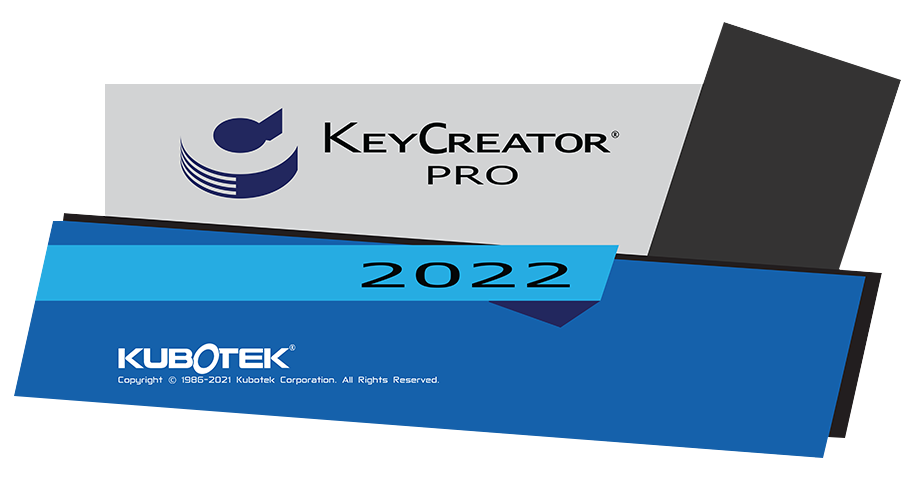

# KeyCreator Pro 2022 SP0

## Généralités

### Système

#### Emplacement

- Keycreator64.2022.SP0 est installé dans un nouveau répertoire
    - C:\Programmes\Kubotek\KeyCreatorPro2022.SP0
    - Cela permet d'utiliser plusieurs versions différentes de KeyCreator sur la même machine
- Versions 64 bits uniquement

#### Configuration requise

- Système d’exploitation et matériel recommandés pour KeyCreator 2022 SP1

| Matériel | Recommandé | Minimum |
| --- | --- | --- |
| OS | Windows 10 Pro 64-bit | Windows 10 64-bit |
| Processeur | Intel Core i7 (quadcore) ou dual quadcore Xeons ou equivalent AMD | Requis par l’OS (Windows) |
| Mémoire | 16 GB RAM ou plus | 8 GB RAM |
| Carte Graphique | NVIDIA, 1 GB de mémoire ou plus | Pas de minimum |
| Matériel Additionnel | Souris 3 boutons avec roulette ou 3Dconnexion 3D mouse |  |

#### Fin du support de Windows 7 & 8

Microsoft Windows 7 et Windows 8 ne sont plus supporté par Kubotek. 
Ainsi que les versions Windows Server 2008 et Windows Server 2012R2

### Version KeyCreator supportées par Kubotek

- V2022
- V2021
- V2020
- V2019

**Versions qui ne bénéficient plus d’un support :**

- Toutes les versions antérieures de KeyCreator
- Toutes les versions de Cadkey

### Pas de prise en charge descendante pour les fichiers CKD

Les fichiers .CKD créés avec KeyCreator 2022 ne pourront être lu avec une version plus ancienne de KeyCreator.

En revanche, les fichiers créées avec des anciennes versions de KeyCreator seront ouvrable et éditable dans KeyCreator 2022 SP1.

### Type de fichier supportées par KeyCreator 2020 SP1

| Format | Sens | Version supportées | Assemblage | Nouveautés |
| --- | --- | --- | --- | --- |
| ACIS | Import - Export | 1.5 R26 - R2019 - R2021 | NON |  |
| CATIA V4 | Import - Export | 4.1.9 - 4.2.4 | NON |  |
| CATIA V5 | Import (Géom+Draw) | V5-6 R2018 - V5 R29 - V5 R30, V5-6 R2020 / R2020x - V5 R31 / R2021 | OUI | V5 R31 / R2021 |
|  | Export Géom + PMI | V5-6 R2018 - V5 R29 - V5 R30, V5-6 R2020 / R2020x - V5 R31 / R2021 - R33 | OUI | R33 |
|  | Drawing | V5-6 R2018 - V5 R29 - V5 R30 - V5 R31 |  |  |
| Catia V6 | Import | V6 R2019x - V6 R2021x |  | V6 R2021x |
| AutoCAD DWG/DXF | Import - Export | Toutes versions jusqu’a 2021 | NON |  |
|  | Export | R12, R13, R14,2000-2018 | NON |  |
| IGES | Import - Export | Jusqu’à la version 5.3 | OUI |  |
| Autodesk Inventor | Import | 6-11,2008-2022 | OUI | 2022 |
| JT | Import | Versions 8,9 & 10 | OUI |  |
| Parasolid | Import - Export | Jusqu’à la version 31 | OUI |  |
| IFC | Import | 4 | OUI |  |
| Pro/E / CREO | Import | Solide – PMI – Drawing - V8 | OUI | V8 |
| Solid Edge | Import | V18 – ST11 - 2021 | OUI |  |
| Solidworks | Import | 98 - 2019 - 2021 | OUI |  |
| STEP | Import - Export | AP203, AP214, AP 242 | OUI |  |
| Unigraphics | Import | 11 - 18, NX 1 - 12 -1847 - NX 1919 - NX 1926 - NX 1980 | OUI | NX 1980 |
|  | PMI | PMI 1847 Drawing 1884 - 1919 - 1926 |  |  |

### Rappel : les licences pour le télétravail

- Pour les clients disposant d'un AUC (Contrat de maintenance annuel) actif
    - Il est possible de créer une licence Home (basé sur l'adresse MAC de la seconde machine)
    - Pour les licences par code d'activation, il est possible de remplacer l'activation de la machine (code d'activation) par une activation par login (utilisable sur n'importe quelle machine disposant de KeyCreator et d'internet)
- Pour utiliser les technologies WTS (Windows Terminal Services), il est nécessaire de disposer d'un serveur de licences et de licences flottantes.
*WTS est utilisé par les outils d'accès à distance et de virtualisation de Windows (Serveur)*

## Améliorations (en bref)

Dans la continuité de KeyCreator 2021, les améliorations de KeyCreator 2022 sont axées sur la réutilisation des données CAO et la productivité, sans interrompre les flux de travail établis.

La poursuite des modifications pour la gestion des matières et couleurs permet une utilisation plus efficace en se conformant aux exigences des flux de travail. 

Dans les mises en plan, les améliorations des vues projetées rendent la création de projections 2D plus fiable et plus rapide à partir des arêtes, des lignes cachées et des lignes liées. 

Pour ceux qui utilisent des assemblages, une amélioration significative des performances lors de la lecture des assemblages avec un grand nombre de références de pièces a été apportée. 
Les résultats des tests internes et des clients bêta montrent que les assemblages avec des références de pièces externes s'ouvrent de 40 à 50 % plus rapidement, et que les assemblages avec des références de pièces internes s'ouvrent jusqu'à 80 % plus rapidement. 

KeyCreator 2022 continu de bonifier son ergonomie et ses performances en simplifiant et améliorant certaines fonctions, boîtes de dialogue et divers flux de travail. 
Ceux-ci inclus :

- L’opération Booléenne Soustraire applique maintenant les matières/couleurs à partir des solides soustraits
- Nouvelles options de sélection de premier plan et de profil 2D
- Nouvelles fonctions SDK/KXL
- Suppression automatique de la surbrillance lors de la sélection dynamique (cliquer et déplacer) pour les modèles lourds.
- Des possibilités supplémentaires sur l’utilisation dans le contexte des pièces de références (assemblage)
- La visualisation améliorée dans le plan de coupe dynamique pour inclure la transparence.

KeyCreator 2022 continue d'améliorer l'interopérabilité en ajoutant l'option d'exportation STEP AP242, la lecture des fichiers de dessin Solid Edge natifs. Onze autres interfaces CAO ont été mise à jour vers leurs dernières versions.

Pour finir, KeyCreator 2022 SP0 corrige également une vulnérabilité potentielle dans les versions précédentes liée à l'ouverture de fichiers CAO malveillants. Cela concerne spécifiquement les fichiers de dessin IFC et 2D.

## Amélioration des matières (couleurs)

### Amélioration du lien entre les matières/couleurs et les faces

- Maintenant lorsqu’une matière est modifiée dans l’onglet matière, elle peut être appliqué sur tous les solides/faces/surfaces qui utilisent cette matière.
    - L’utilisateur a le choix de mettre à jour ou non

- Lors de la suppression d’une matière, l’utilisateur peut supprimer la matière associée à un solide, une face ou une surface.
    
    Il s’agit d’une amélioration essentielle pour les industries d’outillage et de conception de moules car les couleurs (matières) ont des significations spécifiques dans la conception et les flux de travail. 
    

- L’utilisateur a le choix d’appliquer le nom de la matière, cela peut être utile pour appliquer une matière (couleur) et ensuite appliquer la transparence sans changer le nom de la matière.

### Prévisualisation des matières dans les boites de dialogues

Toutes les boîtes de dialogue avec des matières sont redimensionnables et affichent une liste déroulante avec un aperçu des matières. Cela permet d’avoir un indice visuel rapide et de pouvoir gérer un grand nombre de matière en agrandissant la boîte de dialogue, toujours dans le but de faciliter la conception et d’améliorer les flux de travail.

### Opérations booléennes et matière

- La soustraction booléenne applique désormais les couleurs (matières) du solide de soustraction.

- Cela fonctionne aussi avec la soustraction d’un solide par une surface

- Cette migration de couleur ne s'applique pas aux palettes standards de 1 à 64 couleurs utilisée sur la géométrie.

## Amélioration des fonctions de sélection

### Option sélection automatique de Contour 2D : Filtre Profil 2D

*Editer > Attributs système > Filtre Profil 2D*

Permet de sélectionner rapidement et automatiquement un contour fermé (plan).

Après l’ajout de l’option “Chaînage Rapide” dans KeyCreator 2020, cette nouvelle option permet d’avoir encore plus de précision lors de la sélection d’une chaine de lignes (arcs).

#### Rappel sur les sélections automatique

- Chaînage Rapide permet de sélectionner automatiquement une chaine de ligne ouverte ou fermé
    - Limiter le chaînage permet d’obliger le chainage à être réalisé dans le même plan
    - Suivant l’emplacement du curseur, on peut sélectionner une partie de la chaîne
- Filtre Profil 2D permet de ne sélection qu’un chainage de ligne **fermé,** aussi appelé contour.

>[!NOTE]
>Il est possible d’activer toutes ces options en même temps. Comme l’option “Chaînage rapide” permet une sélection plus large que “Filtre Profil 2D”, l’option “Filtre Profil 2D” n’aura pas d’effet.

>[!TIP] 
>Lors du survol d’un chainage grâce à l’une de ces options, il est toujours possible de basculer vers la sélection d’une seule ligne en appuyant sur la touche espace.

#### Les options de sélection automatique ont été regroupés

*Outils > Options des applications... > Position/Sélection > Permettre la sélection dynamique*

### Rappel : Option "Sélection au premier plan"

L’option "Sélection au premier plan" permet de bloquer les entités sélectionnables sous le curseur sur les éléments du premier plan.  
Cela permet de ne pas sélectionner une ligne ou une face par erreur, notamment pour des modélisations complexes.  
Ce mode de sélection fonctionne sur tous les modes d'affichages incluant le mode d'affichage filaire.  

**Pour l'activer**  
*Editer > Attributs système > Sélection au premier plan*  
*Outils > Options des applications... >  Position/Sélection*

 

### Amélioration de l’infobulle avec l’option Chainage Rapide

Mise à jour de l’infobulle lors de l’utilisation de l’option Chainage Rapide pour informer l'utilisateur de ce qu'il a sélectionné et pas seulement de ce qui se trouve sous le curseur. 

Cela inclus :

- Nombre d’entités
- Le numéro de la couche si toutes les entités sont dans la même couche
- Le périmètre ou la longueur de toute la chaine

#### Possibilité de changer le délai d’affichage de l’infobulle

*Outils > Options des applications... > Position/Sélection > Sélection > Délai d’affichage de l’infobulle d’une entité*

Par défaut : 0.4

## Améliorations diverses

### Amélioration sur l’utilisation dans le contexte des pièces de références (assemblage)

L’amélioration de la sélection des formes, lors de l’édition dans le contexte d’une pièce de référence, permet une modalisation plus rapide et plus flexible.

De nouvelles fonctions sont disponibles lors de l’édition dans le contexte : 

- Modifier > Topologie > Découdre une face > Copier
- Xform > Offset chainage

### Amélioration de la fonction Contour Dynamique

- Le menu lors du clic droit inclus les boutons Retour et Zoom Auto pour une utilisation plus facile et rapide.
- Utilisez la touche TAB pour accéder et parcourir les champs de l'infobulle pour les entrées de longueur et d'angle.

 

### Nouvelles fonctions pour SDK/KXL

Fonctions ajoutées pour donner plus de capacités aux utilisateurs et aux partenaires pour personnaliser et travailler avec KeyCreator.

- Access to printer configurations
- Selection by ID number
- Show if the database is locked
- Get units of certain file types
- DynaHandle callback
- Access to pre-selected entities
- Handles to part reference

### Transparence du plan de coupe

Une nouvelle option a été ajouté pour définir la valeur par défaut du pourcentage de transparence lors de l’utilisation de la fonction Plan de Coupe. Cette option améliore considérablement la compréhension et la visualisation.

- Outils > Options des Applications... > Affichage > Couleur Coupe
- *Par défaut 10%*

 

## Amélioration des performances

### Ouverture d’assemblage

Amélioration des performances lors de l’ouverture d’un assemblage, que ce soit avec des références internes ou externes.

- Ouverture 40, 50 % plus rapide pour les références externes
- Ouverture 80% plus rapide pour les références internes
- Plus il y a de références de pièces dans un fichier d'assemblage, plus l'amélioration du temps d'ouverture du fichier d’assemblage est importante.

### Sélection dynamique améliorée

La sélection dynamique (cliquer et déplacer) a été améliorée en désactivant la surbrillance pour les sélections lourdes.

### Protection contre les fichiers IFC et 2D CAO malveillants

KeyCreator 2022 inclut des mises à jour importantes qui atténuent les vulnérabilités d’exécution dans les versions précédentes liées à l’ouverture de fichiers CAO malveillants.
Concerne uniquement les fichiers de dessin IFC et 2D

> Détails :
> - Des chercheurs d’une organisation de test indépendante, Zero Day Initiative, ont identifié des vulnérabilités dans les composants sous licence utilisés par les produits Kubotek et d’autres logiciels d’ingénierie populaires.
> - Aucun exploit public ciblant spécifiquement ces vulnérabilités n’est connu
Ces vulnérabilités nécessitent une action de l’utilisateur (ouverture d’un fichier malveillant) et ne sont pas exploitables à distance
> - Zero Day Initiative a publié des avis sur cet ensemble de problèmes le 5-12-21 (liés à leurs tests de Siemens Solid Edge Viewer) Exemple : [https://www.zerodayinitiative.com/advisories/ZDI-21-566/](https://www.zerodayinitiative.com/advisories/ZDI-21-566/)

## Amélioration de la mise en plan et de la cotation

### Mise en plan : nouvelles possibilités pour la projection d’une vue

Diverses améliorations ont été apportées à l’affichage des vues dans la mise en plan.  
Les rendus “Lignes caché précises” et “Lignes cachées précises améliorées” projettent de la même manière. 

L'option MULTI permet de projeter une vue perpendiculairement ou le long d’une arête du solide (**lignes noires**), d’une ligne liée à une vue (**lignes bleues**), d’une ligne cachée (**lignes pointillées**) ou d’une ligne 3D de la pièce (**lignes rouges**), via la sélection des flèches directionnelles affichées.  
Toutes ces projections seront de véritables projections 2D planes.

>[!NOTE]
> L’option “Z bloqué” est toujours activé en mode mise plan afin que toute les lignes, arcs et courbes créés soit positionnés en 2D.

### Formatage du texte : Labels Auto

*Détail > Note > Label Auto*  
 

Vous pouvez maintenant ajuster rapidement le formatage du texte pour les labels Auto des trous de perçage via Editer Générique.

### Utilisation du délimiteur Texte Cotation

Permet d’utiliser la valeur d’une cotation ou d’un label à partir de son ID.

### Mise en plan > Détail Bulle (Attributs)

Dans une mise en plan, lors de la création d’une bulle (*Mise en plan > Détail Bulle*), un bouton *Attributs* a été ajouté à la fonction pour facilement éditer les attributs des légendes. Cela permet d’éliminer des étapes d'édition supplémentaires.

### Pré-sélection dans les vues

Amélioration de la prise en charge de la présélection dans la mise en plan pour :
• Mise en plan > Gestion des vues > Cacher la géométrie
• Formater l'entité / Modifier les attributs
• Mise en plan > Déplacer/Eclater Entités
Ceci est important pour les utilisateurs qui préfèrent ou sont habitués à la présélection. La sélection de vue n'est pas requise si toutes les arêtes/entités appartiennent à la même vue.

### Fonction vue Non-Aligné

*Mise en Plan > Alignement des Vues > Non-aligné*

La nouvelle fonction d’alignement de vues, dans la mise en plan, “*Non-aligné”* permet aux utilisateurs de rompre l'alignement associatif pour déplacer plus facilement les vues. Un indicateur d'alignement apparaît avant de terminer l'alignement et pour le déplacement générique.

## Liste des corrections (PDF en anglais)

[Bug_Fixes_KC_2022_SP0_en.pdf](assets/files/bug_kixes_kc_2022_SP0_en.pdf ':ignore')

---

## KeyCreator Viewer

### Visualisation des fichiers KeyCreator

Programme indépendant de KeyCreator afin de visualiser, mesurer, imprimer les fichiers CKD.

Vous pouvez installer ce programme sur différents ordinateurs pour consulter des fichiers KeyCreator.

>[!attention]
> **KeyCreator Viewer 2022 ne prend plus en charge les fichiers Cadkey (.prt, .ptn)**

## Récapitulatif AUC ou contrat de maintenance de mise à jour

- Recevoir les mises à jour KeyCreator
- Être prioritaire pour toutes demandes de support ou d'information
- Pouvoir demander une licence KeyCreator Home : une seconde licence KeyCreator à utiliser chez vous liée à une adresse Mac (pas de frais supplémentaires)
- Pouvoir commander et remplacer une clé USB défectueuse (nouvelle clé et transport payant)
- Permets d'utiliser le mode d'authentification par login : remplace l'utilisation du code d'activation (la licence est liée à une machine) et permets d'utiliser sa licence sur différents postes (nécessite une connexion internet pour toute utilisation)