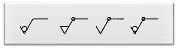
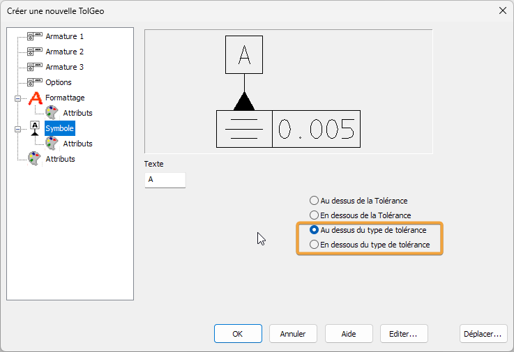

# KeyCreator Pro 2023 SP0

## Généralités

### Système

#### Emplacement
- KeyCreator Pro 2023 SP0 est installé dans un nouveau répertoire
    - C:\Programmes\Kubotek\KeyCreatorPro2023.SP0
    - Cela permet d'utiliser plusieurs versions différentes de KeyCreator sur la même machine
- Versions 64 bits uniquement

#### Configuration requise
- Système d’exploitation et matériel recommandés pour KeyCreator 2023 SP0

| Matériel             | Recommandé                                                        | Minimum                   |
| -------------------- | ----------------------------------------------------------------- | ------------------------- |
| OS                   | Windows 10 ou 11 Pro 64-bit                                       | Windows 10 64-bit         |
| Processeur           | Intel Core i7 (quadcore) ou dual quadcore Xeons ou equivalent AMD | Requis par l’OS (Windows) |
| Mémoire              | 16 GB RAM ou plus                                                 | 8 GB RAM                  |
| Carte Graphique      | NVIDIA, AMD 4 GB de mémoire ou plus                               | Pas de minimum            |
| Matériel Additionnel | Souris 3 boutons avec roulette ou 3D connexion 3D mouse            |                           |

### KeyCreator 2023 supporte Windows 11

Maintenant, Windows 11 est officiellement supporté par KeyCreator 2023 SP0.

Toutefois, Windows 11 modifie la façon dont Microsoft affiche les cases à cocher lorsqu’elles sont sélectionnées.

- Dans certains cas, il est très difficile de voir quels boutons de réglage sont actifs.
    - Ce problème n'est pas propre à KeyCreator et touche de nombreux développeurs qui utilisent le SDK de Microsoft.
    - La réponse de Microsoft sur son site d'assistance est que ce comportement est dû à la conception. Ils suggèrent soit de mettre à niveau le pilote graphique, soit de rétrograder vers Windows 10.

### Version KeyCreator supportées par Kubotek
- V2023
- V2022
- V2021
- V2020

**Versions qui ne bénéficient plus d’un support :**

- Toutes les versions antérieures de KeyCreator
- Toutes les versions de Cadkey

### Pas de prise en charge descendante pour les fichiers CKD

Les fichiers .CKD créés avec KeyCreator 2023 ne pourront être lu avec une version plus ancienne de KeyCreator.  
En revanche, les fichiers créées avec des anciennes versions de KeyCreator seront ouvrable et éditable dans KeyCreator 2022 SP1.

### Type de fichier supportées par KeyCreator 2023 SP0

| Format            | Sens               | Version supportées                                                                                               | Assemblage | Nouveautés                                              |
| ----------------- | ------------------ | ---------------------------------------------------------------------------------------------------------------- | ---------- | ------------------------------------------------------- |
| ACIS              | Import - Export    | 1.5 R26 - R2019 - R2021- R2022                                                                                   | NON        | 2022                                                    |
| AutoCAD DWG/DXF   | Import - Export    | Toutes versions jusqu’a 2021                                                                                     | NON        |                                                         |
| Autodesk Inventor | Import             | 6-11,2008-2023                                                                                                   | OUI        | 2023                                                    |
| CATIA V4          | Import - Export    | 4.1.9 - 4.2.4                                                                                                    | NON        |                                                         |
| CATIA V5          | Import (Géom+Draw) | V5-6 R2018 - V5 R29 - V5 R30, V5-6 R2020 / R2020x - V5 R31 / R2022                                               | OUI        | R2022                                                   |
| Catia V6          | Import             | V6 R2019x - V6 R2021x - 3dxml                                                                                    |            | 3dxml                                                   |
| IFC               | Import             | 4                                                                                                                | OUI        |                                                         |
| IGES              | Import - Export    | Jusqu’à la version 5.3                                                                                           | OUI        |                                                         |
| JT                | Import             | Versions 8,9 & 10                                                                                                | OUI        |                                                         |
| Parasolid         | Import - Export    | Jusqu’à la version 34                                                                                            | OUI        | 34                                                      |
| Pro/E / CREO      | Import             | Solide – PMI – Drawing - V9                                                                                      | OUI        | V9                                                      |
| Solid Edge        | Import             | V18 – ST11 - 2021 - 2022                                                                                         | OUI        | 2022                                                    |
| Solidworks        | Import             | 98 - 2019 - 2021 - 2022                                                                                          | OUI        | 2022                                                    |
| STEP              | Import - Export    | AP203, AP214, AP 242                                                                                             | OUI        |                                                         |
| Unigraphics       | Import             | 11 - 18, NX 1 - 12 -1847 - NX 1919 - NX 1926 - NX 1980 - NX2000, NX2007, NX2008, NX2011, NX2015, NX 2019, NX2027 | OUI        | NX2000, NX2007, NX2008, NX2011, NX2015, NX 2019, NX2027 |
|                   | Export Géom + PMI  | V5-6 R2018 - V5 R29 - V5 R30, V5-6 R2020 / R2020x - V5 R31 / R2021 - R33                                         | OUI        |                                                         |
|                   | Drawing            | V5-6 R2018 - V5 R29 - V5 R30 - V5 R31                                                                            |            |                                                         |
|                   | Export             | R12, R13, R14,2000-2018                                                                                          | NON        |                                                         |
|                   | PMI                | PMI 1847 Drawing 1884 - 1919 - 1926                                                                              |            |                                                         |
| Rhino             | Import             | 3dm                                                                                                              |            | Rhino 3dm                                               |

### Rappel : les licences pour le télétravail

- Pour les clients disposant d'un AUC (Contrat de maintenance annuel) actif
    - Il est possible de créer une licence Home (basé sur l'adresse MAC de la seconde machine)
    - Pour les licences par code d'activation, il est possible de remplacer l'activation de la machine (code d'activation) par une activation par login (utilisable sur n'importe quelle machine disposant de KeyCreator et d'internet)
- Pour utiliser les technologies WTS (Windows Terminal Services), il est nécessaire de disposer d'un serveur de licences et de licences flottantes.
*WTS est utilisé par les outils d'accès à distance et de virtualisation de Windows (Serveur)*

## Améliorations (en bref)
<!-- Faire un résumé des améliorations -->
Les avantages de la productivité et des performances de la version KeyCreator Pro 2023 étaient basés sur les données collectées
des utilisateurs de KeyCreator axés sur la réutilisation des données CAO et la productivité sans interrompre les
flux de travail. Pour ceux qui travaillent avec les industries aérospatiale et automobile, vous connaissez les
utilisation accrue de la technologie MBD/PMI. Cela a nécessité une mise à niveau vers les dernières normes et la poursuite
améliorations de nos outils de détail. Ces améliorations incluent :
• Tolérances d'ajustement ISO
• Nouvelle norme de finition de surface JIS
• Amélioration des symboles de contrôle des fonctionnalités (FCS)
• Possibilité d'ajouter plusieurs références
• Tolérance de référence pour les annotations
• Nouvelles positions d'attachement sur les cotes et les annotations.
• Ajout d'options de cotation à deux
Des améliorations supplémentaires de la productivité de KeyCreator 2023 traitent de la convivialité et éliminent les étapes supplémentaires
dans diverses fonctions. Ceux-ci inclus:
• Améliorations de l'esquisse
• Amélioration de la sélection dans les fonctions
• Automatisation de l'exportation des références de pièces légères
• Fonction composite améliorée
• Placement des rondelles
• Nouveau préfixe pour les vues associatives dans la mise en page
• Amélioration des faces non cousues à l'aide de matériaux
• Performances avec les polices True Type
• Sélection de la flèche de direction de la vue frontale
KeyCreator 2023 continue d'améliorer l'interopérabilité des importations en ajoutant Catia V6 3DXML, Rhino et JT
types de fichier. Neuf autres traducteurs ont été mis à jour vers leurs dernières versions.

---

Les avantages en termes de productivité et de performance de la version 2023 de KeyCreator Pro ont été basés sur des données collectées auprès d'utilisateurs de KeyCreator.
d'utilisateurs de KeyCreator soucieux de réutiliser les données CAO et de gagner en productivité sans interrompre les flux de travail établis.
flux de travail établis. Ceux qui travaillent dans les secteurs de l'aérospatiale et de l'automobile savent que la technologie MBD/PMI est de plus en plus utilisée.
l'utilisation croissante de la technologie MBD/PMI. Cela a nécessité une mise à niveau vers les normes les plus récentes et des améliorations constantes de nos outils de dessin.
et l'amélioration continue de nos outils de dessin. Ces améliorations sont les suivantes
- Tolérances d'ajustement ISO
- Nouvelle norme JIS sur les états de surface
- Amélioration des symboles de contrôle des caractéristiques (FCS)
- Possibilité d'ajouter plusieurs points de référence
- Tolérance de référence pour les annotations
- Nouvelles positions d'attachement sur les dimensions et les annotations.
- Ajout de deux options de cotation
D'autres améliorations de la productivité de KeyCreator 2023 portent sur la facilité d'utilisation et l'élimination des étapes supplémentaires dans diverses fonctions.
dans diverses fonctions. Il s'agit notamment des améliorations suivantes
- Améliorations de l'esquisse
- Amélioration de la sélection dans les fonctions
- Automatisation de l'exportation des références de pièces légères
- Amélioration de la fonction composite
- Placement des rondelles
- Nouveau préfixe pour les vues associatives dans la mise en page
- Amélioration des faces non piquées utilisant des matériaux
- Performance avec les polices True Type
- Vue frontale Sélection de la flèche de direction
KeyCreator 2023 continue d'améliorer l'interopérabilité des importations en ajoutant les types de fichiers Catia V6 3DXML, Rhino et JT
. Neuf autres traducteurs ont été mis à jour vers leurs dernières versions.

---

Les améliorations de KeyCreator Pro 2023 ont été axées sur la réutilisation des données CAO et la productivité sans interrompre les
flux de travail. Ceux qui travaillent dans les secteurs de l'aérospatiale et de l'automobile savent que la technologie MBD/PMI est de plus en plus utilisée. Cela a nécessité une mise à niveau vers les dernières normes et la poursuite des améliorations de nos outils de cotation.
Ces améliorations incluent :

- L'ajout du mode de tolérance ISO (dans les cotations)

<!-- Écrire chaque amélioration par thème -->
## Amélioration des cotations

### Tolérances ISO dans les cotations

Ajout de la possibilité de mettre les tolérances ISO dans les cotations.  
2 nouveaux modes d'affichages des tolérances : ISO ou ISO simple  

Fichiers pour définir les tolérances ISO : FitTolerances.dat dans lang/fr

### Symboles d'état de surface
*Détail > Symbole > Etat de Surface*

La nouvelle norme JIS exige quatre types supplémentaires de symboles d'état de surface, comprenant des commentaires améliorés et des exigences de positionnement.  

### Symboles de tolérances géométrique
*Détail > Symbole > Tolérance géométrique*

Mise à jour des symboles de tolérances géométrique selon la norme ASME Y14.5-2018 et du nouveau standard JIS.

Amélioration du placement du système de référence : il est maintenant possible d'afficher le texte **au dessous** ou **en dessous** du type de tolérance.  

Le cadre de contrôle peut maintenant être placé entre les lignes repères, pour les flèches de type *Cotation Linéaire (Ecart)*.  

Plusieurs cadres peuvent être activé pour la symétrie.  

Un nouveau modificateur : Profile dynamique a été ajouté.  

### Mode de tolérance référence pour les cotations

Le mode de tolérance *Référence* a été ajoutée dans la boîte de dialogue "Options de détail" et dans la boîte de dialogue "Tolérance de style". Elle permet de mettre entre parenthèse la valeur. Ce mode s'applique aux cotations automatiques et aux cotations définies par l'utilisateur. 

  

## Prise en charges des fichiers Catia 3DXML et des fichiers Rhino

Deux nouvelles interfaces ont été ajoutées aux fonctions OUVRIR & IMPORT

- 3DXML : Prend en charge la lecture des fichiers Catia V6 3DXML (.3dxml) (KeyCreator Pro Max uniquement) 
- Rhino : Prend en charge la lecture des fichiers Rhino (.3dm) (KeyCreator Pro Max uniquement) 

## Partenariat avec CADENAS 3DfindIT

La nouvelle fonction Cadenas 3DfindIT permet d’accéder directement à la géométrie 2D & 3D des catalogues web industriels CADENAS (*Inscription et connexion requises*)

## Améliorations diverses pour plus de productivité

## Changements dans l’interface utilisateur

## Liste des corrections (PDF en anglais)
<!-- Créer le fichier et mettre à jour le lien -->
[Bug_Fixes_KC_2022_SP0_en.pdf](assets/files/bug_kixes_kc_2022_SP0_en.pdf ':ignore')

---

## KeyCreator Viewer

### Visualisation des fichiers KeyCreator

Programme indépendant de KeyCreator afin de visualiser, mesurer, imprimer les fichiers CKD.

Vous pouvez installer ce programme sur différents ordinateurs pour consulter des fichiers KeyCreator.

>[!attention]
> Depuis **KeyCreator Viewer 2022**, le viewer ne prend plus en charge les fichiers Cadkey (.prt, .ptn)
> 
<!-- Mettre à jour le splash screen -->

## Récapitulatif AUC ou contrat de maintenance de mise à jour

- Recevoir les mises à jour KeyCreator
- Être prioritaire pour toutes demandes de support ou d'information
- Pouvoir demander une licence KeyCreator Home : une seconde licence KeyCreator à utiliser chez vous liée à une adresse Mac (pas de frais supplémentaires)
- Pouvoir commander et remplacer une clé USB défectueuse (nouvelle clé et transport payant)
- Permets d'utiliser le mode d'authentification par login : remplace l'utilisation du code d'activation (la licence est liée à une machine) et permets d'utiliser sa licence sur différents postes (nécessite une connexion internet pour toute utilisation)