# KeyCreator Pro 2024 SP0

<!-- Splashscreen -->

## Généralités

### Système

#### Emplacement
<!-- Modifier l'emplacement en fonction de la version -->
- KeyCreator Pro 2024 SP0 est installé dans un nouveau répertoire
    - C:\Programmes\Kubotek\KeyCreatorPro.2024.SP0
    - Cela permet d'utiliser plusieurs versions différentes de KeyCreator sur la même machine
- Versions 64 bits uniquement

#### Configuration requise
<!-- Mettre à jour la version et vérifier les informations -->
- Système d’exploitation et matériel recommandés pour KeyCreator 2024 SP0

| Matériel             | Recommandé                                                        | Minimum                   |
| -------------------- | ----------------------------------------------------------------- | ------------------------- |
| OS                   | Windows 10 ou 11 Pro 64-bit                                       | Windows 10 64-bit         |
| Processeur           | Intel Core i7 (quadcore) ou dual quadcore Xeons ou equivalent AMD | Requis par l’OS (Windows) |
| Mémoire              | 16 GB RAM ou plus                                                 | 8 GB RAM                  |
| Carte Graphique      | NVIDIA, AMD 4 GB de mémoire ou plus                               | Pas de minimum            |
| Matériel Additionnel | Souris 3 boutons avec roulette ou 3Dconnexion 3D mouse            |                           |

### Version KeyCreator supportées par Kubotek
<!-- Mettre à jour -->
- v2024
- V2023
- V2022
- V2021

**Versions qui ne bénéficient plus d’un support :**

- Toutes les versions antérieures de KeyCreator
- Toutes les versions de Cadkey

### Pas de prise en charge descendante pour les fichiers CKD
<!-- Voir si on peut utiliser avec une version précédente les fichiers -->
Les fichiers .CKD créés avec KeyCreator 2024 ne pourront être lu avec une version plus ancienne de KeyCreator.  
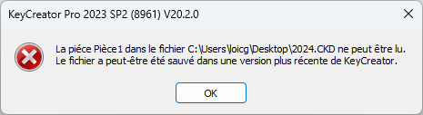

En revanche, les fichiers créées avec des anciennes versions de KeyCreator seront ouvrable et éditable dans KeyCreator 2024 SP0.

### Type de fichier supportées par KeyCreator 2024 SP0
<!-- Mettre à jour les interfaces -->
| Format            | Sens               | Version supportées                                                                                                               | Assemblage | Nouveautés    |
| ----------------- | ------------------ | -------------------------------------------------------------------------------------------------------------------------------- | ---------- | ------------- |
| ACIS              | Import - Export    | 1.5 R26 - R2019 - R2021 - R2022 - R2023                                                                                          | NON        |               |
| AutoCAD DWG/DXF   | Import - Export    | Toutes versions jusqu’a 2021                                                                                                     | NON        |               |
| Autodesk Inventor | Import (3D + PMI)  | 6-11,2008-2024                                                                                                                   | OUI        | 2024 avec PMI |
| CATIA V4          | Import - Export    | 4.1.9 - 4.2.4                                                                                                                    | NON        |               |
| CATIA V5          | Import (Géom+Draw) | V5-6 R2018 - V5 R29 - V5 R30, V5-6 R2020 / R2020x - V5 R31 / R2022 - R2023(R33)                                                  | OUI        | R2023(R33)    |
| CATIA V6          | Import             | V6 R2019x - V6 R2021x - 3dxml - R2023x                                                                                           |            |               |
| IFC               | Import             | 4                                                                                                                                | OUI        |               |
| IGES              | Import - Export    | Jusqu’à la version 5.3                                                                                                           | OUI        |               |
| JT                | Import             | Versions 8,9, 10, 10.6 & 10.7                                                                                                    | OUI        | 10.6 & 10.7   |
| Parasolid         | Import - Export    | Jusqu’à la version 35                                                                                                            | OUI        |               |
| Pro/E / CREO      | Import             | Solide – PMI – Drawing - V9 -V10                                                                                                 | OUI        | V10           |
| Solid Edge        | Import             | V18 – ST11 - 2021 - 2022 - 2023                                                                                                  | OUI        | 2023          |
| Solidworks        | Import             | 98 - 2019 - 2021 - 2022 - 2023                                                                                                   | OUI        |               |
| STEP              | Import - Export    | AP203, AP214, AP 242                                                                                                             | OUI        |               |
| Siemens NX        | Import             | 11 - 18, NX 1 - 12 -1847 - NX 1919 - NX 1926 - NX 1980 - NX2000, NX2007, NX2008, NX2011, NX2015, NX 2019, NX2027, NX2206, NX2212 | OUI        | NX2212 Series |
|                   | Export Géom + PMI  | V5-6 R2018 - V5 R29 - V5 R30, V5-6 R2020 / R2020x - V5 R31 / R2021 - R33                                                         | OUI        |               |
|                   | Drawing            | V5-6 R2018 - V5 R29 - V5 R30 - V5 R31                                                                                            |            |               |
|                   | Export             | R12, R13, R14,2000-2018                                                                                                          | NON        |               |
|                   | PMI                | PMI 1847 Drawing 1884 - 1919 - 1926                                                                                              |            |               |
| Rhino             | Import             | 3dm                                                                                                                              |            |               |

### Rappel : les licences pour le télétravail

- Pour les clients disposant d'un AUC (Contrat de maintenance annuel) actif
    - Il est possible de créer une licence Home (basé sur l'adresse MAC de la seconde machine)
    - Pour les licences par code d'activation, il est possible de remplacer l'activation de la machine (code d'activation) par une activation par login (utilisable sur n'importe quelle machine disposant de KeyCreator et d'internet)
- Pour utiliser les technologies WTS (Windows Terminal Services), il est nécessaire de disposer d'un serveur de licences et de licences flottantes. *WTS est utilisé par les outils d'accès à distance et de virtualisation de Windows (Serveur)*

## Améliorations (en bref)
<!-- Faire un résumé des améliorations -->
Dans la continuité des dernières versions, KeyCreator 2024 continue d'améliorer la gestion des matériaux, ainsi que de faciliter la mise en plan en améliorant les cotations, la gestion des tolérances et l’utilisation des normes internationales. Cela inclut notamment une meilleure importation des fichiers CAD provenant d'autres logiciels.

De plus, KeyCreator continue d'améliorer et de simplifier son interface pour permettre aux utilisateurs d'être plus productifs dans leurs travaux de conception, modélisation et création de plans.

<!-- Écrire chaque amélioration par thème -->
## Améliorations concernant la modélisation

### Gestion des matières

Ajout de la possibilité de créer une matière suivant une entité.  
Utiliser le bouton "Svt Entité" pour récupérer la matière définie sur l'entité.

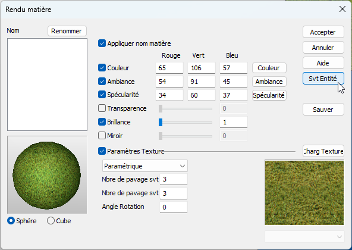

Dans le panneau de gestion des matières, lorsque l'on supprime une matière qui n'est pas utilisé dans le fichier, il n'y a pas d'avertissement (permet d'éliminer des étapes non nécessaire pour une matière qui n'est pas utilisé)

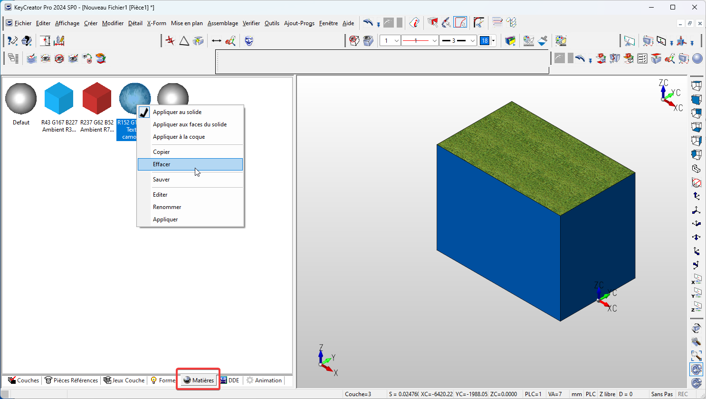

### Matière des faces (limiter/couper un solide - découdre)

Meilleure gestion des matières pour les faces lors de l'utilisation des fonctions Limiter/Couper un solide ou découdre une face.  
En effet la fonction Limiter/Couper un solide appliquent la matière du solide limitant sur la ou les faces coupées du solide limité.  
De même lorsque l'on découds une face d'un solide elle conserve la matière appliqué au solide.

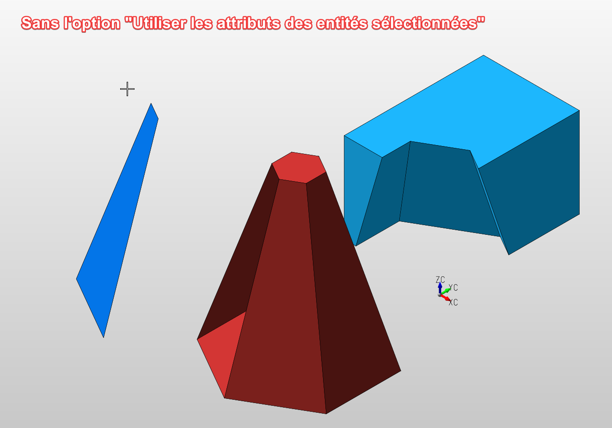
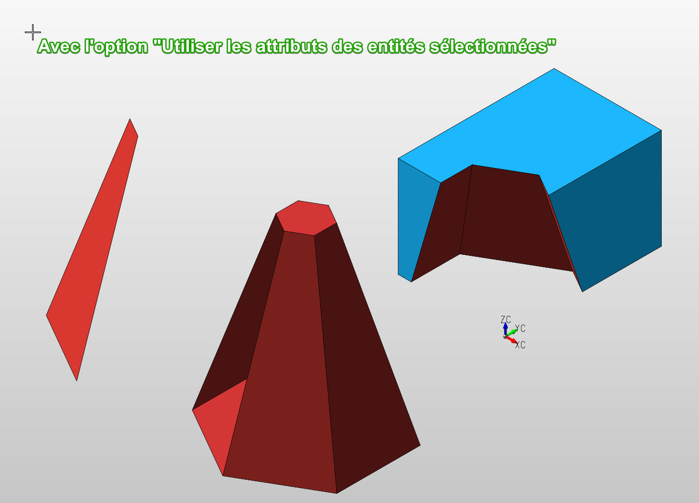

Info :  
Pour pouvoir utiliser cette fonctionnalité, il est nécessaire d'avoir définit l'option "Utiliser les attributs des entités sélectionnées" dans "Options des applications...> Entités > Modifier Options Couper"

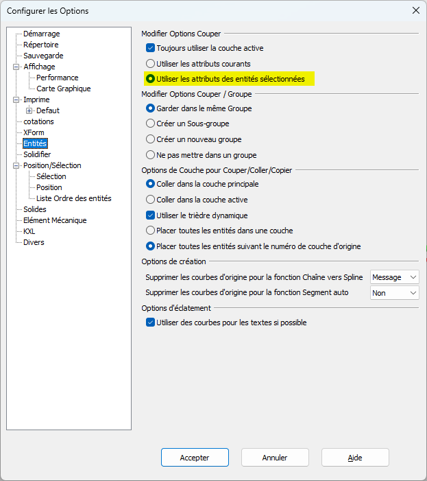

### Centre de gravité définis manuellement associé à l'entité

Lorsque l'on définit manuellement le centre de gravité d'un solide (dans "Editer Générique"), les coordonnées sont maintenant mises à jour automatiquement lorsque l'on déplace l'entité associé au point définit.

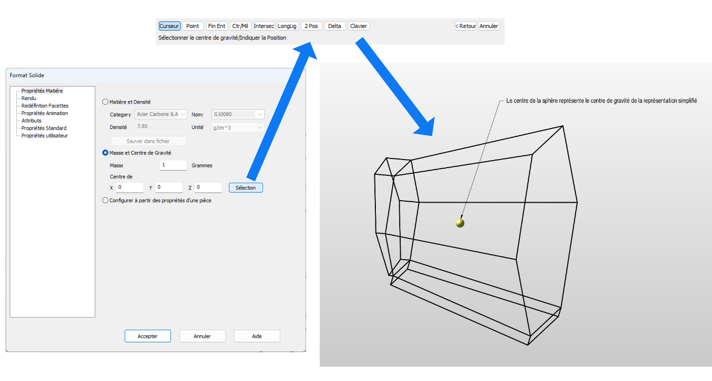

### Amélioration de la sélection des arrêtes tangentes pour les congés et chanfreins

La sélection et la mise en surbrillance des arêtes tangentes a été améliorées lors de l'utilisation de l'option "Raccord sur arêtes Tangentes".  
KeyCreator met en évidence et aide à identifier l'emplacement des arrêtes non tangentes pour:

- Congé constant
- Congé variable
- Chanfrein

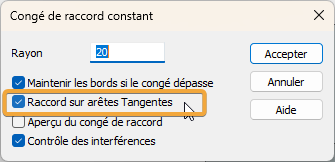
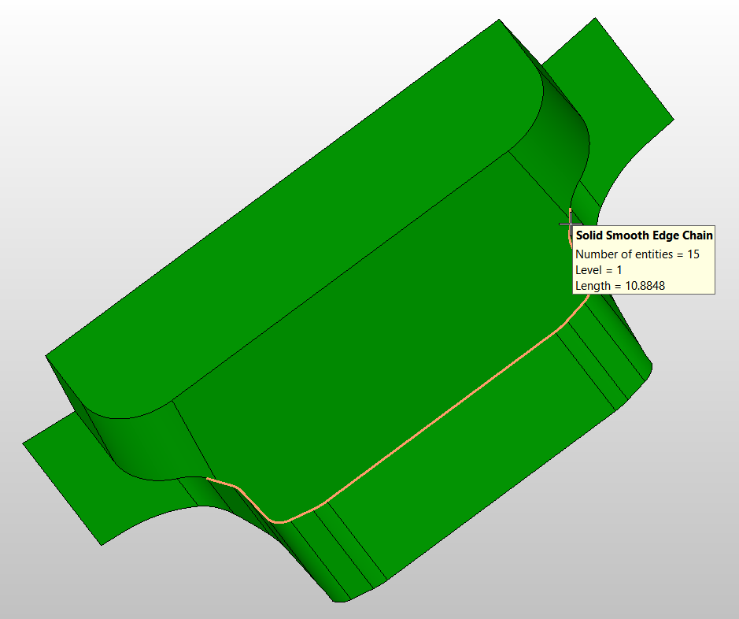

## Améliorations concernant la mise en plan et la cotation

### Amélioration des performances lors de la modification d'une section

Dans la mise en plan, amélioration des performances lorsque l'on modifie une "Vue Section" en ne recréant pas entièrement la section.  
En effet, modifier les paramètres, encadrés en orange dans les images ci-dessus, s'effectue plus rapidement car KeyCreator ne recalcul pas la section et modifie juste l’affichage.

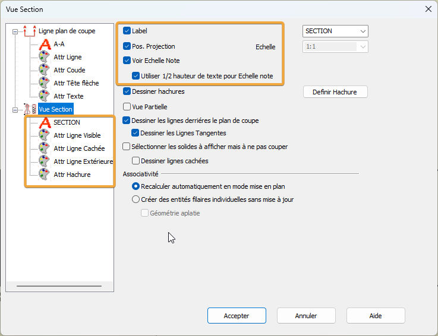
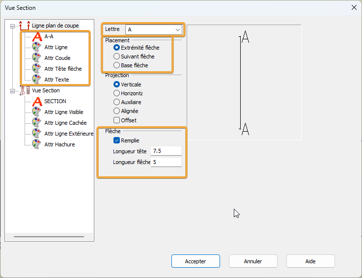

### Nouvel option pour afficher les tolérances ISO

De nouvelles options d'affichage des tolérances ISO ont été ajoutées pour afficher les valeurs de tolérance et/ou les classes de tolérance dans les cotations.  
Les valeurs de tolérance proviennent d'une base de données personnalisable et s'ajustent automatiquement en fonction du diamètre nominal.

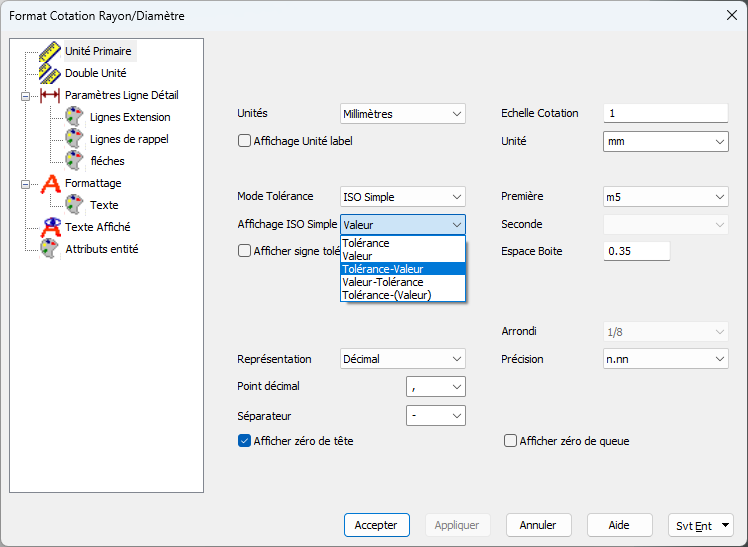
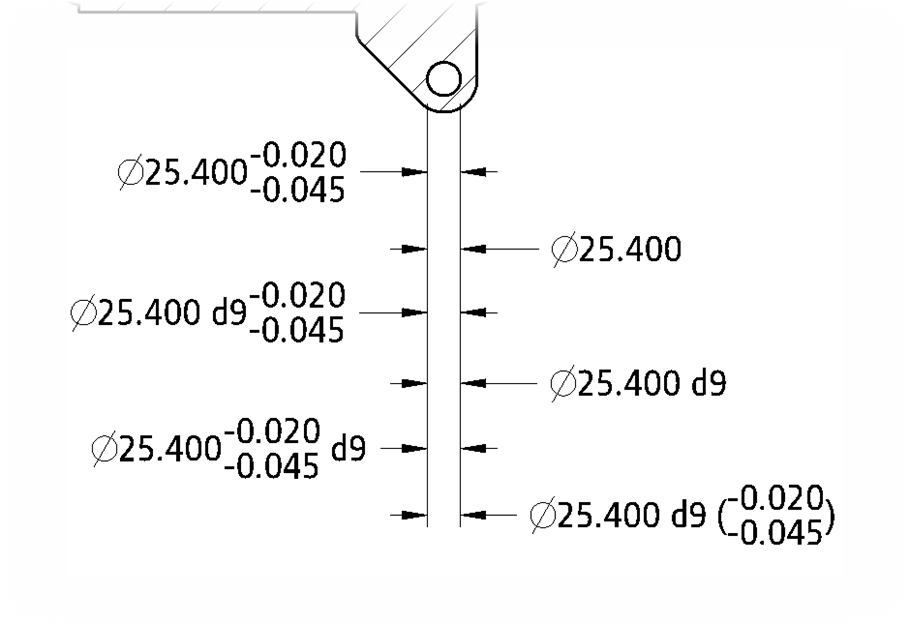

### Données PMI importées en entité de détail natif KeyCreator

Les données PMI dans les formats natifs CAD (CATIA, NX, Creo, etc.) sont lues en tant que types d'entités de détail spécifiques à KeyCreator plutôt que comme des entités de détail générales.
Cela inclut :

- Les références
- Tolérance géométrique
- Les étiquettes
- Les cotations de diamètre

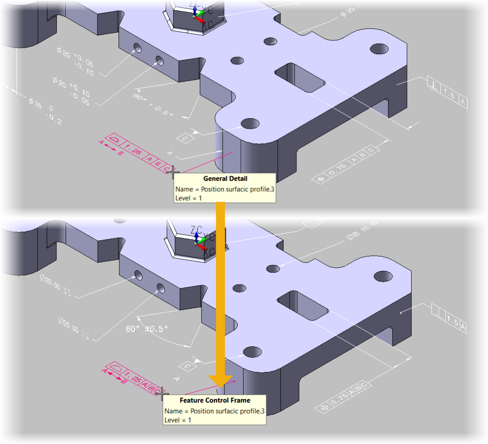

### Ajout de nouveaux symboles

**CF**  
Le symbole “CF” (continuous feature) a été ajouté dans le menu “Symboles” des notes et labels.

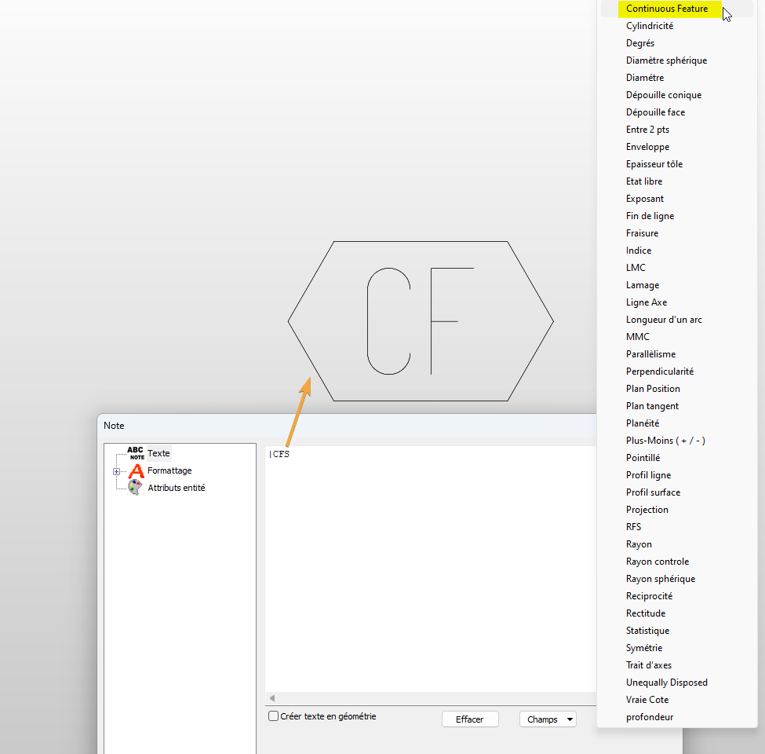

**U**  
Pour les tolérances le symbole “U” pour “Unequally Disposed Tolerance” a été ajouté.
Pour l’utilisé, aller dans “Détail > Symboles >Tolérance Géométrique” utiliser le code “|EUD” dans le champs de texte de la tolérance

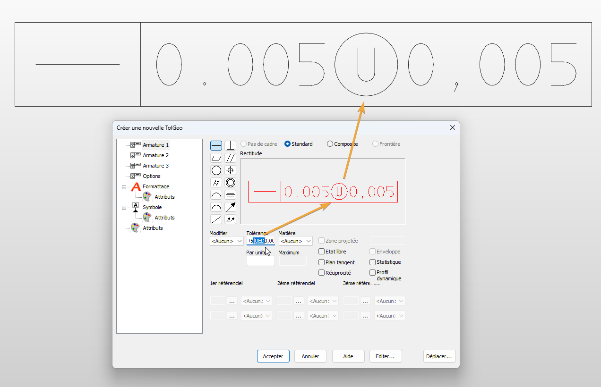

### Les attributs de mise en forme des tableaux de perçage peuvent maintenant être définit de manière globales

C'est-à-dire qu'il est possible de configurer les attributs de couleur, de police, de ligne, etc... dans le menu "Détail > Configuration > Éditer Style > Onglet Table perçage". Cela se fait de manière globale pour tous les futurs tableaux de perçage.  
De plus, cela ajoute la possibilité de configurer l'affichage des tableaux de perçage et de l'enregistrer dans votre fichier modèle CKT.

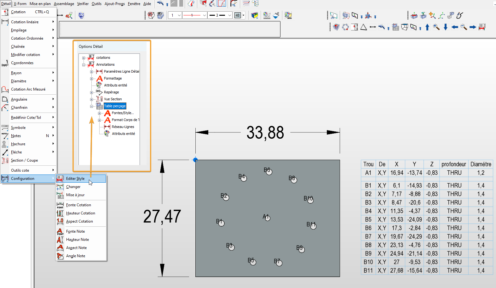

## Améliorations de l’interface

### Démarrage langue automatique (même que le système)

Par défaut, KeyCreator est maintenant réglé sur la langue “Automatique”, c’est à dire qu’après l’installation du pack français, KeyCreator démarrera automatique en français (si Windows est en français). Il est toujours possible de sélectionner une langue par défaut différente de votre système d’exploitation.

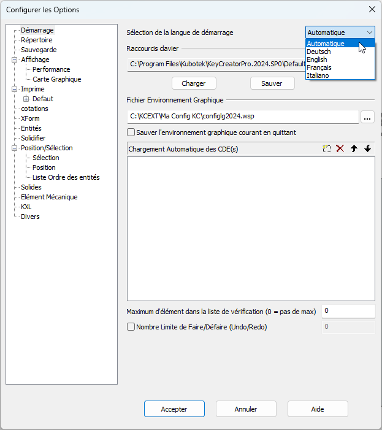

### Fichier de configuration des cotations

L'utilisateur peut passer plus facilement entre les paramètres de cotation américaines (pouces) et les paramètres internationaux (mm) en chargeant deux nouveaux fichiers XML de paramètres de cotation.

Ces fichiers se trouve dans le répertoire principal de l’installation de KeyCreator :

- Detail_Setting_American.xml
- Detail_Setting_International.xml

Pour charger ces fichiers : 

- Aller dans “Détail > Configuration > Editer style”
- Puis cliquer sur “Import”
- Ensuite dans le répertoire d’installation de KeyCreator, sélectionner un des deux fichiers

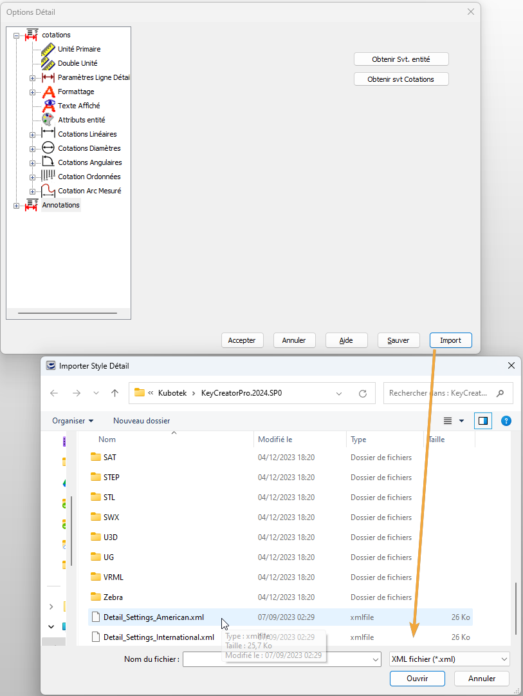

## Liste des corrections (PDF en anglais)
<!-- Créer le fichier et mettre à jour le lien -->
[Bug_Fixes_KC_2024_SP0_en.pdf](assets/files/bug_kixes_kc_2024_SP0_en.pdf ':ignore')

---

## KeyCreator Viewer

### Visualisation des fichiers KeyCreator

Programme indépendant de KeyCreator afin de visualiser, mesurer, imprimer les fichiers CKD.  
Vous pouvez installer ce programme sur différents ordinateurs pour consulter des fichiers KeyCreator.

<!-- Mettre à jour le splash screen -->

## Récapitulatif AUC ou contrat de maintenance de mise à jour

- Recevoir les mises à jour KeyCreator
- Être prioritaire pour toutes demandes de support ou d'information
- Pouvoir demander une licence KeyCreator Home : une seconde licence KeyCreator à utiliser chez vous liée à une adresse Mac (pas de frais supplémentaires)
- Pouvoir commander et remplacer une clé USB défectueuse (nouvelle clé et transport payant)
- Permets d'utiliser le mode d'authentification par login : remplace l'utilisation du code d'activation (la licence est liée à une machine) et permets d'utiliser sa licence sur différents postes (nécessite une connexion internet pour toute utilisation)