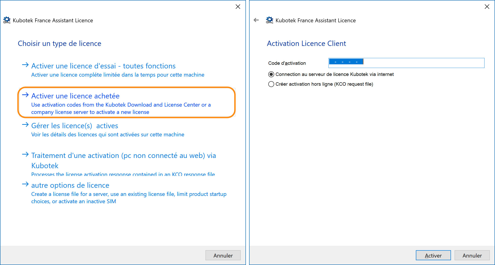
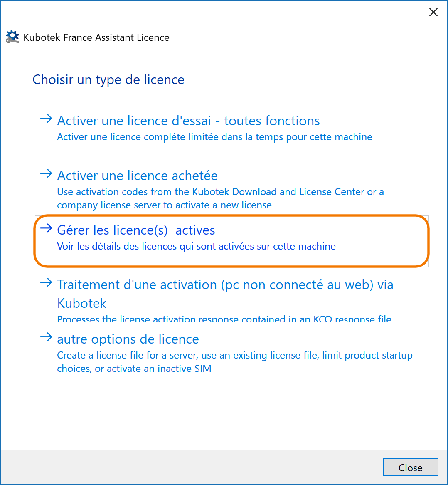
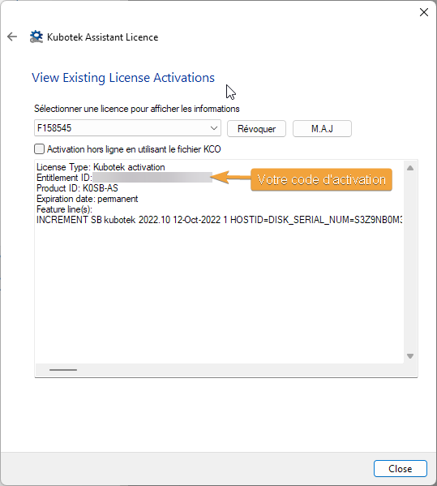
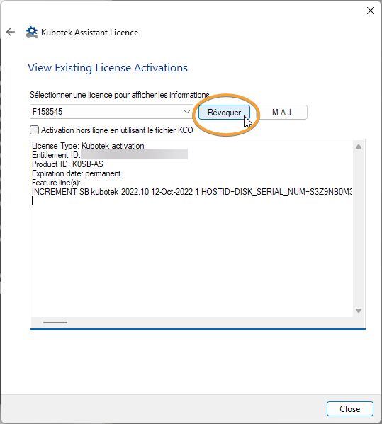

# Activation par code

## Information

_Disponible à partir de KeyCreator version 14_

-   L’activation par code d’activation est plus facile
-   Pas besoin d’identification matériel (Clé USB, Adresse Mac, Disque ID)
-   L’activation est réalisée directement à partir de votre PC (nécessite une connexion internet)
-   Il est possible de réaliser l’activation en mode hors-ligne, à partir d’un autre PC qui lui aura accès à internet.
-   L’activation par code peut être révoqué d’un PC pour ensuite être réutilisé sur un autre PC.

## Activer une licence par Code d’Activation

### 1. Démarrer Kubotek License Wizard

Le programme “License Wizard” est accessible depuis le menu Windows ou dans le répertoire d’installation de KeyCreator. De plus, lorsque KeyCreator démarre, sans licence, le programme vous demande si vous voulez démarrer le “License Wizard”. Si vous avez installé le pack de langue française, il vous sera proposé de lancer le “License Wizard” en français ou en anglais.

### 2. Entrer le code d’activation

Fenêtres activation

-   Cliquer sur « Activer une licence achetée »
-   Entrer votre code d’activation (reçu par email)
-   Sélectionner « Connexion au serveur de licence Kubotek via internet »
-   Cliquer sur « Activer »
-   Lorsque la licence sera reçue, un message s’affichera.

### 3. Erreurs possibles

#### Problème de connexion internet

-   Vérifier que vous êtes bien connecté à internet
-   Vérifier votre firewall (désactivez-le temporairement)
-   Vérifier votre antivirus (désactivez-le temporairement)

#### Problème de licence

-   Vérifier que vous avez rentré le bon code d’activation

### 4. Visualiser votre licence

Redémarrer le “License Wizard” et cliquer sur « Gérer les licence(s) actives ».

 

## Révoquer une licence

Révoquer l’association d’une licence pour pouvoir l’utiliser sur un autre poste.

-   Démarrer “License Wizard”
-   Cliquer sur « Gérer les licence(s) actives »
-   Sélectionner la licence à révoquer (si vous avez plus d’une licence)
-   Cliquer sur “Révoquer” ( ou “Effacer” selon la version de KeyCreator)
-   Lorsque la licence a été révoquée, elle ne sera plus affichée

