# Guide de démarrage rapide KeyCreator

## Présentation

Regroupé dans un seul logiciel, KeyCreator fournit aux professionnels de la CAO, un ensemble complet d'outils de dessin et résout la plupart des problèmes de conception et d'habillage de plans avec une très grande efficacité et précision.

KeyCreator combine les techniques de modélisation solide, surfacique et filaire avec les méthodes de dessin traditionnelles  afin d'obtenir un contrôle complet pour la création et l'édition de pièces, sans aucune contrainte compliquée, sans historique, et sans dépendances technologiques.

Il vous donne la possibilité d'importer, d'éditer ou de construire facilement des modèles 2D, 3D et de créer des mises en plan.

## Configuration de la langue par défaut

Pour démarrer directement en français, aller dans : Outils > Options > Démarrage > “Sélection du langage au démarrage”  
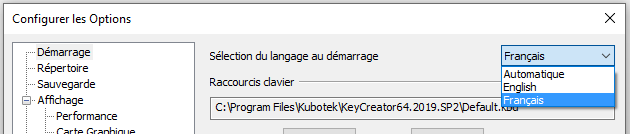

## Environnement graphique de KeyCreator

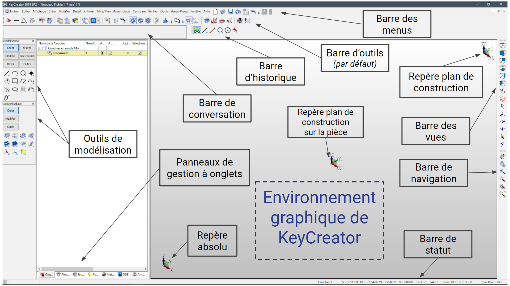

-   **Barre des menus** : regroupe tous les menus permettant d'accéder à toutes les fonctionnalités de KC.
-   **Barre d'outils par défaut** : regroupe sous forme d'icônes les fonctions les plus souvent utilisées de KC.
-   **Outils de modélisation** : Il s’agit d’une barre d’outils qui regroupe les icônes qui permettent d’accéder directement aux commandes de modélisation 2D et 3D. _(Ces différents outils seront détaillés dans la suite)_
-   **Barre des vues** : Cette barre d’outils regroupe des icônes qui permettent de choisir la vue affichée par KC mais également de définir le plan de construction.
-   **Barre de navigation** : permet de se déplacer dans l’espace (rotation, déplacement, zoom, …)
-   **Historique** : Dans cette zone s’affiche dans l’ordre chronologique, les dernières commandes utilisées. Un clic sur l’une de ces icônes et la commande correspondante est relancée.
-   **Barre de status** : affiche différente info (réglages, position, couche,...) ainsi que la commande actuellement utilisé
-   **Les repères** (repère absolu, repère plan de construction) : permettent de se situer dans l’espace
-   **Barre de conversation** : barre permettant de filtrer la sélection ou le positionnement d’entités

**Panneaux de gestion à onglets** : différents panneaux permettant de créer, de gérer et d’assigner les couches, les pièces de références, les jeux de couches, les formes, les matières, le DDE, les animations

## Afficher / masquer les barre d’outils

Pour afficher ou masquer des barres d’outils ou les menus :

-   Clic droit sur une barre d’outils 

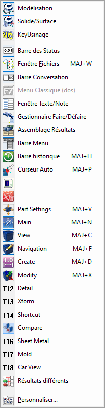

-   Dans le menu Outils > Personnaliser…  

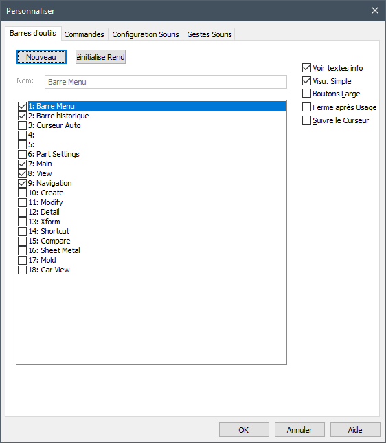

_Il est possible de créer sa propre barre d’outil_

## Utilisation de la souris

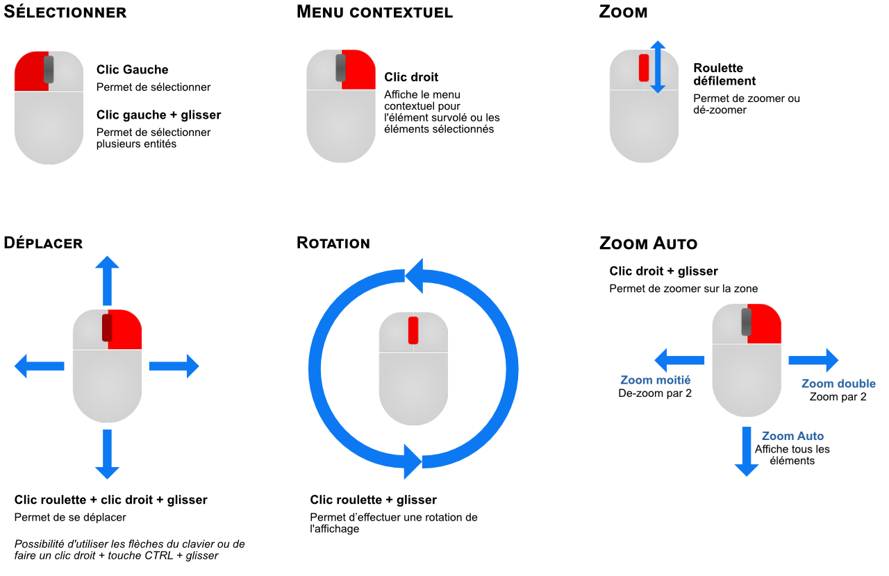

### Pour configurer la souris

Configuration dans Outils > Personnaliser > Configuration Souris

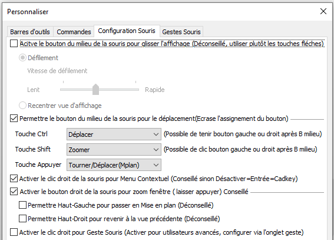

## Utiliser les couches

-   Les couches permettent de gérer l’organisation des différents niveaux d’un dessin et ainsi de séparer sa construction.
-   Possibilité de créer plusieurs niveaux de couches
-   Chaque couche peut-être définies avec différents paramètres et attributs
    -   Ces paramètres sont activées lorsque vous activez une couche (ils ne changent pas si vous avez déjà dessiné des entités)

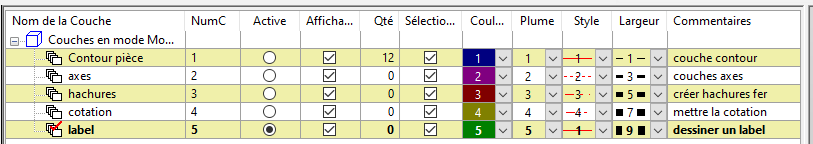

### Pour afficher le panneau des couches

-   aller dans Menu Affichage > Barre d’outils > Gestion Couches
    
-   raccourci clavier MAJ + A
    
-   icône dans la barre d’outils
    
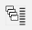

-   un déplacement du panneau des couches via la souris (ou un double clic)  
    

### Créer une couche (_Clic droit sur Arbre Couche_)

-   Tout sélectionner : Sélectionne toutes les couches
-   **Créer une couche** : Permet de créer une nouvelle couche
-   Compter les entités : Indique le nombre d’entité= Qté
-   Copier texte : Permet de copier toutes les infos sur les couches
-   Sortie texte : Permet de sauver les infos sur les couches dans un fichier “.txt”
-   Sortie HTML : Permet de sauver les infos couches dans un fichier “.html”
-   Etendre : Permet de voir toutes les couches et sous-couches
-   Réduire : Permet de ne pas voir les sous niveaux

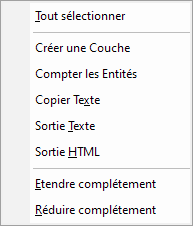

### Gérer les couches (_Clic droit sur une couche_)

-   **Créer une couche** : Permet de créer une sous couche
-   **Copier Entités / Couche** : Permet de copier des entités sur cette couche
-   **Déplacer Entités / Couches** : Permet de déplacer des entités d’une couche vers une autre
-   **Activer** : Active la couche (une seule couche peut être active à la fois)
-   **Afficher** : Affiche toute les couches
-   **Sélectionnable** : Les entités sur les couches sont sélectionnables
    -   Si la case n’est pas coché, vous ne pourrez pas : sélectionner, déplacer, modifier , effacer les entités présent dans la couche
-   **Effacer** : Efface la couche avec les entités
-   **Renommer** : Renomme la couche
-   **Renuméroter** : Change le numéro de la couche
-   **Insérer couche** : Permet d’insérer une couche à une position spécifique dans la hiérarchie
-   **Compter les entités** : Affiche un tableau avec le nombre d’entités de chaque type
-   **Copier Texte / Sortie HTML** : permet d’exporter les infos dans un fichier texte ou HTML
-   **Etendre ou réduire :** permet d’afficher ou non les sous-couches

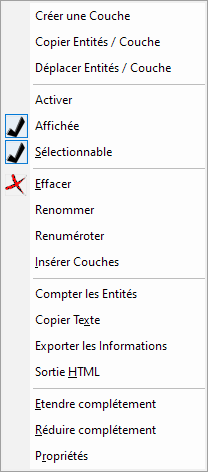

## Plan de construction

-   Le plan de construction permet de dessiner sur n’importe quel PLAN de la pièce 3D
    
    -   Ceci correspond au plan d’esquisse dans d’autre système CAO, sans les contraintes car directement sur la pièce
-   Après la définition d’un plan de construction toutes les entités seront dessinées suivant l’orientation du plan de construction.
    
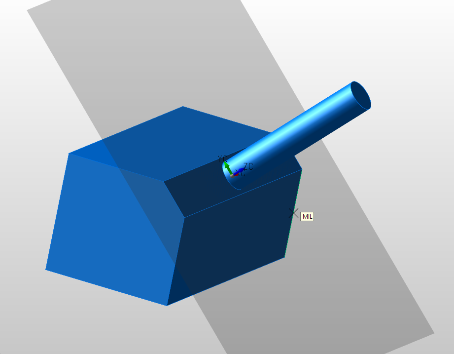

### Utiliser un plan de construction prédéfini

-   Cliquer sur la double flèche bleu de l’icône “Plan de construction” pour accéder aux plans de construction prédéfinis 
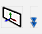

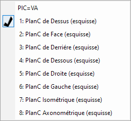

-   Il est aussi possible d’utiliser les icônes directement

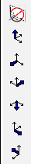

#### Les plans de construction prédéfinis

-   PlC= VA (Plan de construction = Vue active)
    -   Il n’y a pas de plan de construction, la vue active est le plan de référence
    -   Donc dans ce cas les coordonnées sont liées à la vue écran
        -   Même en 3D les seuls repères sont les coordonnées X et Y de l’écran.
        -   Impossible de se positionner
        -   L’axe Z s’oriente vers vous
-   Les autres plans de construction par défaut correspondent aux vues du cube
    -   Dessus
    -   Face
    -   Derrière
    -   Dessous
    -   Droite
    -   Gauche
    -   Isométrique
    -   Axonométrique

### Définir un plan de construction quelconque

-   Clic sur le rectangle blanc avec le trièdre (”Icône plan de construction”) permet de définir un PlanC ou dans le menu _Affichage > Plan de construction > Définir Plan de Construction_  

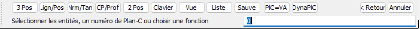

#### Les fonctions les plus utilisées

-   **3 Pos** : permet de définir un plan de construction suivant 3 points
    -   Indiquer le premier sur l’axe X (origine)
    -   Indiquer le second point sur X
    -   Indiquer le point suivant Y
    -   L’axe Z sera automatiquement orienté vers le haut
-   **Liste** : liste nominative des plans de construction (prédéfini ou sauver)
-   **PlC = VA** : plan de construction = vue active
-   **DynaPlC :** déplacement et orientation d’un plan de construction avec trièdre dynamique
-   **Sélectionner une entité**
    -   Permet de définir un plan de construction à partir d’une face d’un solide, d’un cercle (arc) ou de lignes

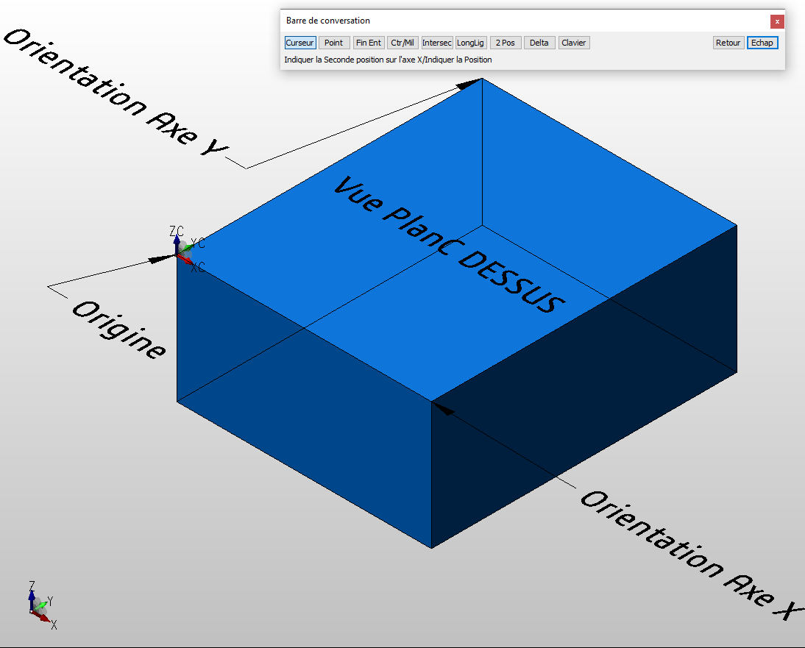

### Afficher le Plan de construction

Il est possible d’afficher le plan de construction sous la forme d’un rectangle gris transparent en cliquant sur l’icône ou dans le menu _Affichage > Plan de construction > Affiche le Plan de construction._  
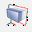

>[!NOTE] Les repères sous forme de trièdres permettent de voir l’orientation du plan de construction par rapport à la vue.

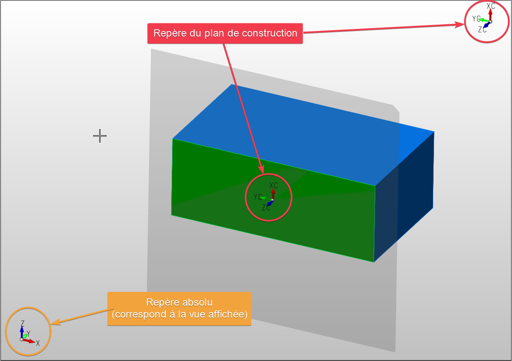

### Autres options dans le menu Plan de construction

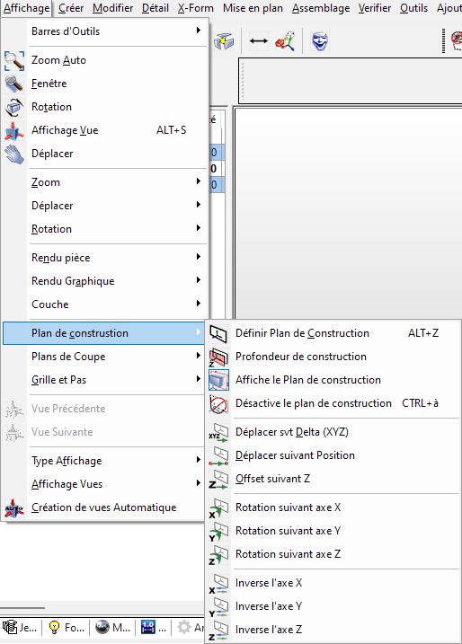

-   Définir un Plan de construction
-   Définir profondeur PlanC = Valeur Z du PlanC
    -   Position ou offset
-   Affiche Transparence PlanC (affiche un rectangle gris pour signaler le planC
-   Désactive PlanC (PlC=VA)
-   Déplace svt Delta (XYZ) : Déplace le PlanC suivant un delta sur X,Y ou
-   Déplace svt Position : Déplace le PlanC suivant position curseur
-   Rotation
    -   Svt X,Y,Z : Effectuer une rotation du PlanC suivant un axe de rotation
-   **Inverser**
    -   Inverse l’orientation des axes X,Y ou Z

## Commandes pour Créer

Le menu _Créer_ permet d’accéder à toutes les commandes de création.

 

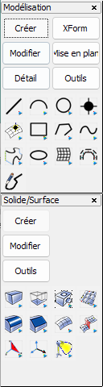

_Les barres d’outils “Modélisation” et “Solide/Surface” permettent d’accéder directement au commandes._

-   la première section permet la création de lignes 2D
-   la seconde section correspond au solides et surfaces
    -   **Primitive Solides** sont les formes 3D de base  
    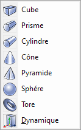
        
    -   **Solide par Contour** permet la création de solides ou surfaces par rapport à des lignes 2D  
    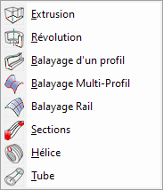

    -   **Formes sur Solide** permet de créer des formes sur un solide  
    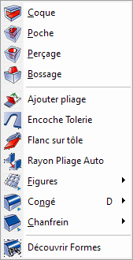

## Commandes pour Modifier

Comme pour la partie créer, la première section correspond aux lignes (2D), les parties suivantes permettent de modifier les solides et surfaces.

 

>[!warning] Plusieurs commandes de KeyCreator prennent en compte la position du curseur pour la sélection, ici permet de choisir qu’elle face va être impactée. (La fonction _Limiter_ utilise aussi ce système pour définir le coté impactée)

## Commandes pour Transformer (X-Form)

Permet d’effectuer des opérations de transformation et de déplacement sur des entités.

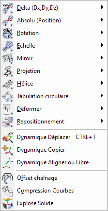 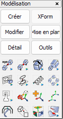

### Dynamique Déplacer

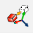 
_X-Form > Dynamique Déplacer_

Permet d’effectuer un déplacement, une rotation, une mise à l’échelle ou la copie d’une ou plusieurs entités (filaire et/ou solide) en utilisant le trièdre dynamique.

#### Utilisation trièdre dynamique

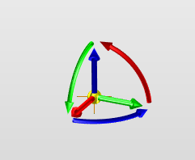

-   Effectuer un cliquer-déplacer pour utiliser le trièdre
    
    -   Les flèches droites permettent de déplacer suivant les axes X, Y et Z
    -   Les flèches courbées permettent d’effectuer une rotation
    -   Le point Jaune à la base permet de déplacer librement sans contrainte d’axe
-   Lorsque l’on clique sur une flèche on peut saisir une valeur spécifique  
    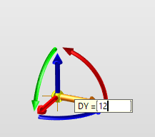

-   Il est aussi possible d’effectuer un clic-droit sur une flèche ou le point jaune pour avoir accès à d’autres options

## Commandes pour coter (Détail)

Le menu détail permet d’ajouter des cotations, du texte ou des hachures au dessin.

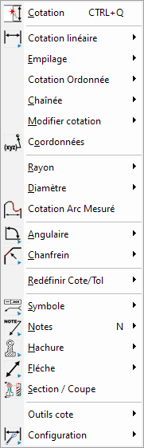

La commande la plus utilisé est la première qui permet d’effectuer la plupart des cotations de manières simple et rapide.
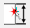 

## Aller plus loin

-   Dans le dossier d’installation de KeyCreator un répertoire “Documentation” permet d’accéder à différentes documentation plus ou moins récente
    -   *Par défaut : C:\Program Files\Kubotek\KeyCreatorPro.2022.SP0\Documentation*
-   Chaîne YouTube  
    https://www.youtube.com/channel/UCgRV3aaP1NNuefBYRNym8kA

-   Autres fiches techniques  
    http://fiches-techniques.kubotekfrance.fr/

-   Kubotek University (en anglais)  
    https://support.kubotek3d.com/university?111

-   Aide KeyCreator  
    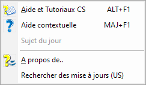

    >[!NOTE]
    > Aide contextuelle : Après avoir cliquer sur l’icône, cliquer sur l’icône d’une commande pour avoir accès directement à l’aide de cette fonction (en ligne et en anglais).
    
-   Demander un devis pour une formation complète sur site   
    Email :  [ventes@cadm-services.com](mailto:ventes@cadm-services.com)

