# Guide d'installation de KeyCreator en licence flottante

## Installer KCNetAdmin sur le serveur

Pour installer le gestionnaire de licence, lancez l'installation sur le serveur de NetworkAdmin.xxxxxx.exe.

Pendant l'installation aucune option particulière n'est à modifier, seul le répertoire d'installation est important.  
_Par défaut : C:\KCNetAdmin\\_

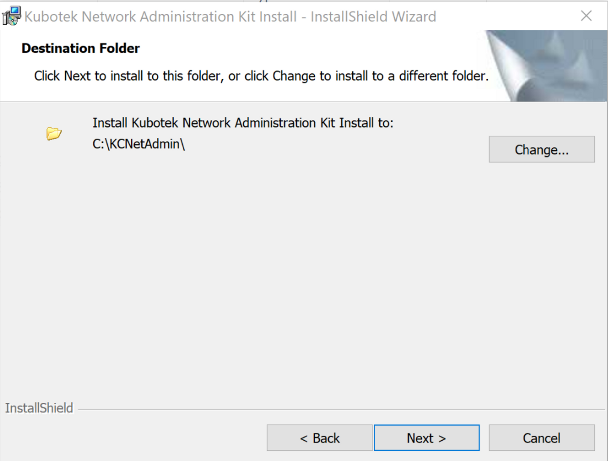 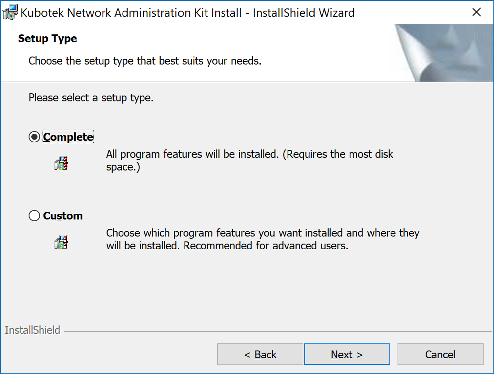

## Installer la licence pour le serveur (code d'activation)

1. Aller dans le dossier d'installation de KCNetAdmin puis démarrer _ServerLicenseWizard.exe_  
   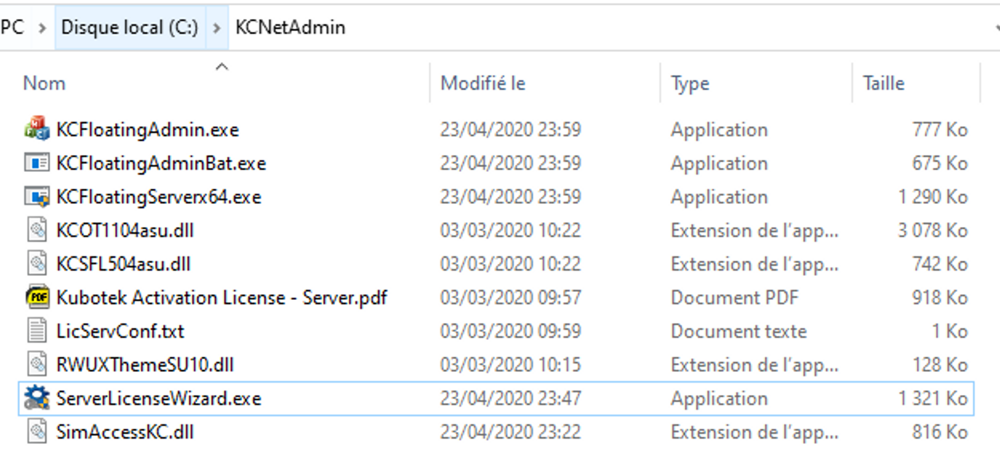
2. Activate a purchased licence  
   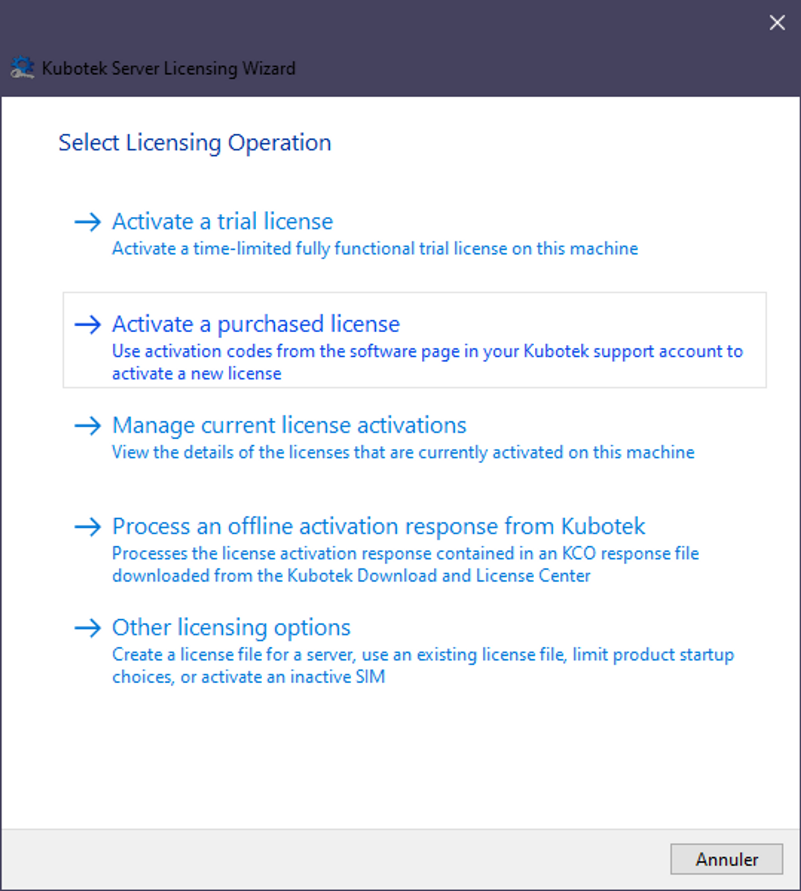
3. Coller le code d'activation reçu par email, puis cliquer sur Activate (Nécessite une connection internet)  
   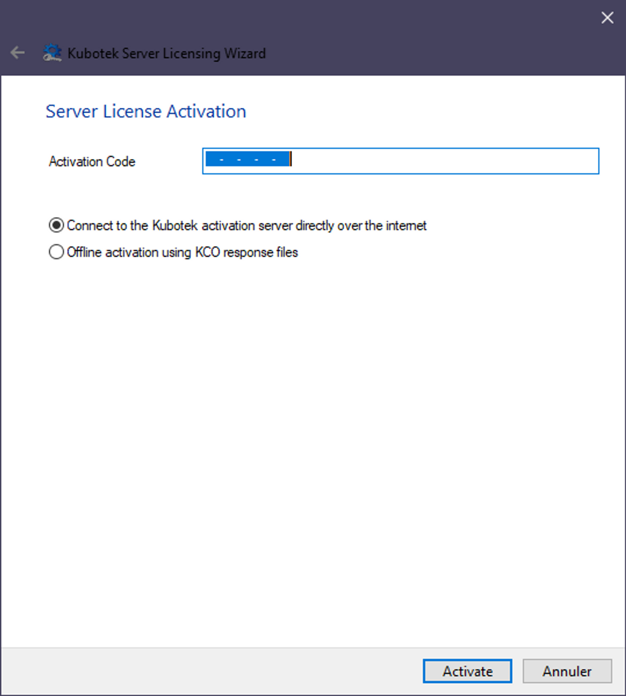  
4. Après avoir reçu le message de confirmation, si vous avez plusieurs code d'activation, recommencer les étapes pour chaque code, sinon cliquer sur Close  
     
5. Pour plus d'information sur les licences par code d'activation suivre ce lien (version pour licences standalone mais même système que pour le serveur) : [Activation par code](activation-par-code.md)

>[!NOTE] Répéter les étapes 2 à 5, si vous avez d'autre code à activer

## Configurer le port réseau du service (Optionnel)

Pour configuer le port réseau sur lequel le service communique, il faut ouvrir le fichier : LicServConf.txt qui se trouve dans le dossier KCNetAdmin. Ensuite, modifier le numéro du port si cela est nécessaire. Par défaut le port est : 28005

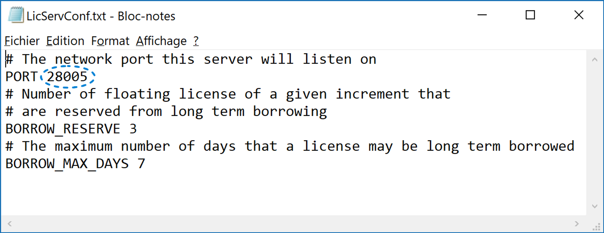

## Démarrer le serveur de licence

Après avoir changé de licence ou modifié le port réseau, il faut redémarrer ( ou démarrer) le service "KeyCreator Floating License Server".

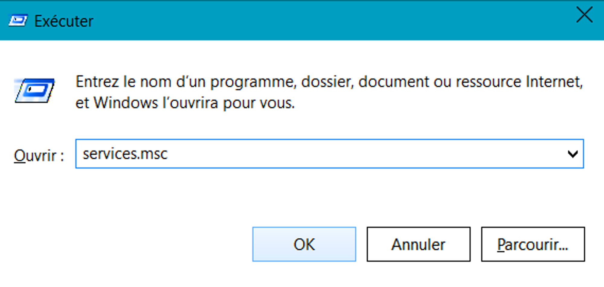

Pour ce faire :

- Aller dans Panneau de Configuration > Outils d'administration > Services ou dans la fenêtre "Exécuter" (WIN+R), taper "services.msc"
- Rechercher le service "KeyCreator Floating License Server"
- Puis cliquer, dans le panneau de gauche sur Rédémarrer le service ( ou Démarrer s'il n'est pas encore démarré)
- Vérifier que le service est bien réglé en Type de démarrage : Automatique

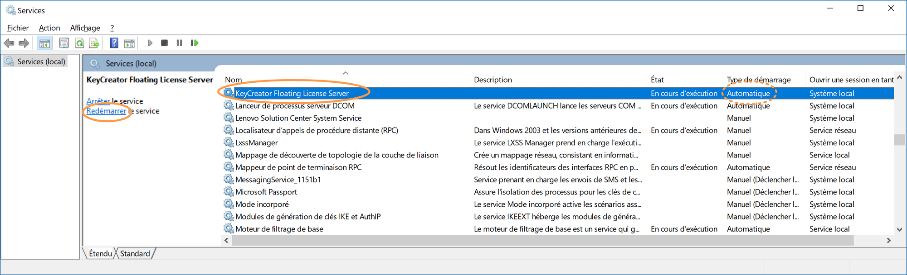

## Vérifier et visualiser l'activité du serveur de licence

Dans le répertoire de KCNetAdmin, il y a un utilitaire permettant de visualiser les informations du serveur de licence : KCFloatingAdmin.exe
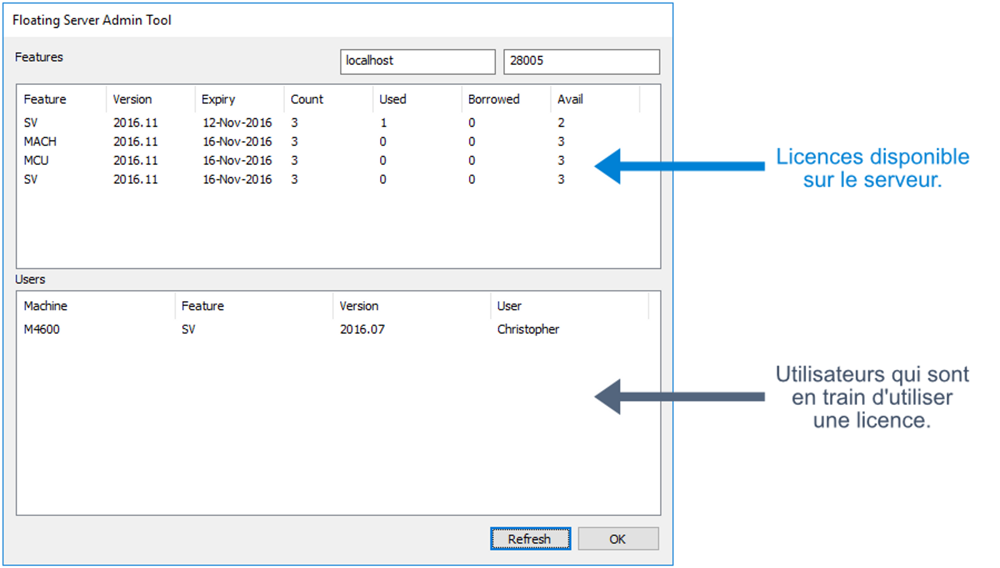

Si la partie du haut n'affiche aucune information cela signifie :

- soit que le service n'est pas démarré, il faut donc le démarré (se reporter au chapitre précédent)
- soit que la licence n'est pas valide

## Partie poste de travail client

Installer KeyCreator (ainsi que le pack FR)

Pour la licence client :

1. Démarrer _License Wizard_
2. Choisir *autre options de licence*  
   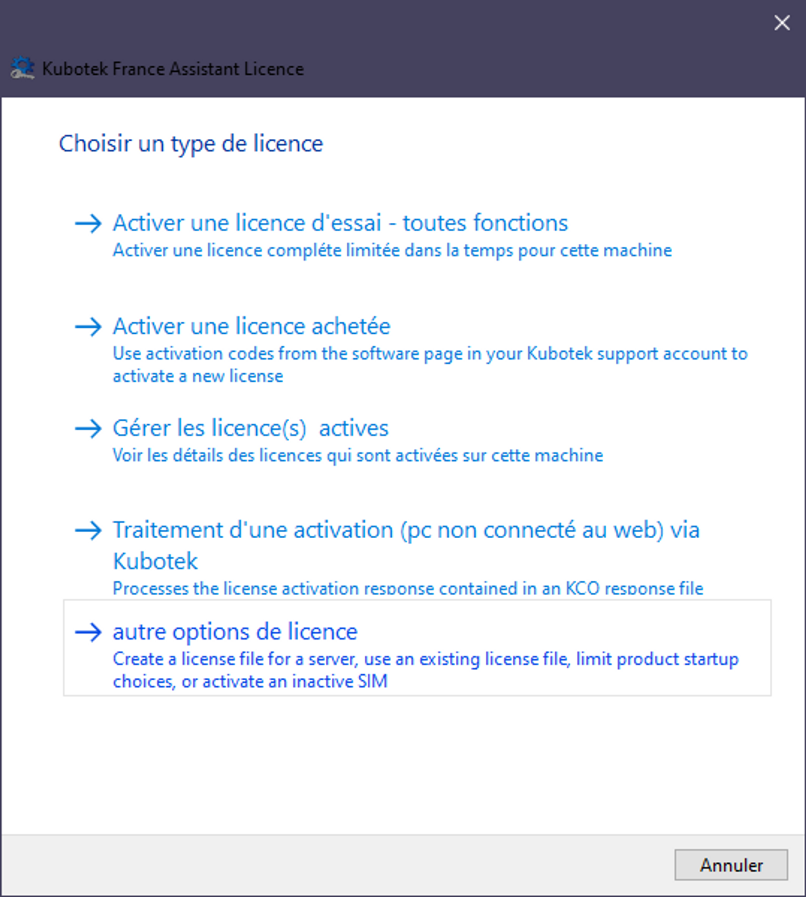
3. Sélectionner _Créer un fichier licence pour utiliser une licence SERVEUR..._  
   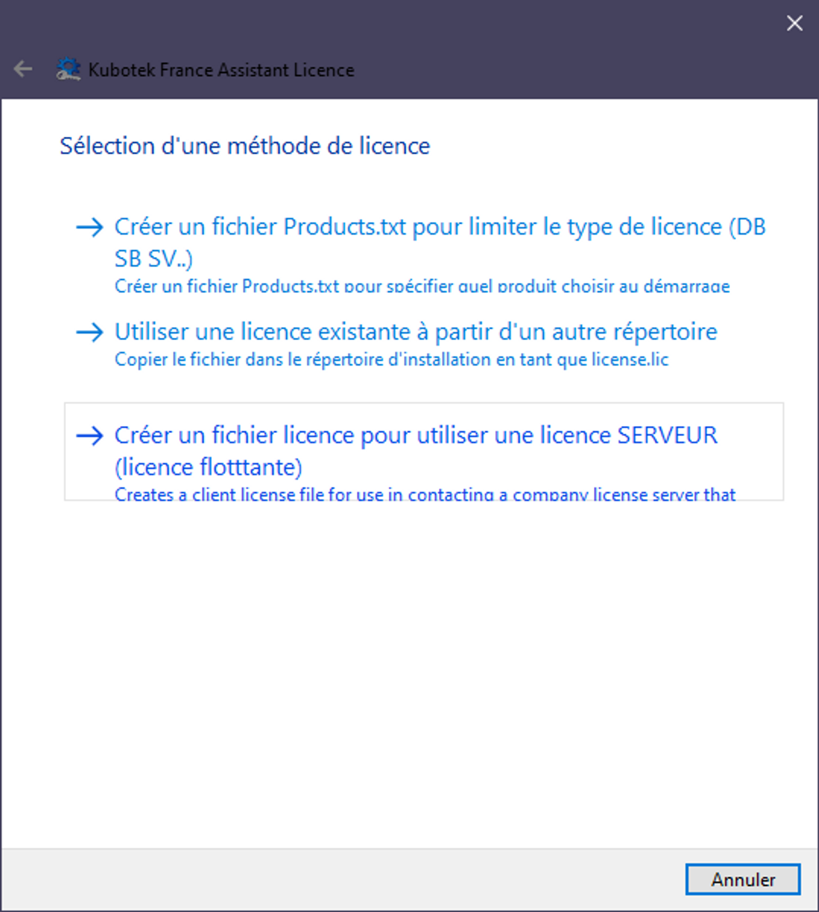
4. Entrer le nom du serveur puis cliquer sur _Créer_  
   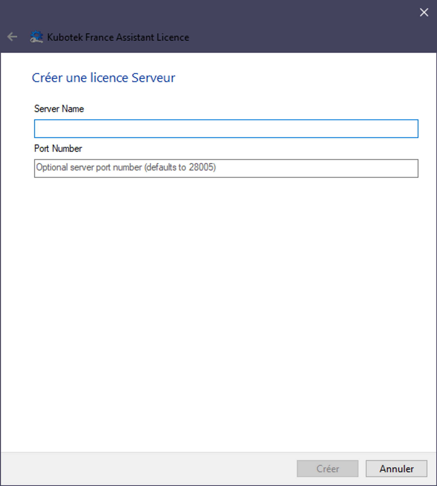
5. Sélectionner la version de KeyCreator qui sera utilisé sur le poste puis cliquer de nouveau sur _Créer_  
   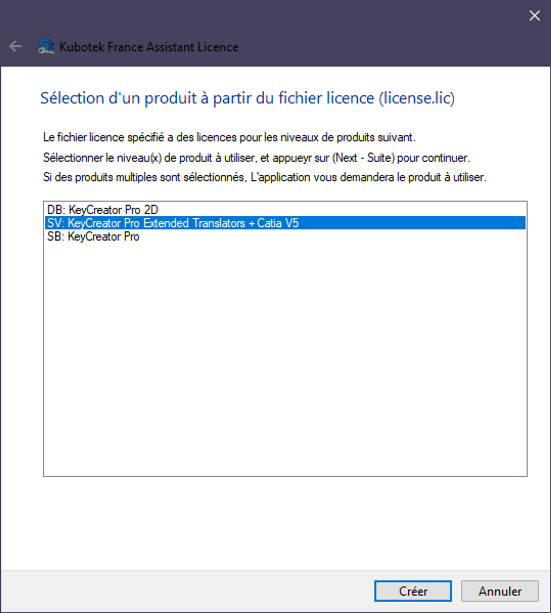
6. Vous pouvez maintenant démarrer KeyCreator  
   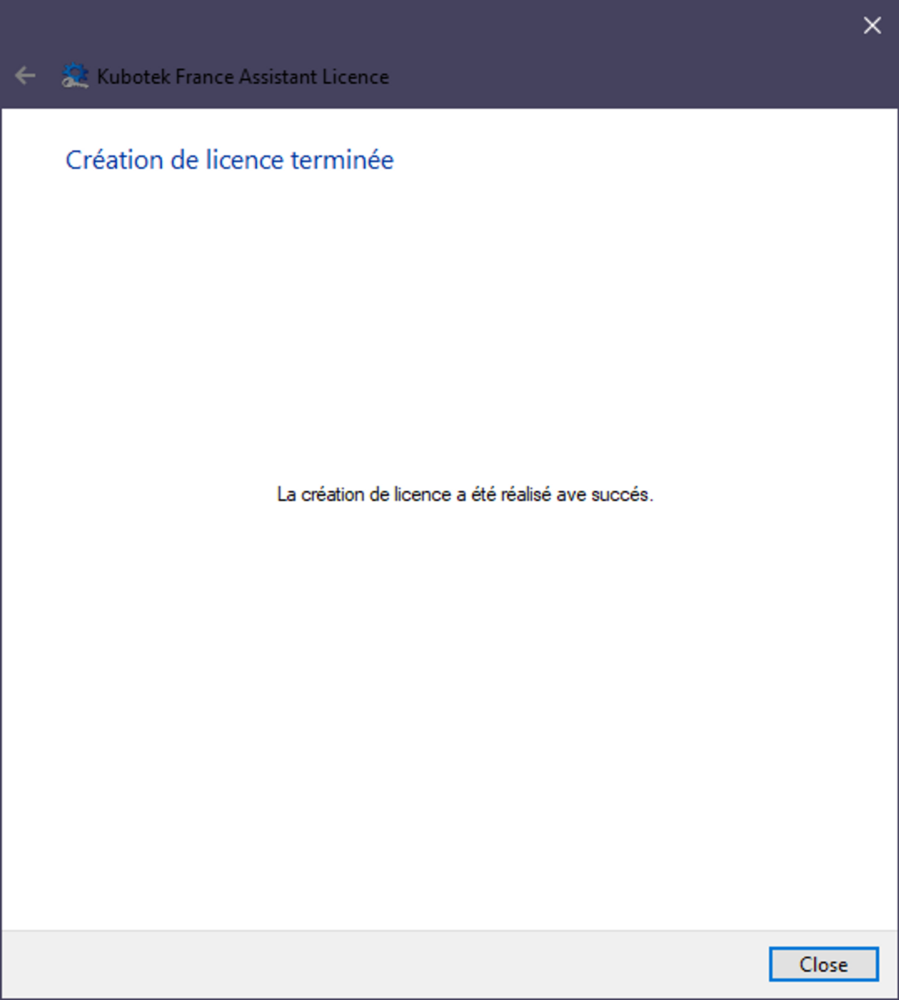

## Changement de serveur

Si vous souhaiter changer de serveur penser à révoquer les licences sur le premier serveur via _ServerLicenseWizard.exe._

_Voir partie "Révoquer une licence" du guide_ [Activation par code](/licences/activation-par-code?id=révoquer-une-licence)
