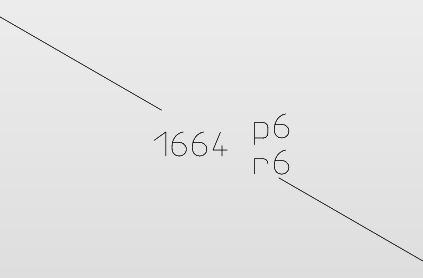
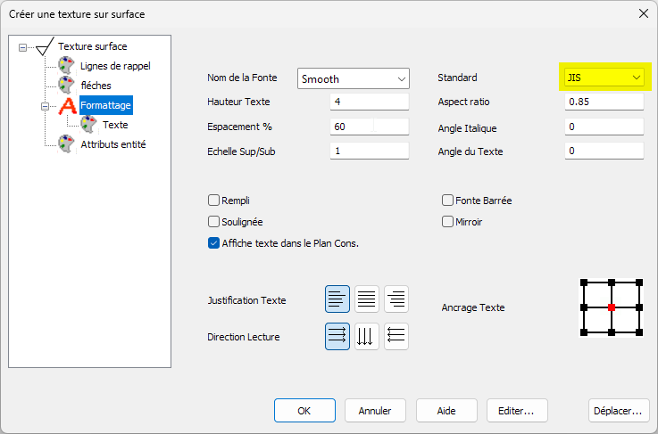
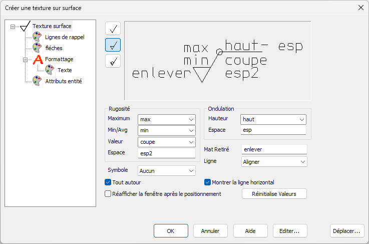
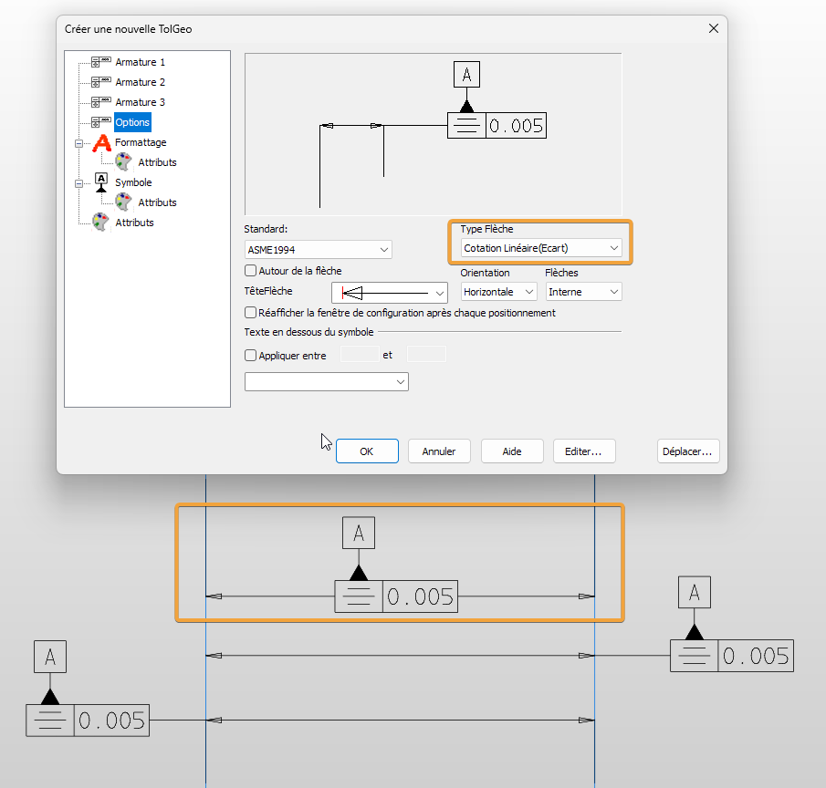
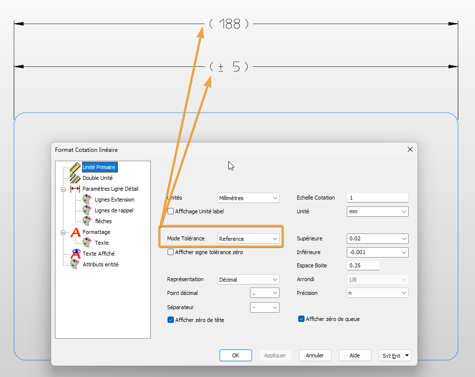
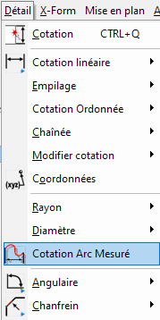
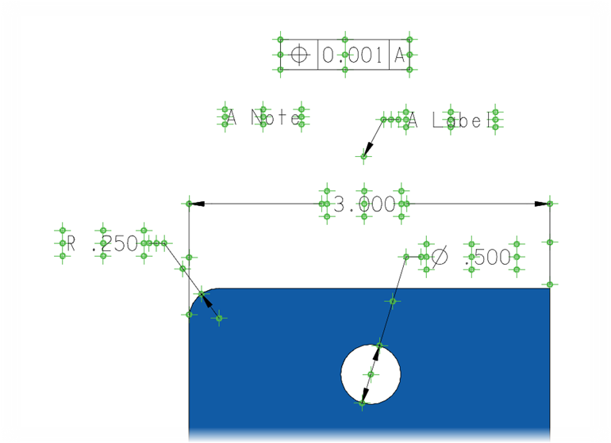
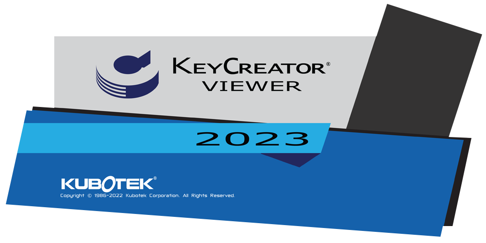

# KeyCreator Pro 2023 SP1

## Généralités

### Système

#### Emplacement
- KeyCreator Pro 2023 SP1 est installé dans un nouveau répertoire
    - C:\Programmes\Kubotek\KeyCreatorPro2023.SP1  
    - Cela permet d'utiliser plusieurs versions différentes de KeyCreator sur la même machine
- Versions 64 bits uniquement

#### Configuration requise
- Système d’exploitation et matériel recommandés pour KeyCreator 2023 SP1

| Matériel             | Recommandé                                                        | Minimum                   |
| -------------------- | ----------------------------------------------------------------- | ------------------------- |
| OS                   | Windows 10 ou 11 Pro 64-bit                                       | Windows 10 64-bit         |
| Processeur           | Intel Core i7 (quadcore) ou dual quadcore Xeons ou equivalent AMD | Requis par l’OS (Windows) |
| Mémoire              | 16 GB RAM ou plus                                                 | 8 GB RAM                  |
| Carte Graphique      | NVIDIA, AMD 4 GB de mémoire ou plus                               | Pas de minimum            |
| Matériel Additionnel | Souris 3 boutons avec roulette ou 3D connexion 3D mouse            |                           |

### KeyCreator 2023 supporte Windows 11

Maintenant, Windows 11 est officiellement supporté par KeyCreator 2023 SP1.

Toutefois, Windows 11 modifie la façon dont Microsoft affiche les cases à cocher lorsqu’elles sont sélectionnées.

- Dans certains cas, il est très difficile de voir quels boutons de réglage sont actifs.
    - Ce problème n'est pas propre à KeyCreator et touche de nombreux développeurs qui utilisent le SDK de Microsoft.
    - La réponse de Microsoft sur son site d'assistance est que ce comportement est dû à la conception. Ils suggèrent soit de mettre à niveau le pilote graphique, soit de rétrograder vers Windows 10.

### Version KeyCreator supportées par Kubotek
- V2023
- V2022
- V2021
- V2020

**Versions qui ne bénéficient plus d’un support :**

- Toutes les versions antérieures de KeyCreator
- Toutes les versions de Cadkey

### Pas de prise en charge descendante pour les fichiers CKD

Les fichiers .CKD créés avec KeyCreator 2023 ne pourront être lu avec une version plus ancienne de KeyCreator.  
En revanche, les fichiers créées avec des anciennes versions de KeyCreator seront ouvrable et éditable dans KeyCreator 2023 SP1.

### Type de fichier supportées par KeyCreator 2023 SP3

| Format            | Sens               | Version supportées                                                                                                       | Assemblage | Nouveautés                                                       |
| ----------------- | ------------------ | ------------------------------------------------------------------------------------------------------------------------ | ---------- | ---------------------------------------------------------------- |
| ACIS              | Import - Export    | 1.5 R26 - R2019 - R2021 - R2022 - R2023                                                                                  | NON        | 2022 - 2023                                                      |
| AutoCAD DWG/DXF   | Import - Export    | Toutes versions jusqu’a 2021                                                                                             | NON        |                                                                  |
| Autodesk Inventor | Import             | 6-11,2008-2023                                                                                                           | OUI        | 2022 - 2023                                                      |
| CATIA V4          | Import - Export    | 4.1.9 - 4.2.4                                                                                                            | NON        |                                                                  |
| CATIA V5          | Import (Géom+Draw) | V5-6 R2018 - V5 R29 - V5 R30, V5-6 R2020 / R2020x - V5 R31 / R2022 - R2023                                               | OUI        | R2022 - R2023                                                    |
| Catia V6          | Import             | V6 R2019x - V6 R2021x - 3dxml - R2023x                                                                                   |            | 3dxml - R2023x                                                   |
| IFC               | Import             | 4                                                                                                                        | OUI        |                                                                  |
| IGES              | Import - Export    | Jusqu’à la version 5.3                                                                                                   | OUI        |                                                                  |
| JT                | Import             | Versions 8,9 & 10                                                                                                        | OUI        |                                                                  |
| Parasolid         | Import - Export    | Jusqu’à la version 35                                                                                                    | OUI        | 34 - 35                                                          |
| Pro/E / CREO      | Import             | Solide – PMI – Drawing - V9                                                                                              | OUI        | V9                                                               |
| Solid Edge        | Import             | V18 – ST11 - 2021 - 2022 - 2023                                                                                          | OUI        | 2022 - 2023                                                      |
| Solidworks        | Import             | 98 - 2019 - 2021 - 2022 - 2023                                                                                           | OUI        | 2022 - 2023                                                      |
| STEP              | Import - Export    | AP203, AP214, AP 242                                                                                                     | OUI        |                                                                  |
| Unigraphics       | Import             | 11 - 18, NX 1 - 12 -1847 - NX 1919 - NX 1926 - NX 1980 - NX2000, NX2007, NX2008, NX2011, NX2015, NX 2019, NX2027, NX2206 | OUI        | NX2000, NX2007, NX2008, NX2011, NX2015, NX 2019, NX2027, NX 2206 |
|                   | Export Géom + PMI  | V5-6 R2018 - V5 R29 - V5 R30, V5-6 R2020 / R2020x - V5 R31 / R2021 - R33                                                 | OUI        |                                                                  |
|                   | Drawing            | V5-6 R2018 - V5 R29 - V5 R30 - V5 R31                                                                                    |            |                                                                  |
|                   | Export             | R12, R13, R14,2000-2018                                                                                                  | NON        |                                                                  |
|                   | PMI                | PMI 1847 Drawing 1884 - 1919 - 1926                                                                                      |            |                                                                  |
| Rhino             | Import             | 3dm                                                                                                                      |            | Rhino 3dm                                                        |

### Rappel : les licences pour le télétravail

- Pour les clients disposant d'un AUC (Contrat de maintenance annuel) actif
    - Il est possible de créer une licence Home (basé sur l'adresse MAC de la seconde machine)
    - Pour les licences par code d'activation, il est possible de remplacer l'activation de la machine (code d'activation) par une activation par login (utilisable sur n'importe quelle machine disposant de KeyCreator et d'internet)
- Pour utiliser les technologies WTS (Windows Terminal Services), il est nécessaire de disposer d'un serveur de licences et de licences flottantes.
*WTS est utilisé par les outils d'accès à distance et de virtualisation de Windows (Serveur)*

## Améliorations (en bref)
<!-- Faire un résumé des améliorations -->

Les améliorations de KeyCreator Pro 2023 ont été axées sur la réutilisation des données CAO et la productivité sans interrompre les  
flux de travail. 
Ceux qui travaillent dans les secteurs de l'aérospatiale et de l'automobile savent que la technologie MBD/PMI est de plus en plus utilisée. Pour bien l’intégré à KeyCreator, cela a nécessité une mise à niveau vers les dernières normes et la poursuite des améliorations de nos outils de cotation.
Résumé des améliorations :
- Amélioration des outils de cotation
    - Tolérances ISO
    - Norme JIS (état de surface)
    - Symboles de tolérances géométrique
    - Tolérance référence
    - Affichage Radial pour la cotation d’un arc (Arc mesuré)
    - Accrochage du curseur aux cotations et aux notes
- Prise en charges des fichiers  Catia 3DXML et des fichiers Rhino
- Partenariat avec CADENAS 3DfindIT pour importer directement des modèles CAO
- Amélioration de l'ergonomie et des performances
    - Composites
    - Contour dynamique
    - Plan de construction suivant un arc (même orientation que la face)
    - Placement cohérent des rondelles (Elts Asemblage)
    - Editer Générique
    - police TrueType
- KeyCreator Viewer devient KeyCreator CKD Viewer

<!-- Écrire chaque amélioration par thème -->
## Amélioration des cotations

### Tolérances ISO dans les cotations

Ajout de la possibilité de mettre les tolérances ISO dans les cotations.  
2 nouveaux modes d'affichages des tolérances : ISO ou ISO simple  

Fichiers pour définir les tolérances ISO : FitTolerances.dat dans lang/fr  

### Symboles d'état de surface
*Détail > Symbole > Etat de Surface*

La nouvelle norme JIS exige quatre types supplémentaires de symboles d'état de surface, comprenant des commentaires améliorés et des exigences de positionnement. 

### Symboles de tolérances géométrique
*Détail > Symbole > Tolérance géométrique*

Mise à jour des symboles de tolérances géométrique selon la norme ASME Y14.5-2018 et du nouveau standard JIS.

Amélioration du placement du système de référence : il est maintenant possible d'afficher le texte **au dessous** ou **en dessous** du type de tolérance.   

Le cadre de contrôle peut maintenant être placé entre les lignes repères, pour les flèches de type *Cotation Linéaire (Ecart)*.  

Plusieurs cadres peuvent être activé pour la symétrie.  

Un nouveau modificateur : Profile dynamique a été ajouté.  

### Mode de tolérance référence pour les cotations

Le mode de tolérance *Référence* a été ajoutée dans la boîte de dialogue "Options de détail" et dans la boîte de dialogue "Tolérance de style". Elle permet de mettre entre parenthèse la valeur. Ce mode s'applique aux cotations automatiques et aux cotations définies par l'utilisateur. 

  

### Cotation Arc Mesuré : nouvelle option d’affichage
Une nouvelle option est disponible pour afficher les cotations d’un arc : **Radial**  
  
_Menu Détail > Cotation Arc Mesuré_   
  
  
Option Radial pour afficher la cotation liée à l’arc.  
  
  
### Curseur : amélioration de la sélection une cotation ou une note
- Amélioration des positions sélectionnable sur une cotation ou une note.
- Les positions sont associative avec “Fin Entité” et “Ctr/Milieu”  
  
- Pour pouvoir utiliser le curseur de positionnement sur une cotation ou une note
    - Aller dans _Outils > Options des applications > Position/Sélection > Position_ 
    - Dans la rubrique _Ignorer les entités pour l’accrochage_, vérifier que l’option _Détail_ est bien **décoché**  
  
  

## Prise en charges des fichiers Catia 3DXML et des fichiers Rhino

Deux nouvelles interfaces ont été ajoutées aux fonctions OUVRIR & IMPORT

- 3DXML : Prend en charge la lecture des fichiers Catia V6 3DXML (.3dxml) (KeyCreator Pro Max uniquement) 
- Rhino : Prend en charge la lecture des fichiers Rhino (.3dm) (KeyCreator Pro Max uniquement) 

## Partenariat avec CADENAS 3DfindIT

La nouvelle fonction Cadenas 3DfindIT permet d’accéder directement à la géométrie 2D & 3D des catalogues web industriels CADENAS (*Inscription et connexion requises*)

## Amélioration de l'ergonomie et des performances
  
### Amélioration des composites
_Outils > Non - Géométrique > Composite_

  

- La commande _Composite \> Créer_, s’exécute maintenant qu’une fois et ne se répète plus automatiquement
- La commande _Composite \> Retirer_, sélectionne le solide parent et non les entités enfants
    
- Il maintenant possible de réorganiser la liste des composites
    
    - Cliquez sur l’en\-tête _Nom_ _de la composite_ pour trier la liste par ordre alphabétique  
    
    - Cliquez sur l’en\-tête _Nombre de composites_ pour déplacer la ligne sélectionnée d’un cran vers le haut
    
  

  
### Amélioration du Contour Dynamique 
  
#### Incréments pour l’angle et le rayon des arcs
_Créer > Contour dynamique_  
Lors de l’utilisation de la fonction _Contour Dynamique_ avec des arcs, il est maintenant possible de définir un incrément pour l’angle et le rayon.
  
  

  
  
  
#### Blocage des axes
_Créer > Contour dynamique_
  
La fonction _Contour Dynamique_ permet maintenant de bloquer un axe pour pouvoir s’accrocher à une autre entité.  
Cela permet de créer une ligne qui aura la distance exacte projeté sur un axe.  
- Pour se faire, cliquer sur l’axe X (rouge) ou Y (vert) pour bloquer l’axe  
  
- Ensuite votre tracé suivra cet axe et vous pourrez cliquer un point sur une entité pour créer une ligne
- Il n’est pas possible de bloquer l’axe Z (bleu) mais vous pouvez réaligner les axes pour utiliser l’axe X ou Y si besoin
    - Clique droit sur la sphère jaune pour réorienter les axes suivant le repère absolu, le plan de construction ou une vue   
      
    
  
  
  
Vous pouvez maintenant utiliser ce chemin comme vous le désirez  
  
  
### Amélioration pour définir un plan de construction
La définition des plans de construction et des vues à partir d'une arête plane d'un solide suit la même orientation de l'axe Z que la sélection de la face plane du solide (ou des normales aux solides).

  
### Placement cohérent des rondelles (Elts Asemblage)
Le point de base d'insertion d’une rondelle suit désormais la même méthode de positionnement que les autres éléments d’assemblage (_Outils > Elts Asemblage_).
Le point de base est maintenant, par défaut, le point inférieur. Cela permet une implantation plus facile et plus rapide des éléments dans les trous.

  
### Amélioration : Editer Générique
#### Sélection du solide plutôt que de la face
Lors de l’utilsation de la commande _Editer Générique,_ la priorité de sélection est défini sur l'entité parente plutôt que l'enfant.
Il est toujours possible d’utiliser la touche "barre d'espace" pour basculer vers l'entité enfant.

   
  

#### Editer Générique : Conserve l’onglet utilisé
La commande _Editer Générique,_ se souvient désormais du dernier onglet utilisé (pour les solides), ce qui permet d’être plus efficace lorsque l’on effectue plusieurs modifications.  

  
### Affichage police TrueType
Avec la dernière mise à jour graphique, l'option pour simplifier le seuil d’affichage du texte TrueType est devenue obsolète et a été supprimée.
(Dans _Outils > Options des applications... > Affichage > Performance_ )  
Il s'agit d'un paramètre système qui n'affectera pas les fichiers plus anciens, le texte sera juste visible
L'amélioration des performances de l'affichage du texte True Type est 7 fois plus rapide que dans KeyCreator 2022.
  
   

  
## License Wizard : plus de licence d’essai
L'assistant de licence ne permet plus une activation d'essai. 
Contactez le service commercial si vous avez besoin d'une licence d'essai :
[info@cadm-services.com](mailto:info@cadm-services.com "mailto:info@cadm-services.com")
  

## Liste des corrections (PDF en anglais)
<!-- Créer le fichier et mettre à jour le lien -->
[Bug\_Fixes\_KC\_2023\_SP1\_en.pdf](../assets/files/bug_kixes_kc_2023_SP1_en.pdf)

---

## Viewer pour fichiers KeyCreator : KeyCreator CKD Viewer
Le viewer KeyCreator a été renommé et s’appelle maintenant KeyCreator CKD Viewer

### Visualisation des fichiers KeyCreator

Programme indépendant de KeyCreator afin de visualiser, mesurer, imprimer les fichiers CKD.

Vous pouvez installer ce programme sur différents ordinateurs pour consulter des fichiers KeyCreator.

>[!attention]
> Depuis **KeyCreator Viewer 2022**, le viewer ne prend plus en charge les fichiers Cadkey (.prt, .ptn)
> 
<!-- Mettre à jour le splash screen -->

## Récapitulatif AUC ou contrat de maintenance de mise à jour

- Recevoir les mises à jour KeyCreator (au moins une par an)
- Être prioritaire pour toutes demandes de support ou d'information
- Pouvoir utiliser une licence KeyCreator Home : une seconde licence KeyCreator à utiliser chez vous lié à une adresse Mac (faire la demande, pas de frais supplémentaires)
- Pouvoir intervenir pour des problèmes de licences : changement de code d'activation (code d'activation non révoqué avant le changement de PC ou si le PC ne fonctionne plus), changement de clé USB défectueuse
- Pourvoir utiliser le mode d'authentification par login : remplace l'utilisation du code d'activation (la licence est liée à une machine) et permets d'utiliser sa licence sur différents postes (nécessite une connexion internet pour toute utilisation)