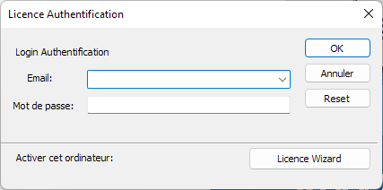
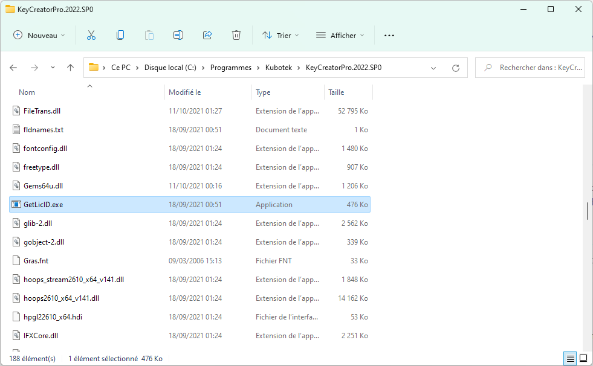
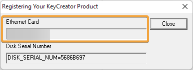

# KeyCreator par code d'activation - utilisation en télétravail

*Version KeyCreator: v2022*

## Déplacer la licence d'un poste à un autre

### Prérequis

- Avoir accès à internet le temps de la manipulation

### Démarche

- Révoquer la licence sur le poste actif
- Activer le code d'activation sur un autre poste
Voir la fiche technique sur l'utilisation des codes d'activation :  [Activation par code](/licences/activation-par-code)

### Avantages

- Il n'est pas nécessaire d'avoir un AUC actif (contrat de maintenance actif)

### Inconvénients

- Il faut avoir accès au poste avec la licence active et penser à révoquer la licence à chaque fois

## Passer à une utilisation par login et mot de passe

### Prérequis

- Avoir un AUC actif (Contrat de maintenance)
- Le poste doit être connecté à internet à chaque utilisation de KeyCreator

### Démarche

L'utilisateur doit révoquer son code d'activation, puis faire la demande de création d'un login et mot de passe auprès de Cadm Services.
Ensuite la licence sera liée au login et mot de passe, l'utilisateur pourra installer KeyCreator sur autant de postes qu'il le souhaite et pourra se connecter grâce à son login et son mot de passe au démarrage (un poste à la fois).

### Avantages

- Permet d'être utiliser sur autant de postes que l'on souhaite
- Pas de configuration nécessaire, juste installer KeyCreator et le pack FR

### Inconvénients

- Nécessite un accès internet à chaque utilisation
- Ne fonctionne plus si l'on arrête le contrat de maintenance, il sera nécessaire de repasser à une utilisation par code d'activation

## Créer une "Home License"

### Prérequis

- Avoir un AUC actif (Contrat de maintenance)

### Démarche

Pour créer une licence *Home*, l'utilisateur doit faire la demande auprès de Cadm Services en fournissant l'adresse MAC du 2ème PC qu'il souhaite utiliser.

Pour récupérer l'adresse MAC, après l'installation sur la seconde machine, il suffit d'utiliser l'utilitaire "GetLicID(.exe)" présent dans le répertoire d'installation de KeyCreator
*(Par défaut: C:\Program Files\Kubotek\KeyCreatorPro.xxxx.SPx\)*

Ensuite l'utilisateur recevra un fichier license.lic à mettre à la racine du répertoire d'installation de KeyCreator et pourra utiliser KeyCreator sur sa seconde machine.

### Avantages

- Pas de modification sur le poste actif, c'est une seconde licence qui est rattaché à la licence
- Permet une utilisation sans internet

### Inconvénients

- La "Home License" ne fonctionne plus si l'on arrête le contrat d'AUC
- Ne permet d'utiliser qu'une autre machine

## Changer pour des licences flottantes

La dernière possibilité est de migrer les licences fixes vers des licences flottantes.

Pour plus d'information sur les licences flottantes voir la fiche technique sur le choix de la licence pour KeyCreator : [Choix de la licence pour KeyCreator](/licences/choix-de-la-licence-pour-keycreator) 

### Avantages

- Permet de partager les licences entre plusieurs utilisateur
- Permet d'utiliser des systèmes de virtualisation via les technologies WTS (Windows Terminal Services)

### Inconvénients

- Cela entraine un cout de migration ainsi qu'une augmentation du prix du contrat de maintenance.
- Nécessite une plus grande connaissance des outils informatique et réseaux pour la mise en place d'un serveur de licence et d'un VPN pour une utilisation à distance.