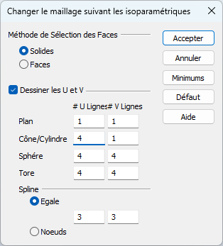

# **Afficher les génératrices des solides**  **(lignes isoparamétriques)**

* Par défaut, KeyCreator affiche le minimum de génératrice pour les solides

## Ajouter ponctuellement des génératrices sur certains solides

* Aller dans le menu Editer \> Entités \> Lignes Isoparamétriques UV

* Dans la boîte de dialogue  
  * Cocher “Dessiner les U et V”  
  * Définir le nombre de génératrice U (vertical) et V (horizontal) pour chaque type de solide (nécessaire)  
  * Accepter

* Sélectionner les solides sur lesquels appliqués les génératrices   
  * il est possible d’appliquer sur tous les solides avec “Tout Aff” \> Tout”   
  * il est préférable d’appliquer les génératrices, uniquement sur les solides nécessaires, pour ne pas surcharger l’affichage et ralentir KeyCreator inutilement

* Résultat

## Définir le nombre de génératrice pour la création de chaque nouveau solide

Il est possible de configurer KeyCreator pour qu’il crée automatiquement les génératrices lors de la création de nouveau solide.

### Pour configurer les génératrices par défaut :

- Aller dans le menu "Outils \> Options des applications..."  
- A gauche sélectionner l'onglet "Solides"   
- Puis cocher la case "Dessiner les Isoparamétriques".  
- Ensuite définir le nombre de génératrices que vous désirez par type de solide dans les cases en dessous. 

>[!Note]
Sur certaine version, il y a un problème de traduction, ce référer à l'image ci-dessus pour avoir les bonnes options

