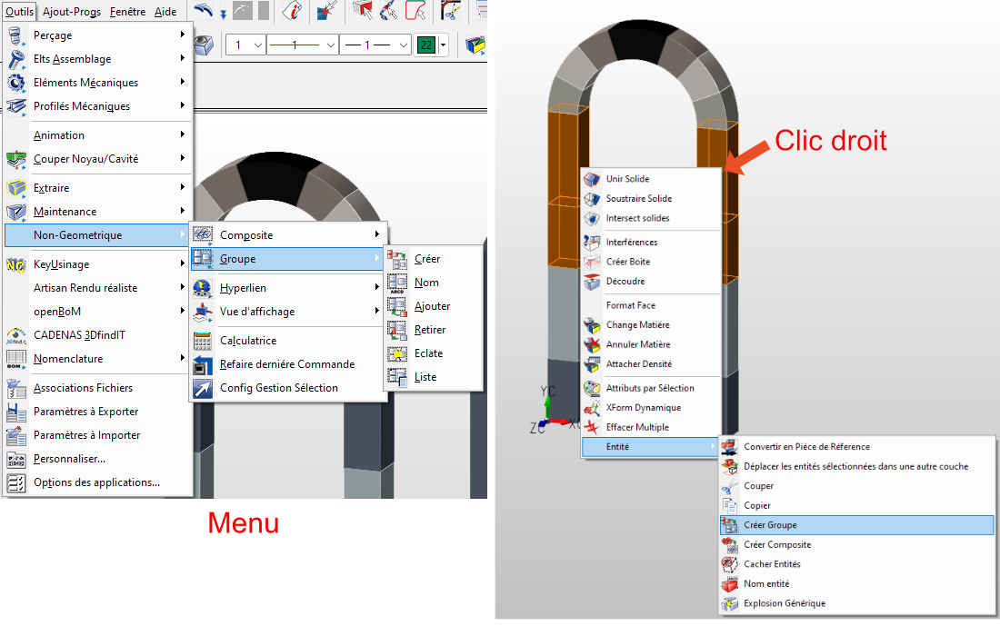

# KeyCreator : Combiner des solides

## Union booléenne

La fonction union booléenne permet de joindre différents solides entre eux pour créer un seul solide. 
(Les intersections de face seront alors unies)

Les solides ne doivent pas forcément se toucher. Les solides disjoints ne seront pas déplacés pour se toucher. Au lieu de cela, ils resteront disjoints dans le corps unique. 

Le solide uni est reconnu comme une entité unique. 

La fonction est disponible dans le menu : *Modifier > Opérations Booléennes > Union* ou via le raccourcis "B" (raccourcis clavier par défaut). Il est aussi possible de sélectionner plusieurs solides puis d'utiliser la commande dans le menu intelligent lors d'un clic droit.

## Les groupes

Il est possible de définir un groupe pour ensuite y ajouter des solides. Les solides ajoutés à un groupe restent indépendants. Les groupes permettent de facilement pouvoir sélectionner un ensemble de solides pour être utilisé lors de différentes commandes, sans avoir besoin de les re-sélectionner un à un à chaque fois.

Pour utiliser les groupe aller dans le menu : *Outils > Non-Géométrique > Groupe*  
Il est aussi possible de sélectionner plusieurs solides puis de créer un groupe à la volée via le menu intelligent lors d'un clic droit (menu Entité)

Ensuite pour utiliser les groupes créés, utiliser l'option "Groupe" dans le menu de sélection :

## Les composites

Les composites sont assez similaires aux groupes, car elles permettent de regrouper un ensemble de solides (entités). Néanmoins, les composites sont plus robustes car elles permettent un accès plus rapide et plus facile aux entités qu'elles contiennent, étant donné que les solides regroupés dans une composite sont considérés comme une seul et même entité avec un ID et un nom (tout en conservant les attributs et forme de chaque solide, entité).

Il est ensuite possible d'utiliser la commande "Explosion générique" pour supprimer une composite et ainsi récupérer chaque solide séparément.

Les composites agissent comme des entités uniques pour de nombreuses opérations, telles que les fonctions XForm, les changements d'attributs et les changements de couche.

Pour créer des composites utiliser le menu *Outils > Non-Géométrique > Composite*  
Il est aussi possible de sélectionner plusieurs solides puis de créer une composite à la volée via le menu intelligent lors d'un clic droit (menu Entité)

## Convertir en pièce de référence (assemblage)

Il est possible de convertir plusieurs solides en une pièce de référence utilisée pour faire de l'assemblage. Cela permet de créer un nouveau fichier avec les solides sélectionnés et d'utiliser ce fichier comme pièce de référence. Cela peut-être utile si vous souhaitez utiliser vos solides combinés à plusieurs endroits.

De plus, lors de la modification de la pièce de référence toutes les occurrences ajoutées au fichier seront modifiées.

Pour convertir des solides en pièce de référence, utiliser le menu *Assemblage > Convertir en pièce de Référence*  
Il est aussi possible de sélectionner plusieurs solides puis de les convertir en pièce de référence à la volée via le menu intelligent lors d'un clic droit (menu Entité)

## Fonction "Combiner les solides" (obsolète)

L'ancienne fonction "Combiner solides" est devenue obsolète et, à terme, disparaîtra de KeyCreator au profit des fonctions présentées ci-dessus.
Toutefois, si vous souhaitez tout de même l'utiliser, il est toujours possible d'ajouter la commande à votre barre d'outils. 

Pour se faire aller dans le menu *Outils > Personnaliser...* puis dans l'onglet *Commandes* puis dans la *Catégories* "Obsolète". Faite glisser la commande vers votre barre d'outils (n'oubliez pas de sauvegarder votre environnement, fichier .wsp pour récupérer la commande après la fermeture de KeyCreator)

La commande "Séparer solides disjoint", quant à elle, est toujours disponible dans le menu *Opérations Booléennes*.