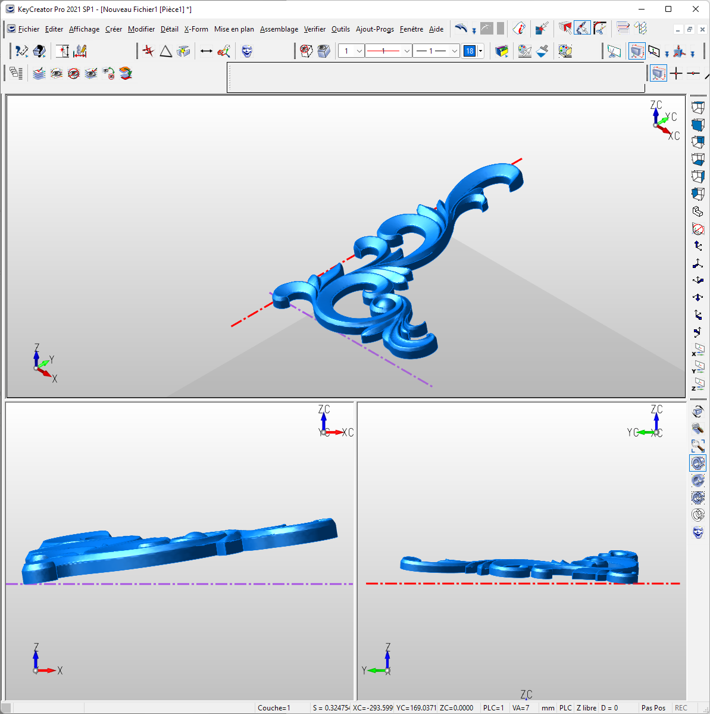
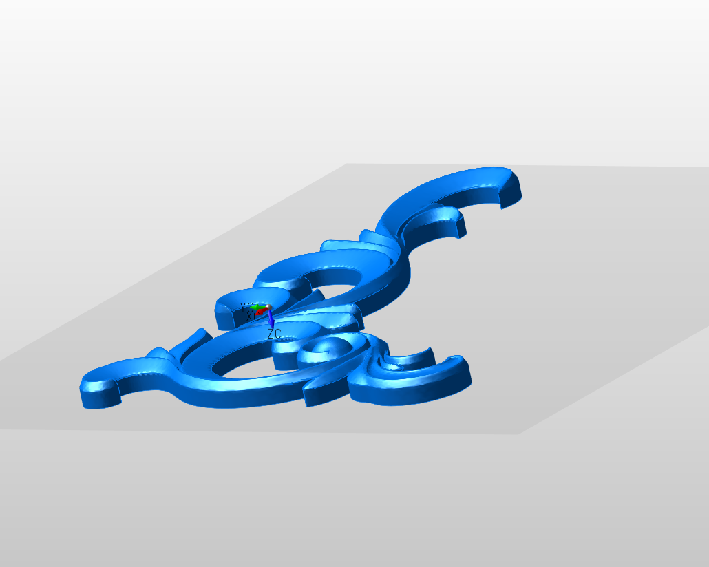
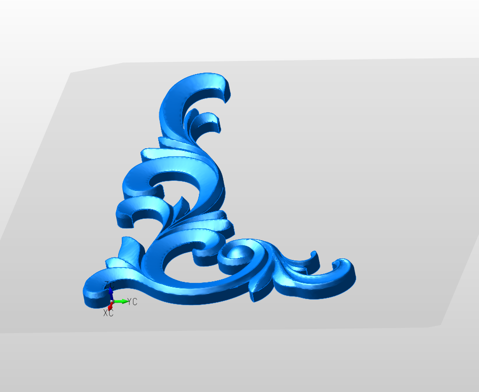

# Importer une pièce mal positionnée dans l'espace

_Réalisé avec KeyCreator 2021_

## Problème

Lors de l'importation d'une pièce, il est possible qu'elle ne soit pas bien positionnée dans l'espace. _Cela peut se produire lorsque la pièce a été créée avec un autre système CAO ou que l'exportation n'a pas été bien réalisée._

## Solution

1.  Importer la pièce dans un nouveau fichier (plus simple pour manipuler)

2.  Définir le plan de construction à la base de la pièce  
    _Affichage > Plan de construction > Définir Plan de construction (utiliser la méthode la plus appropriée : 3 points, une face, un arc, etc)_

    

3.  Copier la pièce  
    _Edition > Copier_

    -   Sélectionner la pièce
    -   Puis le point de base

    > [!NOTE]
    > Pour faire la copie, KeyCreator, prend comme référence de positionnement le plan de construction ainsi que le point de base de la copie.

4.  Créer un nouveau Fichier

5.  Coller  
    _Edition > Coller_

    

6.  Enregistrer le fichier (au format KeyCreator)

    Maintenant, vous pouvez utiliser ce fichier pour l'importation. La pièce est maintenant, facilement portionnable et déplaçable grâce au trièdre dynamique disponible lors de l'importation.  
    (_Fichier > Import > KeyCreator_)
