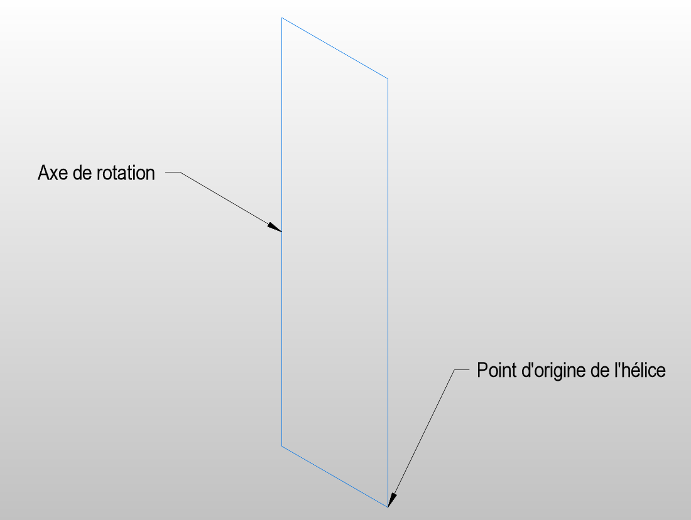
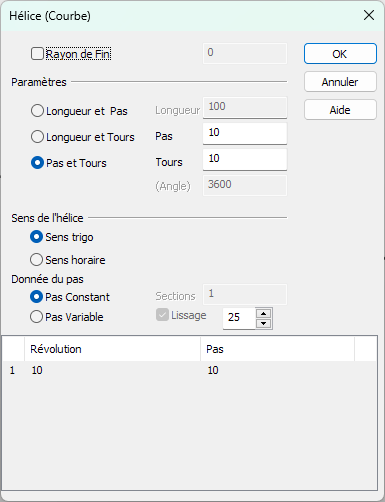
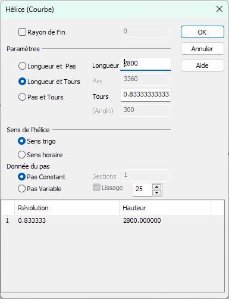
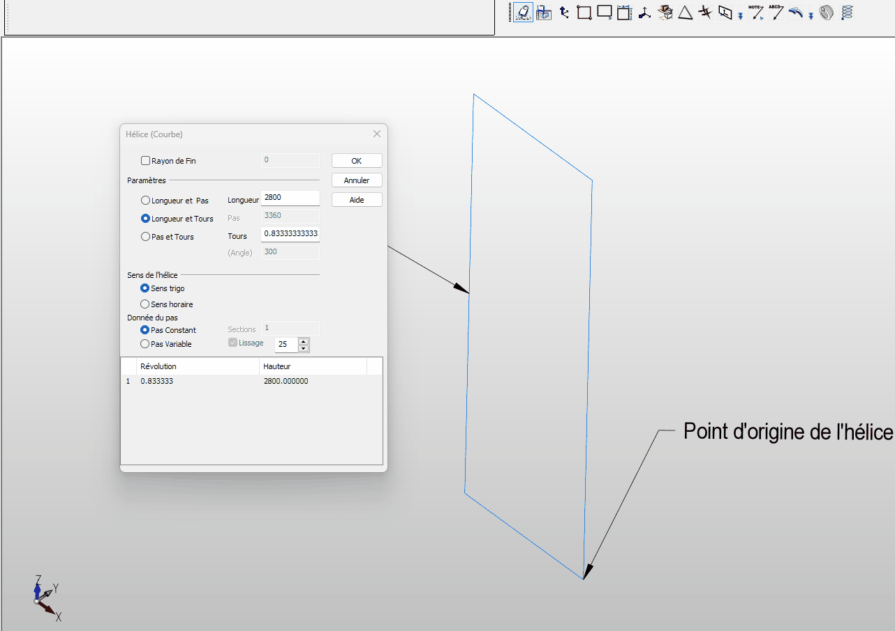
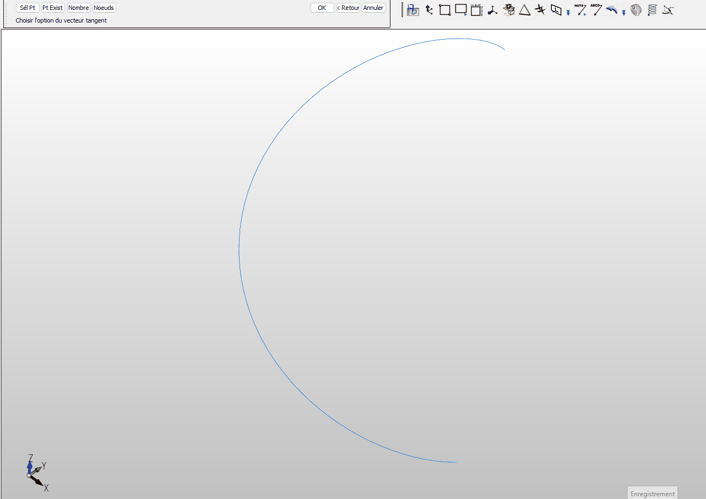
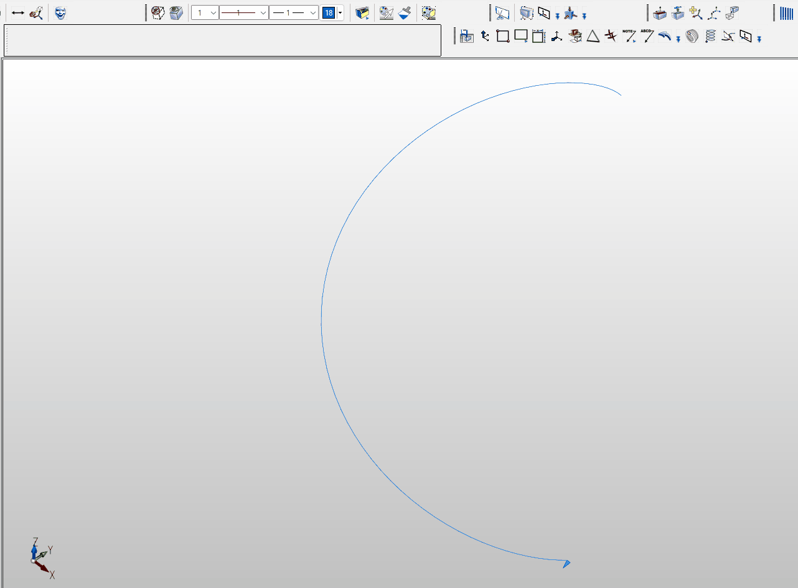
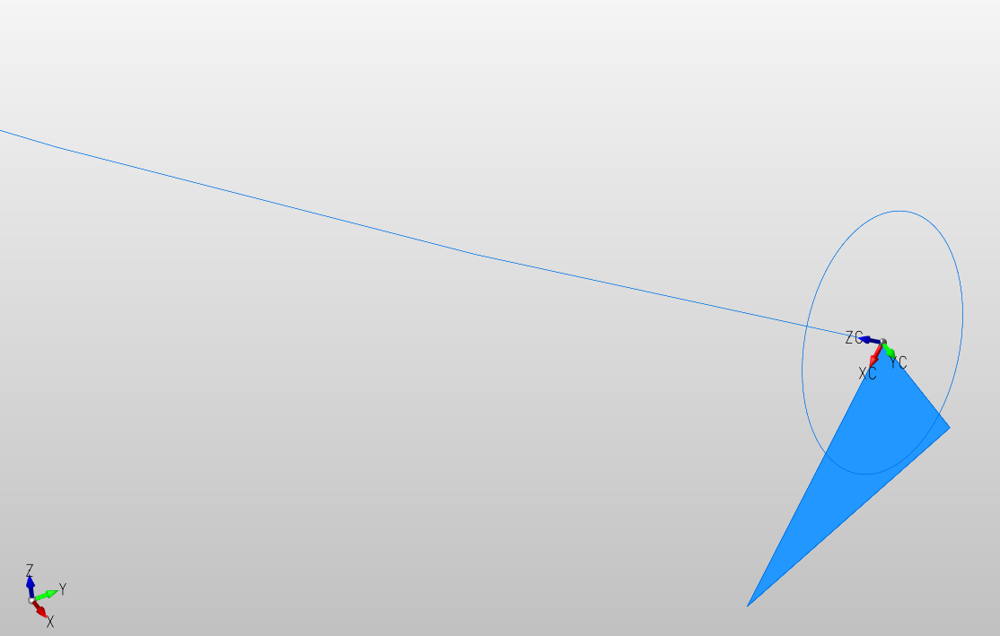
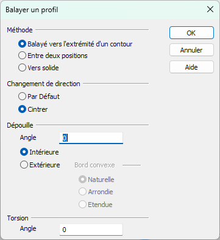
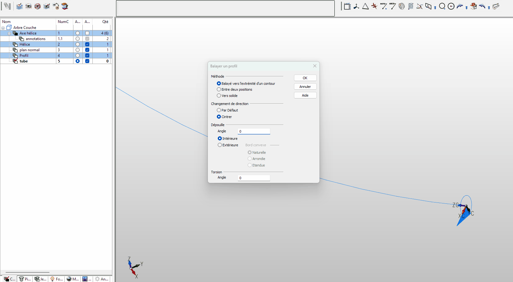

# Modéliser un tube de forme hélicoïdale

## Résumé des fonctions utilisées

- *Créer > Spline > NURBS Hélice*
- *Créer > Plan > Normal à 1 Courbe*
- *Créer > Solide par contour > Balayage d'un profil*

## Utiliser la fonction la fonction NURBS Hélice

### Créer un axe de rotation et le point de départ de l'hélice

Pour créer un tracé en forme d'hélice, il est nécessaire d'avoir un axe de rotation et un point de départ, qui représente le rayon de l'hélice.

Une solution simple est de créer un rectangle qui représentera l'axe de rotation et le rayon de l'hélice.

### Créer le tracé en hélice

Pour utiliser la fonction, aller dans le menu *Créer > Spline > NURBS Hélice*

#### Paramètres de la fonction

**Rayon de fin**  
Ce paramètre facultatif définit le rayon à l'extrémité de l'hélice. (Le point de départ détermine toujours le rayon au début.) Un rayon final de zéro créera une spirale en forme de cône.

**Paramètres**  
Sélectionnez un paramètre pour l'hélice NURBS parmi les options disponibles.

- *Longueur et Pas* : Entrez la longueur et le pas de l'hélice.
- *Longueur et Tours* : Saisissez la longueur et le nombre de tours de l'hélice.
- *Pas et Tours* : Saisissez le pas et le nombre de tours de l'hélice.
- Longueur = pas x tours

**Sens de l'hélice**

- Sens trigo : Lorsque cette option est sélectionnée, l'hélice suit le sens antihoraire.
- Sens horaire : Lorsque cette option est sélectionnée, l'hélice est orientée dans le sens horaire.

**Donnée du pas**  

- Constant : Le pas restera constant tout au long de l'hélice.
- Variable : Active la boîte de liste de saisie du pas pour les sections hélicoïdales jointes de pas différents.

#### Exemple

Pour réaliser une hélice d'un angle de 300° sur une hauteur de 2800.
On choisit le paramètre *Longueur et Tours* avec une longueur de 2800 et un Tours = 300/360 car 1 tour d'hélice équivaut à un angle de 360° (dans la fonction, on peut voir directement le calcul de l'angle et du pas correspondant à ces valeurs) 

## Création d'un tube à partir du tracé

Pour créer le tube nous allons utiliser la commande de balayage d'un profil le long du tracé hélicoïdale mais pour créer le profil (dans le cas d'un tube un cercle), il faut définir le plan de construction pour qu'il soit normal à 'hélice. Nous allons donc d'abord définir ce plan.

### Création d'un plan normal à une Courbe

Utiliser la fonction *Créer > Plan > Normal à 1 Courbe*.
- utiliser l'option *Pt Exist* (Point existant) pour utiliser le point de fin du tracé.

### Création du profil (cercle)

- Définir le plan de construction en utilisant le plan créé précédemment.

- Créer le cercle de diamètre voulu

### Création du tube

Nous pouvons maintenant créer le tube en utilisant le fonction *Créer > Solide par contour > Balayage d'un profil*.

## Autres informations

- Pour voir une autre utilisation de la fonction *NURBS Hélice* vous pouvez aller voir la vidéo "Création d'un filetage et d'un moletage" sur YouTube :

https://www.youtube.com/watch?v=FIuvLEWOUjs