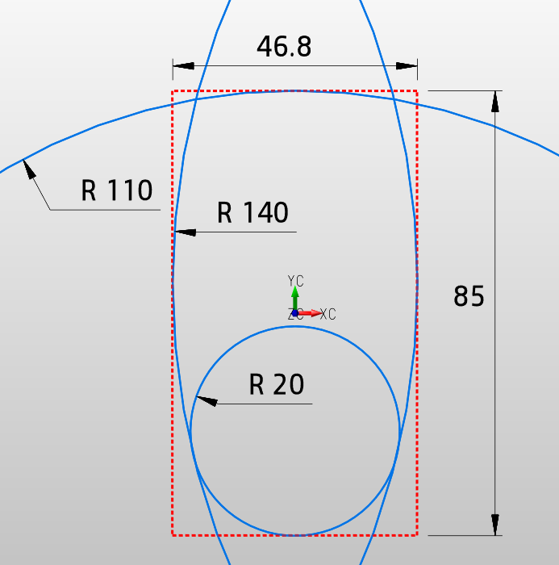
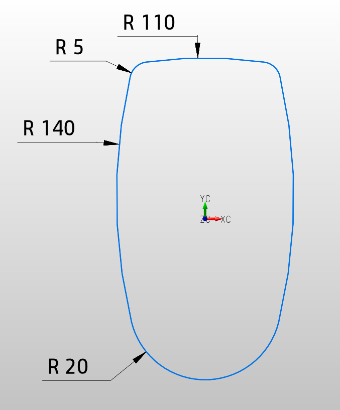
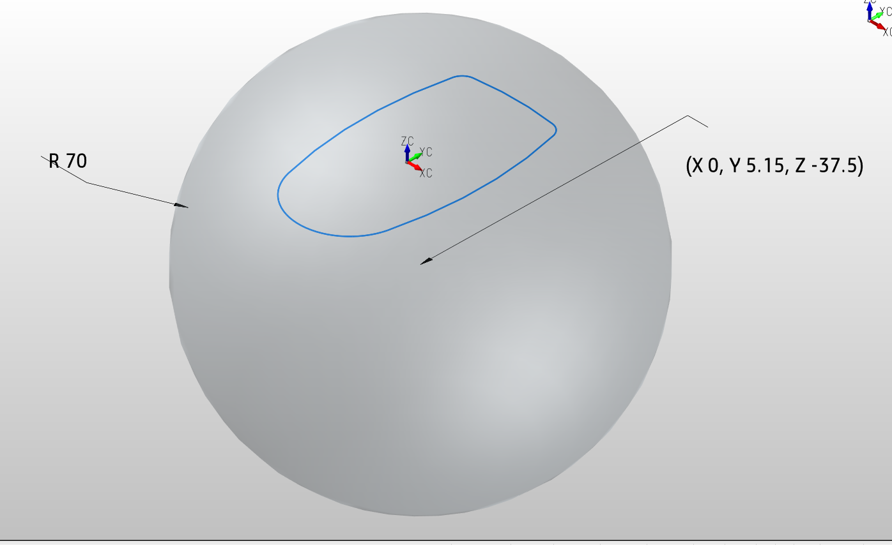
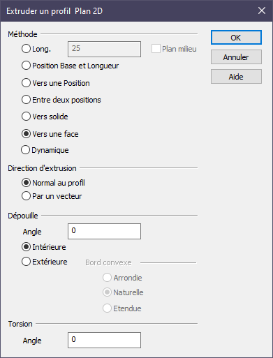
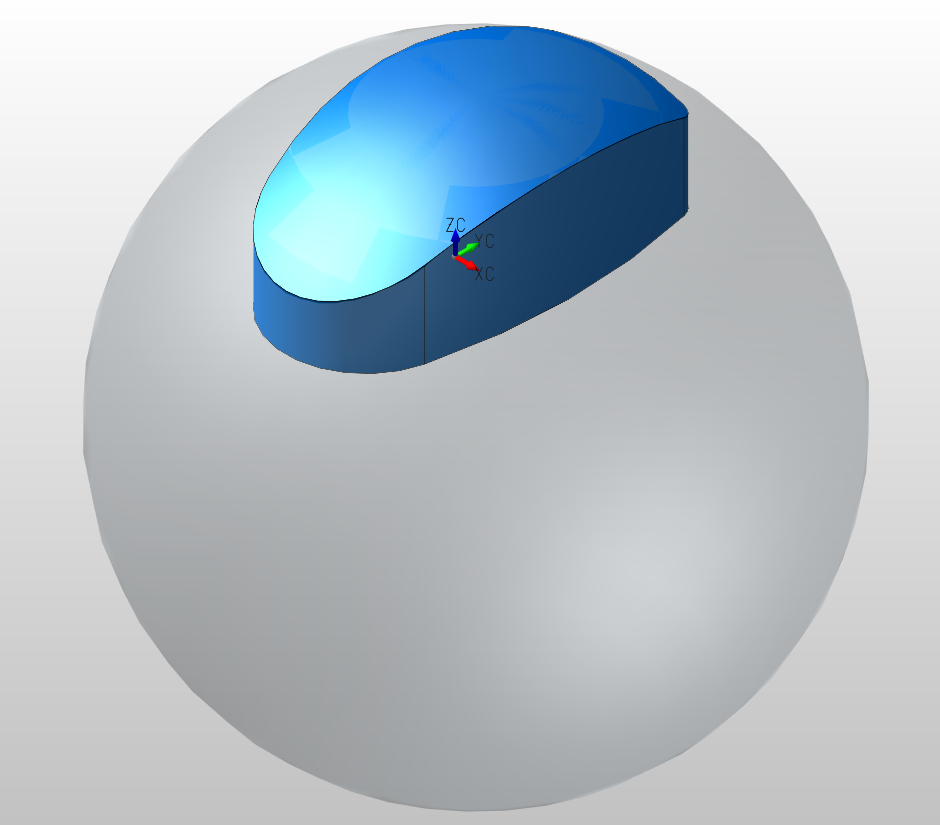
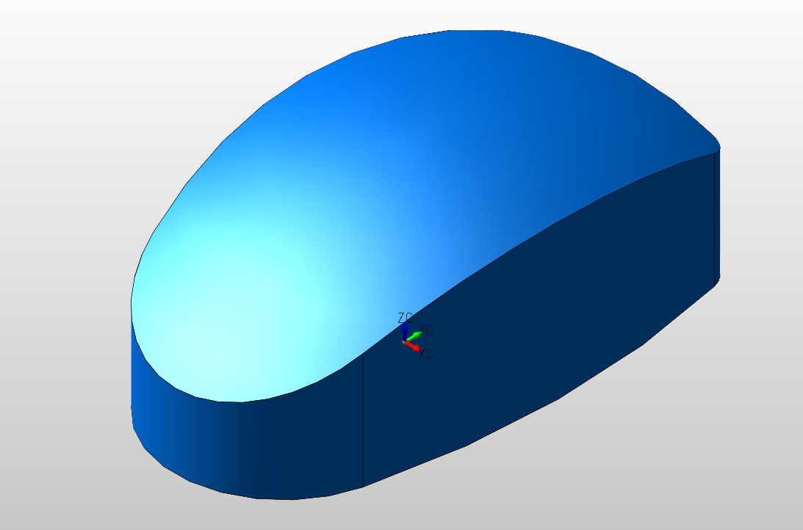
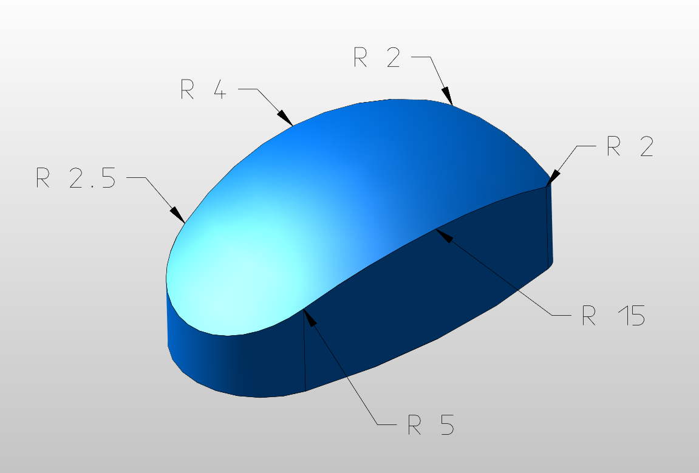
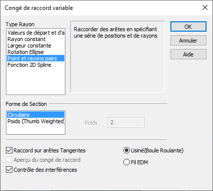
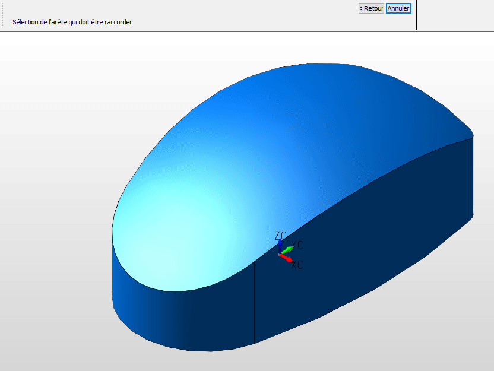
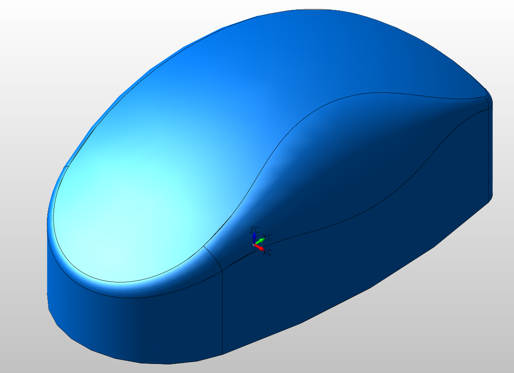

# Modéliser la forme d'une souris

*Réalisé avec KeyCreator 2020*

## Points abordés

- 2D : rectangle, cercle, congés, limiter
- 3D : Sphère, extrusion vers face, congés variables

## 1. Créer le contour 2D

- Créer un rectangle de 46.8x85 ( toutes les unités sont en mm)
- Créer l'arrondi du bas
  - Créer un cercle tangent à la ligne de base du rectangle  
    [ Créer > Rectangle > Largeur / Hauteur] [R]
    - rayon 20
    - centre à delta y de 20
- Créer l'arrondis du haut
  - Créer cercle tangent à la ligne haut du rectangle  
    [Créer > Cercle > Centre et 1 tangence] [C]
  - rayon 101
  - centre à delta y -101
- Créer arrondis des flancs
  - Créer un cercle tangent à 2 entités  
    [Créer > Cercle > Tangent à 2 entités] [C]
    - Rayon 140
    - Tangent au cercle de 20 et la ligne verticale du rectangle
  - Répéter l'opération pour l'autre cotés

- Limiter les cercles pour obtenir le contour final
- Créer des congés sur les coins supérieurs  
[Modifier > Congés > Limiter]
  - Rayon 5

    

## 2. Extrusion 3D

- Créer une sphère  
[Créer > Primitive Solide > Sphère] [P]
  - Rayon 70
  - Centre :
    - XY = entre les 2 arcs de 140 (flanc)
    - Z = -37.5

- Faire une extrusion du contour 2D vers la face de la sphère  
[Créer > Solide par contour > Extrusion] [W]

 

## 3. Congés variables

- Suivant les rayons indiqué ci-dessous créer un congé variable  
[Créer > Formes sur solide > Congé > Variable] [D]

- Choisir "Point et rayons pairs" (Rayons suivant points)

- Sélectionner chaque point puis indiquer la valeur

## Résultat

### Fichier KeyCreator

[tuto-forme_souris.ckd](modeliser-forme-souris/tuto-forme_souris.ckd)
