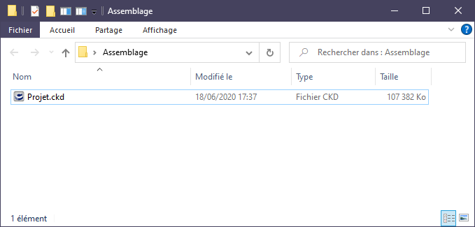
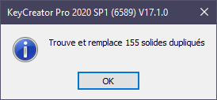
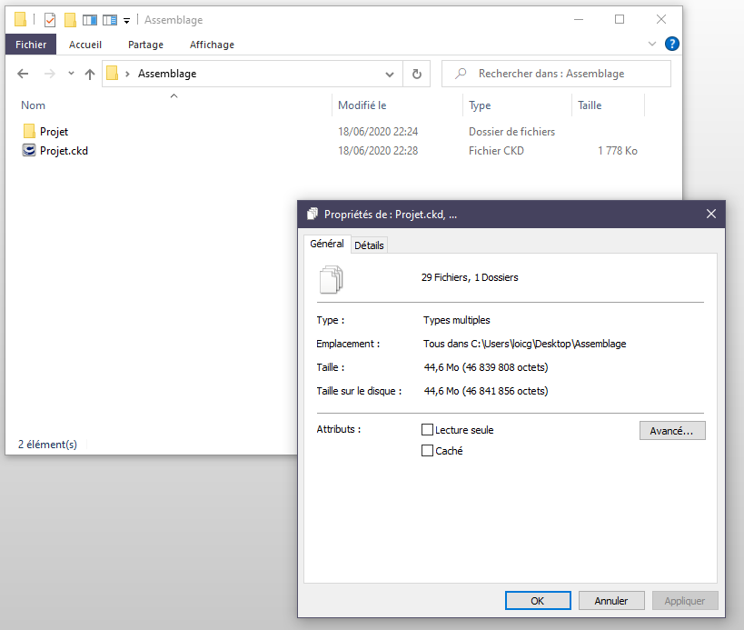
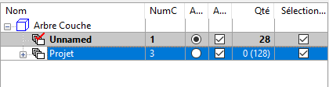
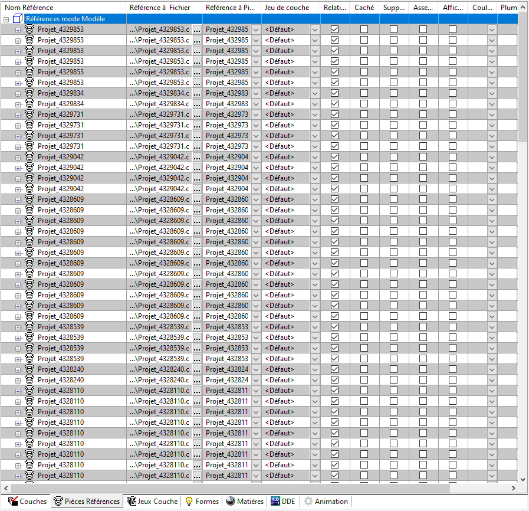
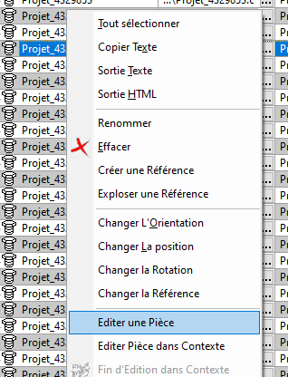

# Simplifier un fichier avec plusieurs solides identiques grâce à l'assemblage

*Réalisé avec KeyCreator 2020*

## Créer un assemblage automatiquement pour des solides identiques

- Copier votre fichier dans un nouveau dossier

- Ouvrir le fichier dans KeyCreator
- Cliquer sur le menu "Assemblage" puis "Découvrir Assemblage", ensuite sélectionner "Tout Aff" > "Tout" > Ok
    - cette fonction va analyser votre modélisation puis créer une pièce de référence pour chaque solide présent en plusieurs exemplaire
    - cela permet d'alléger votre fichier
    
    
    
- Ensuite sauvegarder, puis fermer le fichier
- Répondre **Oui** à la boite de dialogue ci-dessous

## Résultat

### Dans le répertoire

On peut voir, dans le dossier du fichier, un nouveau dossier portant le nom du fichier, contenant toutes les pièces de références. De plus, le poids du répertoire est de 44,6 Mo alors que le fichier de base pesait 107 Mo.

### Dans KeyCreator

- Une nouvelle couche a été créé contenant les solides utilisés comme références ("Unnamed")

- Dans l'onglet "Pièces Références" (à coté de l'onglet Couches), on peut voir les solides utilisant une référence (lien vers le fichier créé contenant le solide)

- Il est possible de modifier la pièce référencé, en faisant un clic-droit sur la référence, puis "Editer une Pièce"
    - la pièce s'ouvrira alors, et toute modification sur cette pièce sera impacté sur toutes les pièces pointant vers cette référence

